# ExternalDocTemplate {#externaldoctemplate}

DataRobot, Inc.

#### Architecture overview[^a] {#architecture-overview-a}

Basic Drawing:[^b]

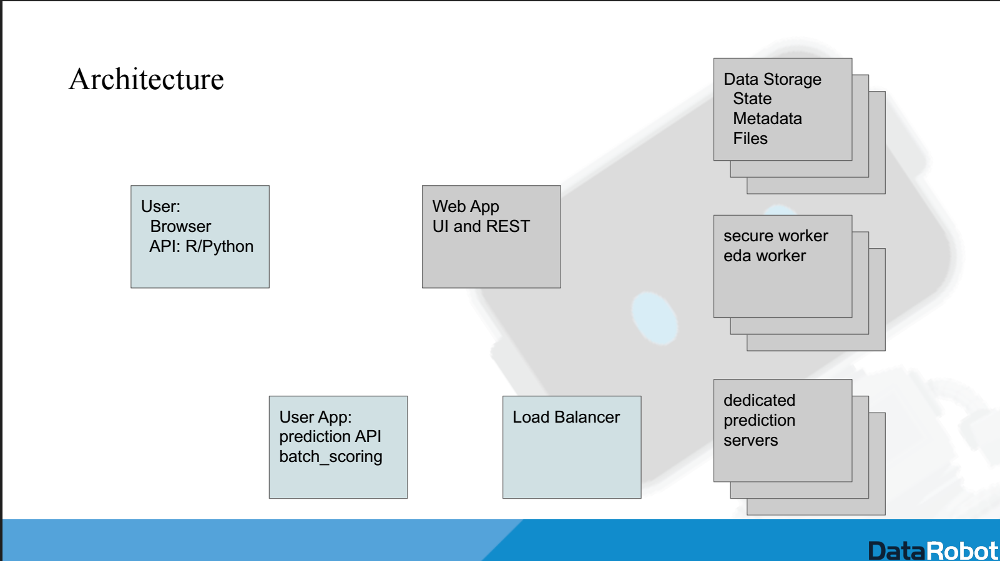

Basic Explanation:

Cores

DataRobot Enterprise Edition is available as a per-core annual software license that is deployed on customers’ hardware - whether on-premise or on a private cloud. The platform edition of DataRobot is targeted for large enterprises as well as businesses and organizations in regulated industries that cannot use a public cloud service for analytics.

The pricing is straightforward and reflects the value that lies in the computation required to build accurate predictive models and (also) deploy them for predictions. It is based on the number of CPU cores that DataRobot is deployed on.

Memory

Practically speaking, DataRobot can handle up to 100GB of data for training models. With datasets of this size, we make sure to try out both in-memory and distributed algorithms to determine which is the best fit for your dataset. We downsample the data to fit the RAM available in a single server and train models using single instance algorithms. We also run the entire dataset (or as much of it that can fit) on a Spark cluster and train distributed algorithms from MLlib. Those results are then available on the leaderboard for you to review and compare.

Queues

The Worker Usage interface (located on the right sidebar of the application)  functions as a live activity feed displaying file imports and model building queues. This interface is always visible no matter where you are on the application.

Workers types

EDA

When you begin a new project by importing a dataset file, the Worker Usage interface appears and you can see it process through three steps: Uploading Data, Reading raw data, Exploratory Data Analysis. Once the file import is complete, you can see how long it took for the Worker User interface to complete each of those three steps in the queue. The timestamps are written directly underneath each step along with a green green checkmark to indicate that the step was completed.

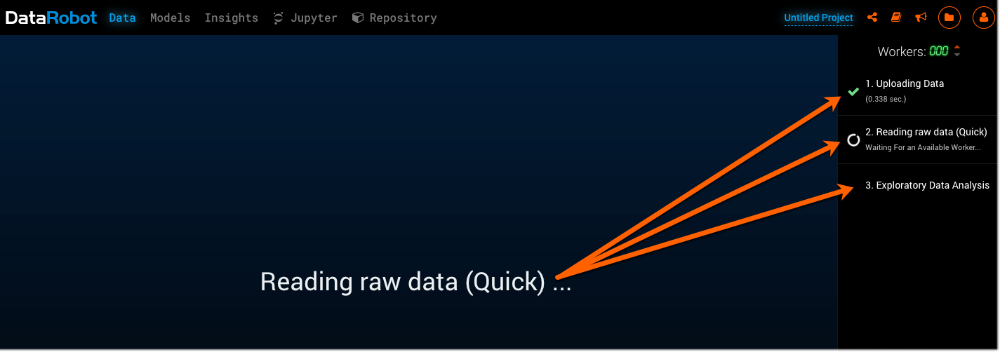

Modeling

Once you choose a prediction target topic from the dataset and select your preferred settings, you can then “Start” the model building process.

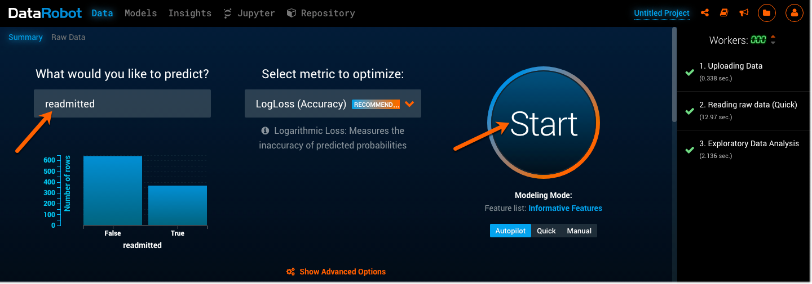

Once DataRobot begins building models, the Worker Usage interface will display and process a numbered list of steps to begin building each model.

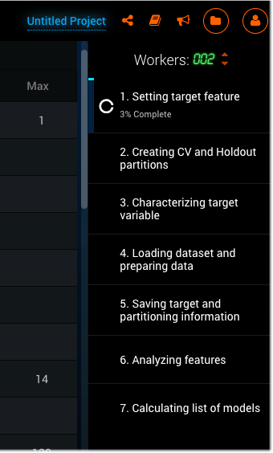

Then, the modeling queue will start and display a list of model names being queued up and built for your dataset. The user is able to view the queue of models that have yet to execute, and the running execution of the model on a worker (a cpu instance). Each project has its own Job Queue, which services model computation requests from the corresponding Modeling Dashboard instance. Every job either executing or in the queue can be deleted at any time. A job in the queue displays the title of the model to run, the % sample size, and the number that represents the cross validation (CV) set.

There are three Modeling Modes that affect how the queue functions and builds models for you.

(MAKE TABLE):[^c]

Note: If you select either the Autopilot or Quick modes, DataRobot will select only the relevant models that fit best with your dataset and prediction need. 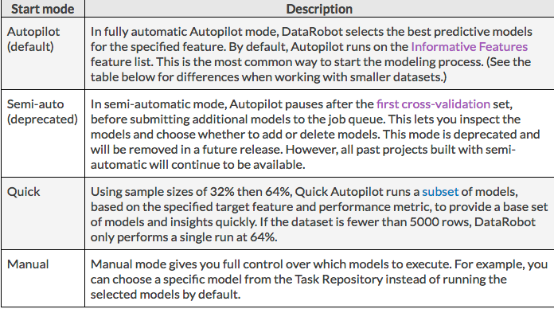

Prediction[^d]

As each model is built, it is added to the Leaderboard located under the Models tab. The Leaderboard lists every model built for your particular dataset in order of accuracy and speed. You can now make predictions based off of these models by either importing and making predictions on a new dataset, or by making predictions on the original dataset.

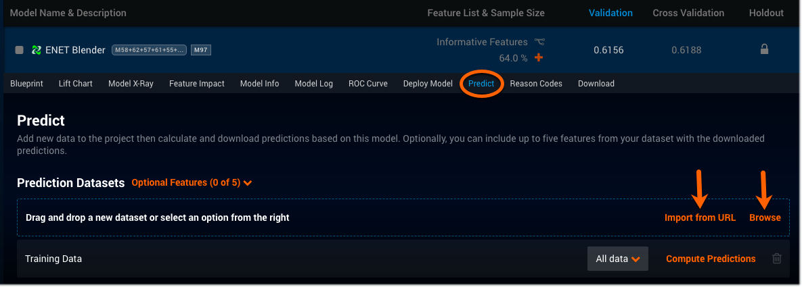

When you made predictions off of these models, the queue again appears to show a live feed of the progress being made, and the work being done, on the predictions.

Worker count vs. corker availability for shared projects

At the top of the Worker Usage interface is the Worker count that is automatically set to 4, which indicates that there are 4 workers currently being used for your project. You can either increase or decrease the number of workers by clicking either the up or down arrows located next to the worker count number. You can also pause the workers from building models, and also resume the process by clicking the Play/Pause icon located to the left of the Worker count.

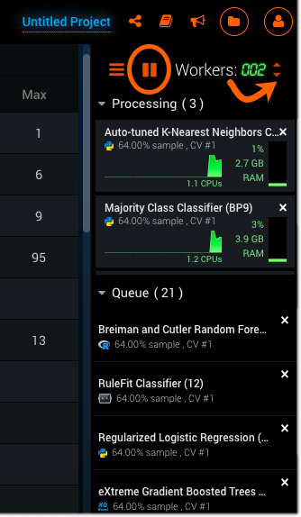

You will notice that you are initially limited to a 4 worker limit. This can be changed through the admin. Admins have access to the management console, which allows them to create groups within their organization. Once these group-based worker assignments are created, admins can then set modeling limits for their groups. This means that admins can set a cap on the number of workers that each group can use, which minimizes resource contention throughout organizations.

Hadoop Drawing[^e]

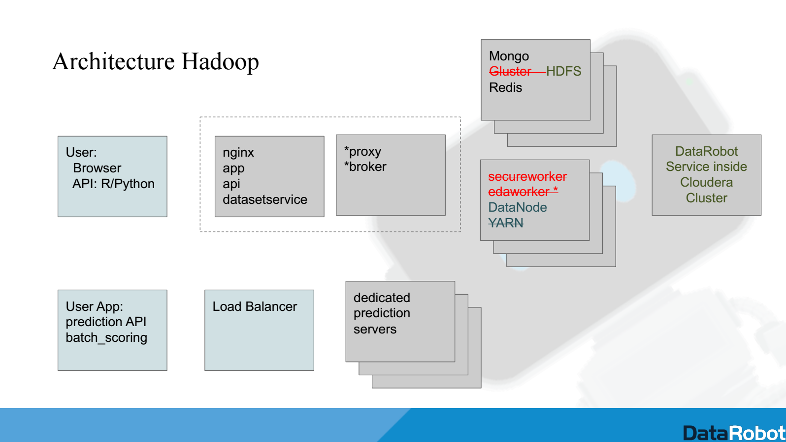

Hadoop explanation as it differs from basic[^f][^g][^h]

There are four main differences between DataRobot Hadoop and the standard deploy: 1) Model building uses existing Hadoop data nodes resources, 2) Hadoop has the ability to perform high-throughput scoring using Spark, 3) Hadoop’s cluster resources and DataRobot are managed by YARN, and 4) DataRobot can utilize Hadoop resource to allow bigger data ingest and model building (5GB vs 10GB).

Security:

LDAP[^i][^j][^k]

LDAP (Lightweight Directory Access Protocol) is a directory service access  protocol used for centralized or single-signon authentication. SLDAP or LDAPS are the same, both means LDAP over SSL (SSL encrypted connection to LDAP server).

DataRobot supports LDAP, but uses different LDAP attributes for different directory service products such as MS AD, Open LDAP, Oracle Internet Directory, iPlanet, Oracle Virtual Directory, and IBM Directory. This means that the attribute configuration for different products will be different.

LDAP is the protocol that communicates with the directory service, allowing the directory server and LDAP client to communicate effectively with each other in order to validate users during application login[^l].

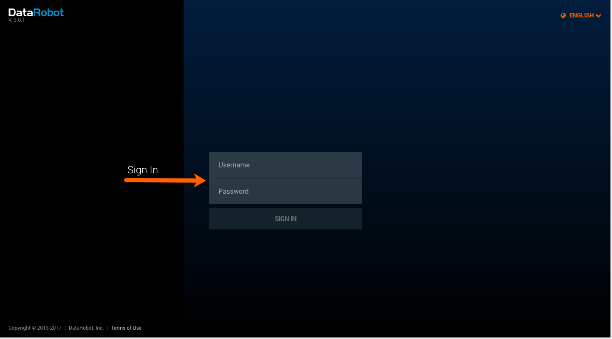

DataRobot can authenticate users through the configured LDAP. A user’s login information is sent over from DataRobot and checked against the Directory Service through LDAP. If that user’s information is valid, that result is sent back and an entry is then created for that user in DataRobot.

Note: When a first-time user is authenticated through LDAP, only their username is created and saved in DataRobot - not their password. This is a one-time process that only happens for the first login.

DataRobot stores users in email format (the domain that represents that organization) for the internal DataRobot authentication[^m].

However, LDAP users only have a simple username that appear in a list on DataRobot[^n].

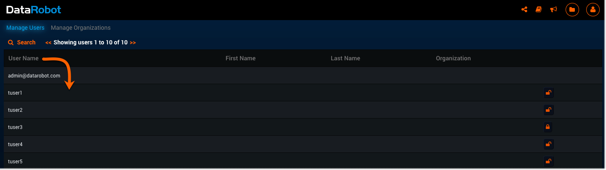

When a user has been validated with their initial LDAP login, the organization’s admin can go into DataRobot to set permissions[^o] for that user under the Manage Users section located in their profile dropdown menu.

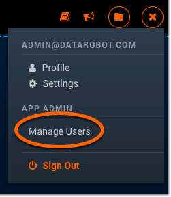

1.  Select a user by clicking on their username to access that user’s account information.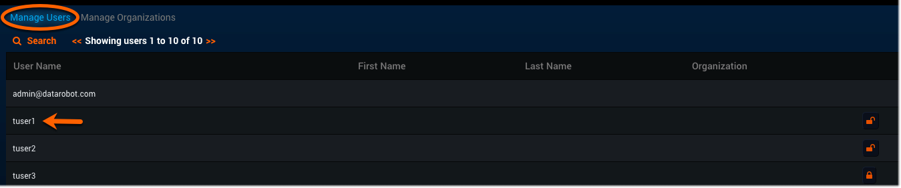

    2\. You are now viewing that user’s profile. Click Change Permissions to see a list

        of each individual permission.

3\. Now you can Enable or Disable features for this user by checking the boxes, or

    leaving them blank. You can also set this user’s organization, number of workers,

    and a file upload size limit. 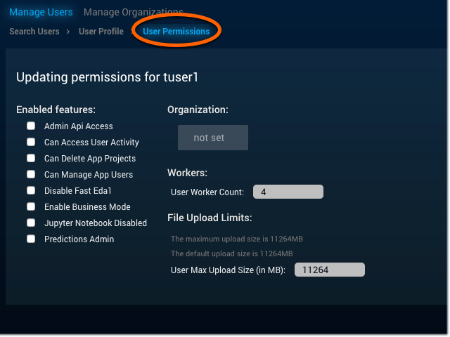

Having an LDAP supported directory service keeps all of the users and organizations categorised and accessible. Any updates made in LDAP Directory server  will automatically update every application without the need to manually search and edit each one individually. For example, if a user is removed from Directory server, the application which is configured to authenticate to this particular Directory server won’t allow the removed user to login. This is a streamlined and efficient way for admins to accurately manage the DataRobot application authentication for large companies.

About config.yaml[^p][^q]

Part of config.yaml is involved with LDAP configuration as a step in the protocol process of reading and authenticating in every user’s login information (username and password) from the client’s LDAP supported Directory Service such as MS AD. Config.yaml is master configuration file for the DataRobot cluster,  this facilitates the passage of user information between DataRobot and LDAP supported Directory Service in the organization for centralized user authentication.

The following is an example of LDAP configuration for Microsoft Active Directory in config.yaml file:

app_configuration:t

 drenv_override:

   USER_AUTH_LDAP_BIND_DN: tuser1@example.com

   USER_AUTH_LDAP_BIND_PASSWORD: &#039;&lt;clear text password here&gt;&#039;

   USER_AUTH_LDAP_GLOBAL_OPTIONS: &#039;[]&#039;

   USER_AUTH_LDAP_SEARCH_BASE_DN: ou=datarobot,dc=example,dc=com

   USER_AUTH_LDAP_SEARCH_FILTER: (&amp;(objectClass=user)(sAMAccountName=$username))

   USER_AUTH_LDAP_URI: ldap://ad-controller.example.com:389

   USER_AUTH_TYPE: ldapsearch

[^a]: 

[^b]: 

[^c]: 

[^d]: 

[^e]: 

[^f]: 

[^g]: 

[^h]: 

[^i]: 

[^j]: 

[^k]: 

[^l]: 

[^m]: 

[^n]: 

[^o]: 

[^p]: 

[^q]:
