<a name="architecture-overview"></a>
Architecture overview
=====================

Basic Drawing:
--------------

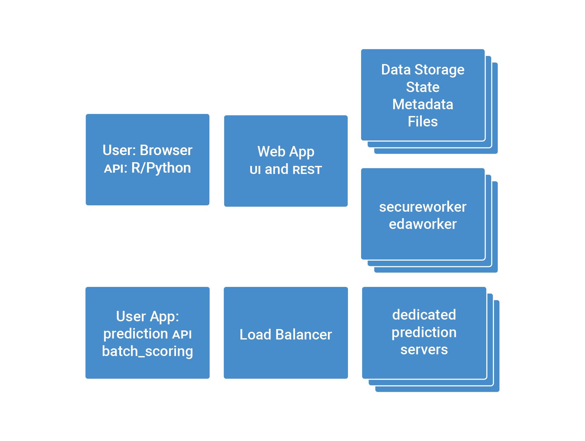

<a name="basic-explanation"></a>
Basic explanation:
------------------

<a name="cores"></a>
###Cores

DataRobot Enterprise Edition is available as a per-seat software license that is deployed on customers’ hardware - either on-premise or on a private cloud. The Platform edition of DataRobot is targeted for large enterprises, businesses, and organizations in regulated industries that cannot use a public cloud service for analytics.

The pricing is straightforward and reflects the value that lies in the computation required to build accurate predictive models, in addition to deploying them for predictions. It is based on the number of CPU cores on which DataRobot is deployed.

<a name="memory"></a>
###Memory

The allowed file size on DataRobot depends on the platform and release, detailed in the [Size Matrix](https://support.datarobot.com/hc/en-us/articles/115003904626-What-file-size-can-I-import-?flash_digest=774af71819e1d46534bb81907a8dec8c0738f368#). File size distinctions are made for the Enterprise Hadoop, and Enterprise Non-Hadoop platforms. 

With datasets of this size, we make sure to try out both in-memory and distributed algorithms to determine which of the two is the best fit for your specific dataset. We downsample the data, fitting it into the available RAM, and train models using single instance algorithms. We also run the entire dataset (or as much of it that can fit) on a Spark cluster, and train with distributed algorithms from MLlib. The results are then made available on the **Leaderboard** for you to review and compare.

<a name="queues"></a>
###Queues

The _Worker Usage_ interface (located on the right sidebar of the application) functions as a live activity feed that displays file imports and the model building queues. This interface is always visible on the right-hand side of the application.

<a name="workers-types"></a>
Workers types
-------------

<a name="eda"></a>
###EDA 

When you begin a new project (by importing a dataset file), the Worker Usage interface appears and you can clearly see it processing these three steps: (1) Uploading Data, (2) Reading raw data, and (3) EDA (Exploratory Data Analysis). Once the file import is complete, you can see (on the Worker User interface) how long it took to finish each of those three steps in the queue. Timestamps are written directly underneath each numbered step along with a green checkmark, which indicates that each step is done.

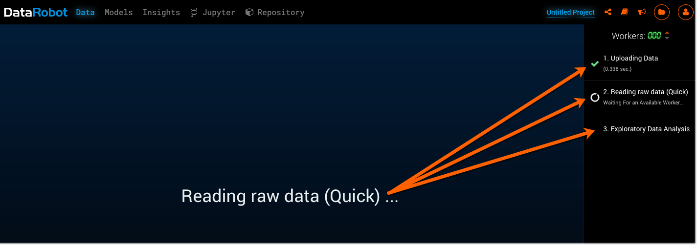

<a name="modeling"></a>
###Modeling

Once you choose a prediction target topic (from your dataset) and select your preferred settings, you can **Start** the model building process!

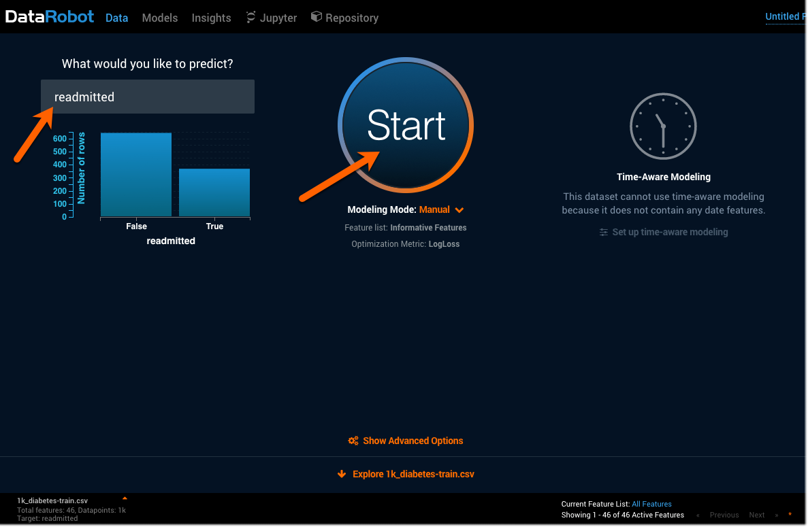

Once DataRobot starts building models, the Worker Usage interface displays another numbered list of steps to begin building each model.

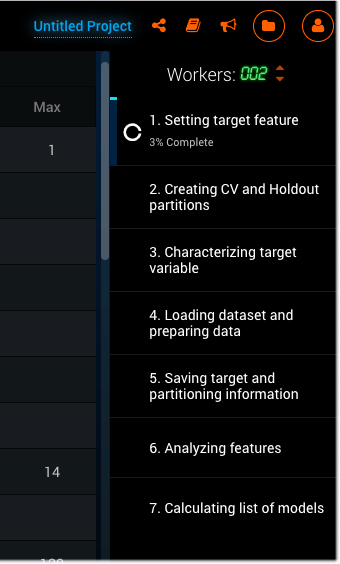

Then, the modeling queue will start and display a live list of models (identified by name) that are being queued up and built for your dataset. You can see the queue of models that have yet to execute, as well as the current running execution of a model on a worker (a cpu instance). 

Each project has its own _Job Queue_, which services model computation requests from the corresponding Modeling Dashboard instance. Every job, that is either executing or in the queue, can be deleted at any time. A job in the queue displays the title of the model to run, the % sample size, and the number that represents the cross validation (CV) set.

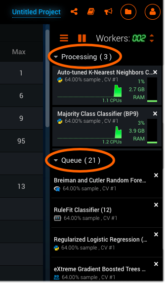

There are three _Modeling Modes_ that affect how DataRobot functions and builds models for you.

|Start Mode| Description|
|----------|:----------:|
|Autopilot| In the fully automatic Autopilot mode, DataRobot selects the best predictive models for the specified feature. By default, Autopilot runs on the Informative Features feature list. This hands-free mode is the most common way to start the modeling process.|
|Quick| Using sample sizes of 32% followed by 64%, Quick Autopilot runs a subset of models based on the specified target feature and performance metrics. This mode provides a base set of models and insights quickly. If the dataset has fewer than 5000 rows, DataRobot only performs a single run at 64%.|
|Manual| Manual mode gives you full control over which models to execute. For example, you can choose a specific model from the Task Repository, instead of running the selected models by default.|

***Note:*** If you select either the Autopilot or Quick mode, DataRobot will select only the relevant models that fit best with your dataset, and for your prediction needs.

<a name="prediction"></a>
###Prediction

As each model is built, it is added to the **Leaderboard** which is located under the **Models** tab. The **Leaderboard** lists every model that DataRobot builds for your particular dataset, in order of accuracy and speed, with the fastest and most accurate models on top of the list. Now, you can make predictions based off of the **Leaderboard** models by using two methods: (1) importing and making predictions on a new dataset, or (2) making predictions on the original dataset.


When you make predictions off of these models, the queue again appears on the right-hand side to show a live feed of the progress being made and the work being done on the predictions.

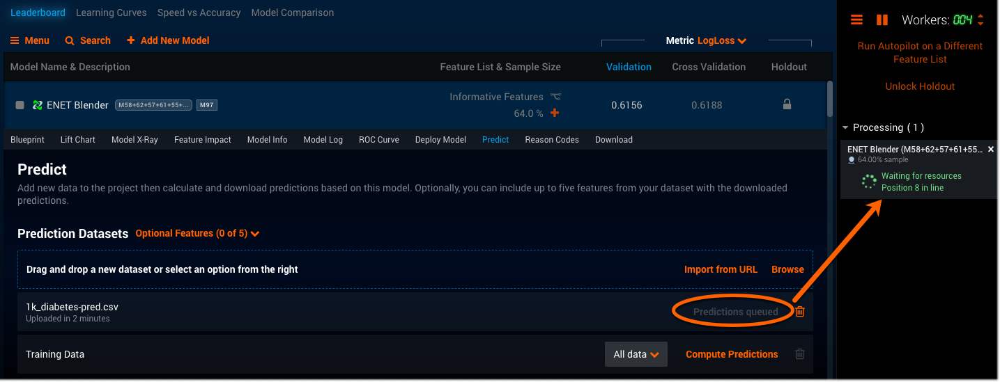

<a name="worker-count-vs-worker-availability-for-shared-projects"></a>
###Worker count vs. worker availability for shared projects

At the top of the Worker Usage interface is the _worker count_, which is set to 4 workers by default. This indicates that there are 4 workers currently being used on your project. You can increase or decrease the number of workers by clicking either the up or down orange arrows located next to the worker count number. A higher worker count number means that projects can be processed quicker than projects with a low worker count number. You can also pause the workers from building models or resume the process, by clicking the orange **Play/Pause** button located to the left of the worker count.


The Admin can change the worker count number, which is a good way to ensure that all users within an organization have fair access to the workers. Admins also have access to the management console, which allows them to create groups within their organization. Once these group-based worker assignments are created, Admins can then set modeling limits for the group. This means that Admins can set a cap on the number of shared workers that each group can use, which minimizes resource contention throughout organizations.

Each user's own worker count number is respected and maintained, regardless of how many workers are available on projects and through organizations. This means that a user's personal worker count (located in their profile settings) is the maximum number workers available to that user at all times (unless the Admin changes it). 
For example: If a user has a worker count of 4 workers, that user can utilize any number of workers ranging from 1-4. If the user is part of a project or organization with a worker count of 12 workers, they can only use up to 4 of those 12 workers, and no more. 

Hadoop Drawing:
---------------

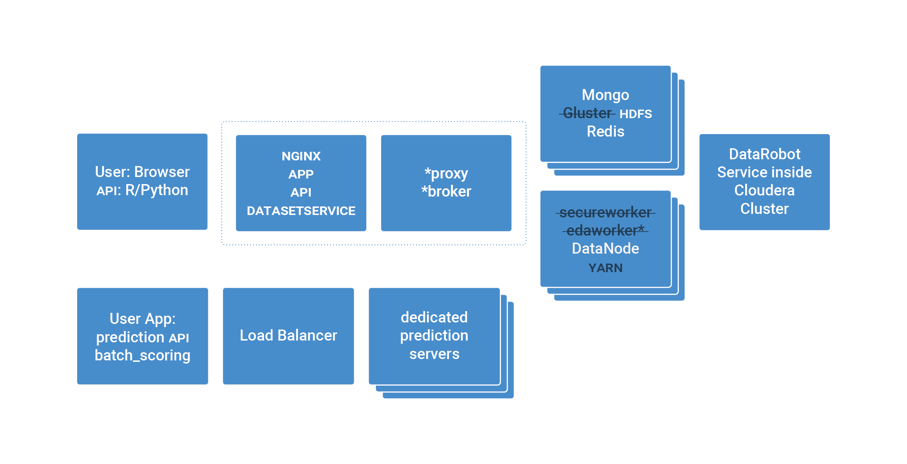

<a name="hadoop-explanation-as-it-differs-from-basic"></a>
###Hadoop explanation as it differs from basic

There are four main differences between DataRobot Hadoop and the standard deploy: 

1. Model building (on DataRobot) uses existing Hadoop data nodes resources
2. Hadoop has the ability to perform high-throughput scoring, using Spark
3. Hadoop’s cluster resources and DataRobot are both managed by YARN 
4. DataRobot can utilize Hadoop resources to allow for bigger data ingest and model building (5GB vs 10GB)

<a name="security"></a>
Security
---------

<a name="ldap"></a>
###LDAP

LDAP (Lightweight Directory Access Protocol) is a directory service access protocol used for either centralized or single-signon authentication. 

**Note:** SLDAP or LDAPS are the same because both mean LDAP over SSL (SSL encrypted connection to LDAP server).

DataRobot supports LDAP, but uses different LDAP attributes for different directory service products, such as: MS AD (Microsoft Active Directory), Open LDAP, Oracle Internet Directory, iPlanet, Oracle Virtual Directory, and IBM Directory. This means that the attribute configuration for different products will also be different.

LDAP is the protocol that communicates with the directory service. It allows the directory server and LDAP client to communicate effectively with each other, in order to validate users during application login.

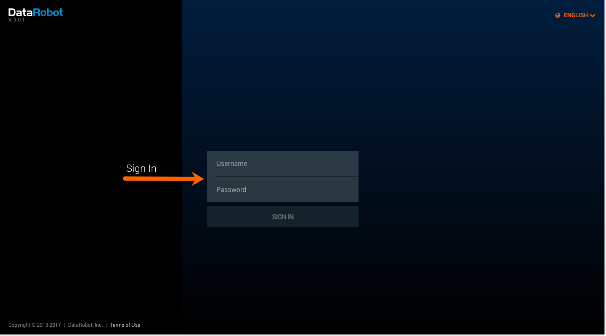

LDAP is usually configured using an LDAP container (or group), which allows only a subset of Enterprise LDAP users access to the DataRobot instances. In order to revoke access to DataRobot, the user needs to be removed from an LDAP container.

DataRobot can authenticate users through the configured LDAP. A user’s login information is sent over from DataRobot and checked against the Directory Service, through LDAP. If that user’s information is valid, the result is sent back and an entry is created for that user in DataRobot.

**Note:** When a first-time user is authenticated through LDAP, only their username is created and saved in DataRobot - not their password. This is a one-time process that only happens with the first login.

DataRobot also stores users in an email format (the domain that represents their organization) for internal DataRobot authentication.

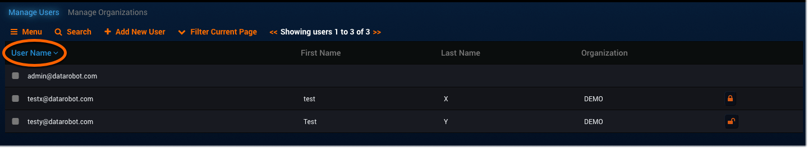

However, each LDAP user has only a simple username that appears in a list on DataRobot.

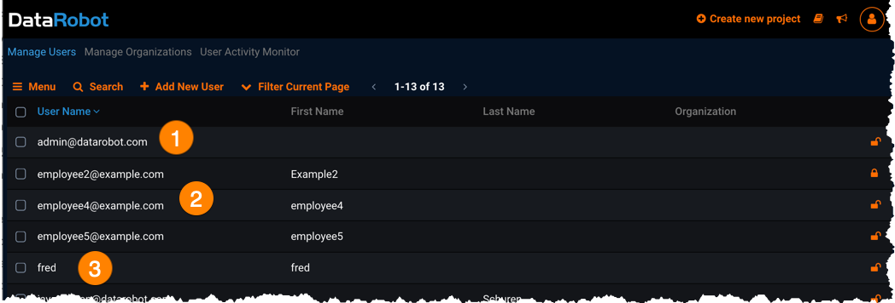

When a user has been validated with their initial LDAP login, the organization’s Admin can go into DataRobot to set permissions for that user under the **Manage Users** page, which is located in the profile dropdown menu.

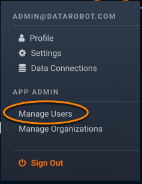

1. Select a user by clicking on their username to access that user’s account information. 

	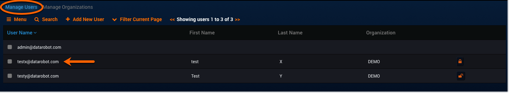
	
	You are now viewing that user’s profile on the **User Profile** page.

2. Click **Change Permissions** to see a list of each individual permission.

	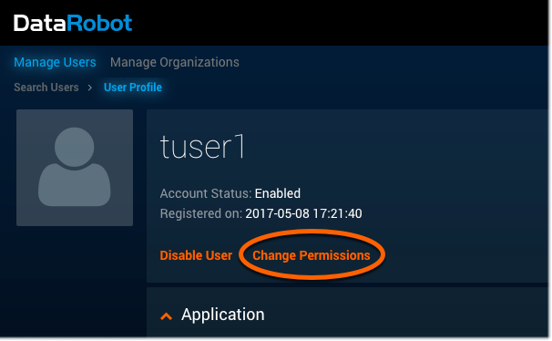

3. You can enable or disable features for this user by checking the boxes, or leaving them blank.  

	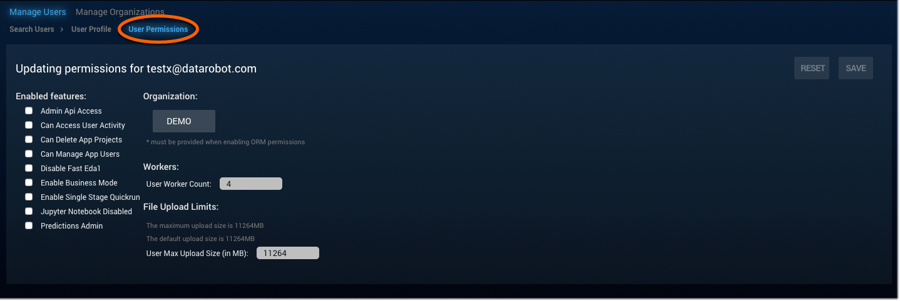
	
**Note:** You can also set this user’s organization, number of workers, and a file upload size limit from this same page.

Having an LDAP-supported directory service keeps all of the users and organizations categorised and accessible. Any updates made in the LDAP Directory server will automatically update every application without the need to manually search and edit each one individually. For example, if a user is removed from the Directory server, the application (which is configured to authenticate to this particular Directory server) won’t allow the removed user to log back into the application. This is a streamlined and efficient way for Admins to accurately manage DataRobot application authentication for large companies.

<a name="about-configyaml"></a>
###About config.yaml

Part of config.yaml is involved with the LDAP configuration as a step in the protocol process for reading and authenticating every user’s login information (username and password) belonging to the client’s LDAP-supported Directory Service (such as MS AD). 

Config.yaml is the master configuration file for the DataRobot cluster. It facilitates the passage of users' information going between DataRobot and the LDAP-supported Directory Service in the organization, for centralized user authentication.

The following is an example of an LDAP configuration for MS AD in a config.yaml file:

```
app_configuration:

 drenv_override:

   USER_AUTH_LDAP_BIND_DN: tuser1@example.com

   USER_AUTH_LDAP_BIND_PASSWORD: &#039;&lt;clear text password here&gt;&#039;

   USER_AUTH_LDAP_GLOBAL_OPTIONS: &#039;[]&#039;

   USER_AUTH_LDAP_SEARCH_BASE_DN: ou=datarobot,dc=example,dc=com

   USER_AUTH_LDAP_SEARCH_FILTER: (&amp;(objectClass=user)(sAMAccountName=$username))

   USER_AUTH_LDAP_URI: ldap://ad-controller.example.com:389

   USER_AUTH_TYPE: ldapsearch
```

**Note:** Enabling LDAP disables the creation of both email and local accounts. 
Please inform Support (support@datarobot.com) about which DataRobot accounts need to be linked to LDAP accounts. 
