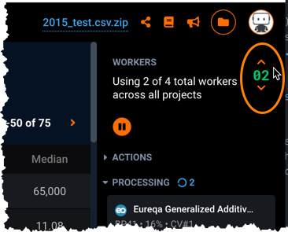
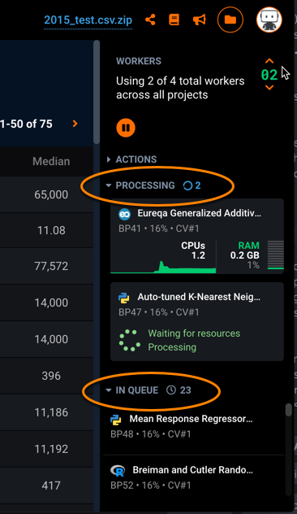
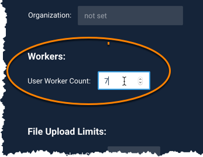
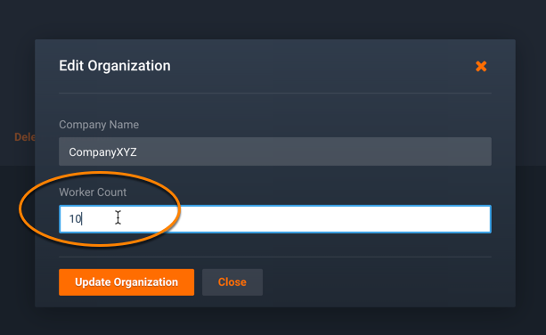
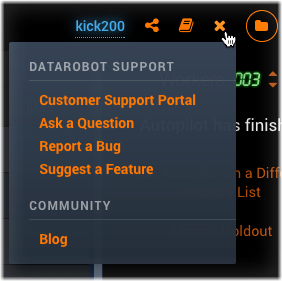

# Typical Admin workflow

At this point, support for various DataRobot features has been defined within the DataRobot deployment configuration, and you are ready to start using DataRobot. For a new installation, you will:

1. Log in using the default Admin account
2. Understand how the cluster is configured and which features are supported (see [default cluster settings](managing-platform.md#platform-configuration-settings))
3. Create user accounts, starting with your own
4. Set permissions for the Admin and users (see [descriptions of permissions and features](./permissions-features.md))
5. Configure organizations to control resources (optional)

  When ready, your users will be able to start using DataRobot to develop machine learning projects that generate predictions. You will monitor user and system activity, and perform other [common admin tasks](managing-platform.md#common-admin-tasks) to troubleshoot or prevent issues.

6. Monitor and manage the deployment
7. Troubleshoot issues as needed

# Project data processing and workflow

A "project" is the combination of the dataset used for model training and the models built from the dataset. DataRobot builds a project through several distinct phases.

During the first phase, DataRobot imports (uploads) the specified dataset, reads the raw data, and performs EDA1 (Exploratory Data Analysis) to understand the data. The next phase (EDA2) begins when the user selects a target feature from the dataset and starts the model building process. The result of EDA2 is a set of models, ranked in order of models with the best predictions first.

Training and developing models takes time and is resource intensive; the more models training at one time, the more system resources utilized and the greater the chances for resource contention.

## What are workers?

"Workers" are the processing power for the DataRobot Platform: for creating projects, training models, and developing predictions. They represent a portion of processing power allocated to a task. The DataRobot license provides for a set number of workers per node/cluster.

Different types of workers are utilized during the various project workflow tasks. Some worker types you may hear about include DSS workers (Dataset Service Workers), EDA workers, modeling workers, and quick workers. All workers, with the exception of secure/modeling workers, are based on system and license settings and available on first come, first served basis. Refer to the _Installation and Configuration guide_ for information about those worker types. This guide explains how to monitor and manage modeling worker counts and allocations.

Modeling workers are used during EDA2 to train the data on the specified feature and build models. During this phase, modeling worker allocation is key to building models quickly; more modeling workers means models will be built faster. (Note that modeling worker allocation is independent of hardware resources in the cluster.) The Admin and users each have some ability to modify modeling worker allocation.

**NOTE:** In a Hadoop cluster environment, workers are run within the Hadoop cluster and YARN manages all modeling worker allocation. These are not managed by DataRobot.

## How modeling workers are allocated

Each user is allocated 4 workers by default. This "personal worker allocation" means, at any one time, no more than 4 workers will be processing a user's tasks across all projects in the cluster. If a user has multiple browser windows running and DataRobot is building models in each, all tasks running in all windows are still restricted to the personal worker count. In other words, more windows will not provide more workers.

The number of workers allocated when a project is created is the "project worker allocation". This allocation stays with the project if it is shared; however, the target share user will still be restricted to their personal worker allocation.

For example, if a project owner has 12 personal workers allocated to a project and shares it with a user who has 4 personal workers allocated to the project, then the user sharing the project will have 4 workers available to develop models on that project. This example illustrates how a shared project may have more workers that a user's personal allocation, but that user is still restricted to their personal allocation worker count.

## Changing worker allocation during project workflow

The EDA workers used when importing and analyzing the dataset during EDA1 are set and controlled by the system; the Admin and users cannot increase allocation of these workers. Attempts to increase workers during EDA will not affect how quickly data is analyzed or processed during this phase.

During model development (EDA2), a user can increase the "workers" usage (using the worker toggle in the worker usage panel) so that more workers process the project in parallel, as long as there are workers available to that user (based on personal worker allocation).

**NOTE:** If the user's personal worker allocation is changed (decreased or increased), existing projects are not affected.

## Monitoring and managing worker counts

If a project is actively processing and training models, then it is using a portion of the allocated worker count; any jobs shown in the queue are waiting for available workers. Queued jobs will not move into processing when a project is paused or when there are no workers available to process them.

For example, this image shows 2 jobs in process while 23 are waiting to process (or, in queue):

The **Resource Monitor** provides a dashboard showing how modeling workers are being used across the cluster. The Admin can monitor worker usage to ensure workers are being shared as needed throughout the DataRobot users and determine when to make changes to worker counts.

In the [user's profile](intro.md#additional-user-settings), you can increase or decrease the number of workers available to process that user's modeling tasks.

If a user is having issues finishing project processing and you suspect your system is oversubscribed, you could ask the user to wait 5-10 minutes, or ask all users to stop submitting jobs until the issue is resolved, or use [Organizations](managing-users.md#managing-organizations) to apply group worker limits.

To ensure workers are available as needed and prevent resource contention, the Admin can add users to organizations that restrict access to workers. The Admin can set a cap on the total number of shared modeling workers the members of an organization can use in parallel. For example, you can create an organization of 5 users that has an allocation of 10 workers: for this organization, the 5 users can collectively use up to 10 workers at one time, and the group as a whole would be restricted to 10 workers at most at any given time, regardless of their personal worker allocations.

If a user with a personal allocation of 4 workers is defined in an organization with a worker allocation of 10 workers, the user can use no more than his personal allocation, i.e., 4 workers in this example.

How users contact you
-----------------------
When users have questions or issues, they can contact you through the megaphone  in the upper right navigation.

They can ask questions, report bugs, or suggest features through dialogs available from this dropdown. As part of contacting DataRobot Customer Support, users may send screenshots of their UI unless support for sending screenshots has been disabled within cluster configuration.
