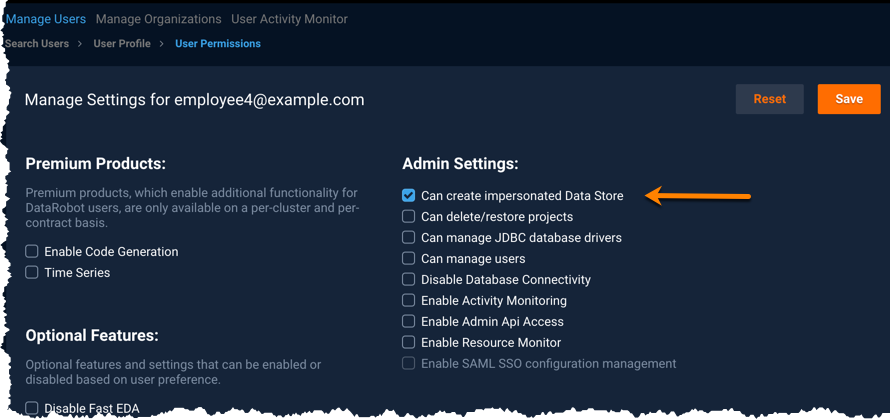

Managing Platform
======================

Common Admin Tasks
------------------
After user accounts have been [created](managing-users.md) and users are actively creating projects, building models, and so forth, you will need to use DataRobot admin tools to keep users and the DataRobot platform working effectively.

Some of the common tasks you may need to perform while maintaining your DataRobot cluster deployment:

* For locked-down systems, [restricting access to JDBC data stores](#restricting-access-to-jdbc-data-stores)

* Allocating worker resources, whether for [individual users](managing-users.md#additional-user-settings) or across groups of users ([via organizations](managing-users.md#creating-managing-organizations))

* Monitoring worker allocation [using the Resource Monitor](monitoring-resources.md#monitoring-resources)

* Monitoring user and system activity [using the User Activity Monitor and reports](monitoring-user-activity.md#monitoring-activity)

* [Deactivating or reactivating users](managing-users.md#deactivating-user-accounts)

* [Deleting or restoring projects](managing-projects.md#estoring-projects)

Understanding your Platform Configuration
-----------------------------------------
Premium Products and Enabled Features are those set within the cluster configuration. In the **Manage Settings** page (available from  User Profile, **Change Permissions**), you can see which products and features are set for your cluster; if you need to make any changes to any of these settings, contact Customer Support.

### Premium Products

Your cluster deployment may include some premium products based on your DataRobot contract. When included, premium products are available across the full cluster to all users. Any premium products configured for your deployment (within the `config.yaml`) are listed in the **Premium Products** section of this page. Possible premium products:

Product   | Description   |
--------- | ------------- |
**Enable Code Generation** | Supports exporting model scoring code for leaderboard models outside of the application. portable, high-throughput, and low-latency scoring; creates the exact same predictions as the original model.
**Time Series** | Automates the development of sophisticated time series models that predict the future values of a data series based on its history and trend.

### Enabled Configuration Features
Features enabled across the cluster are configured within the cluster configuration (`config.yaml`). These features are enabled for all users in the cluster, are not configurable via the UI, and cannot be set on a per-user basis. The settings shown here may be expected for  a typical cluster configuration:

Feature   | Description   |
--------- | ------------- |
(\*\*) **Enable Compliance Documentation** | Enables ability to generate and download Compliance Documentation. (**NOTE**: Starting with version 4.4, compliance documentation is enabled as part of the base product.)
**Enable multi-job Feature Impact** | Enables splitting feature impact computation into multiple queue jobs; the feature impact jobs can be split and run on multiple workers
**Enable Autopilot Run Entity** | Enables support for tracking autopilot run information
**Enable MMM Aggregation Features** | Enables MMM features that rely on aggregations
**Enable Time Series Zero-Inflated Modeling** | Enables support for zero-inflated modeling for Time-Series projects
**Enable MMM Improved Integrations Tab** | Enables access to the improved MMM Integrations tab (for model deployments)
**Show Uncensored Blueprints** | Enables uncensored blueprints, which are required for compliance documentation (for reference, in Managed API Cloud deployments uncensored blueprints are disabled by default)
**Enable do-not-derive for time series** | Enables the ability to set an individual feature as "do-not-derive", excluding it from feature derivation. Any feature that is not specified is handled using the standard time series feature engineering framework for creating a modeling dataset
**Enable Time Series Non Regular Datetime Modeling** | Enables non-regular datetime modeling for Time Series projects (for example, this enables time series projects to be built using datasets with irregular timestamps)
**Enable Advanced Tuning via the API** | Enables Advanced Tuning API to be used for non-Eureqa models; note that Advanced Tuning API is always enabled for Eureqa-based models
**Enable DataRobot Prime** | Enables the ability to download executable code that approximates a model so predictions may be made on data outside of DataRobot
(\*) **Enable Optional Multi-Factor Auth** | Enables support for opt-in features for multi-factor authentication
(\*) **Enable MMM email notification settings** | Enables support for email notifications (as part of prediction deployments)
(\*) **Classification & Regression** | Enables access to ordinary regression classification functionality; applies only when ordinary regression and classification functionality is present on the cluster
(\*) **Disable MMM training predictions** | Disables numerous data science improvements and features, including: PSI improvements, Covariate analysis, prediction explanations, feature impact, accuracy decay improvement, etc.

(\*) denotes features enabled by default for all for on-premise, or private/hybrid cloud deployments

(\*\*) denotes rarely disabled features

### Beta Features
These are beta level (CFDS preview) features and, as such, may change from release to release. If you would like to know more about these features, or if you would like to enable any of these features, you should contact your CFDS for more information about the feature and its implications for your system.

Restricting access to JDBC Data Stores
--------------------------------------

When using Kerberos authentication for JDBC, you can control access to data stores through validation and variable substitution.

### User setting
You can restrict the ability to create and modify JDBC Data Stores that utilize impersonation to only those users with the Admin Setting "Can create impersonated Data Store". Within cluster configuration (config.yaml), you can define impersonated keywords that are used by any installed drivers that support impersonation. These keywords could be used to define operations considered "dangerous" and therefore permitted to only select users. By default, no impersonation keywords are defined.

When a user attempts to create or modify a JDBC Data Store and there are impersonation keywords defined for the installation, DataRobot determines if the URI includes any of the keywords. If the URI includes one or more of the keywords and the user has the "Can create impersonated Data Store" Admin Setting, they are allowed to create or modify the JDBC Data Store. If keywords are included in the URI but the user does not have the "Can create impersonated Data Store" setting, then DataRobot will not allow the request to create or modify the JDBC Data Store.

### Variable substitution
The variable substitution syntax,`${datarobot_read_username}`, provides another way to control access to drivers. If that variable is included in the URI when trying to ingest from the data source/data store, DataRobot replaces it with the impersonated account associated with the logged in user.
