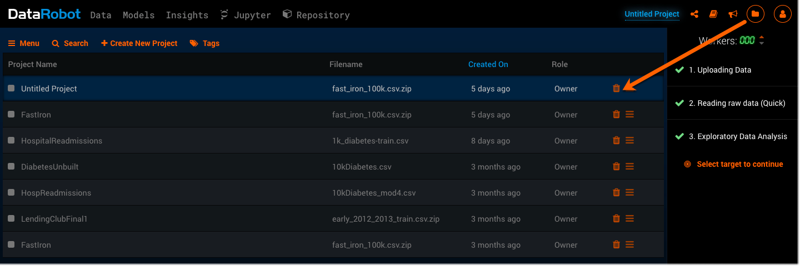
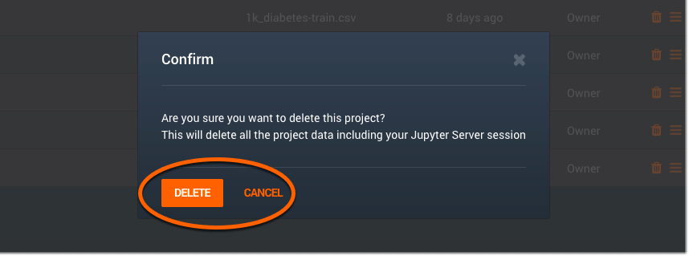
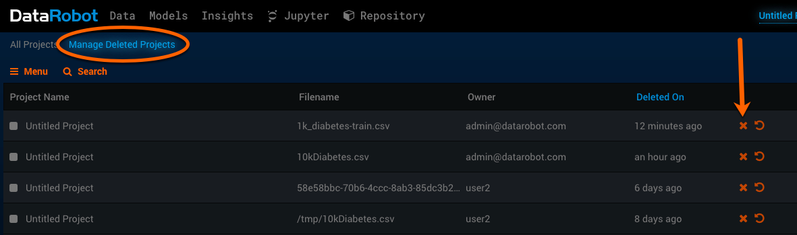
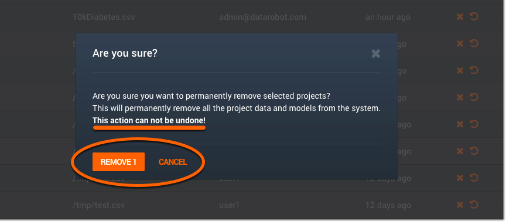
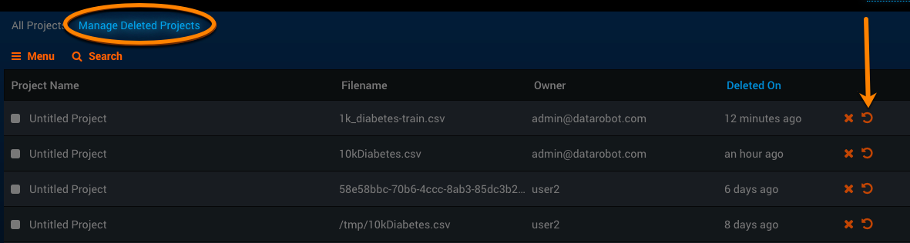

Managing projects
-----------------

###Permanently deleting projects

**NOTE:** Must be an Admin or have the Admin Setting "Can delete/restore projects".

Deleting projects is a valuable feature that can help clear space for new projects. If you are a project owner, you can delete that project; if you are a user of a shared project, you can leave the project but not delete it.

1. Click on the folder icon located on the top right corner of the application screen and select **Manage Projects**. This will take you to the **Manage Projects** page, which lists every project you’ve made on DataRobot:

	

	If you are the owner of this project, you see a trash can icon that allows you to delete the project. (If you are not the project owner, you see a button enabling you to leave the project.)

2. Click the trash can icon for the corresponding project to delete it. A confirmation screen will appear as a warning before you decide to complete the deletion.

	

	At this point, the project has been deleted, but it hasn't been _permanently_ deleted. In order to permanently delete a project, a few additional steps are needed.

3. Click on the **Manage Deleted Project** tab located next to **Manage Projects**. This is where all of the deleted projects are stored.
4. You will see a row of "X" icons located to the far right of each project. The "X" icon will permanently delete the project:

	

5. Click on the "X" icon to permanently delete the project. Another warning message will appear before the project is permanently deleted, in case you change your mind and want to keep it:

	

**NOTE:** Once you delete a project from the **Manage Deleted Projects** page, it is permanently deleted and cannot be recovered.

###Restoring projects
You can also restore a project that's been deleted from the **Manage Deleted Projects** page.

Once you’ve deleted a project from the **Manage Projects** page, click on the **Manage Deleted Projects** tab. Any and all of the deleted projects on this page can be restored.

To the right of the “X” (permanently delete) icon is a circular back arrow pointing in a counter-clockwise direction. This arrow icon allows you to restore a deleted project, and bring it back to the **Manage Projects** page.

Click the back arrow icon for the project you want to restore:

A screen will appear to make sure that you want to follow through with the restoration. You can complete the restoration by clicking **Restore 1 project** or cancel the process by clicking **Cancel**:

**NOTE:** Once a project is deleted from the **Manage Deleted Projects** page (by clicking the "X" icon), it is deleted permanently and cannot be restored.
