
Managing User Accounts
======================

The DataRobot deployment provides support for 3 types of user accounts:

User Account Type | Description
------ | -----------
**Internal** (1) | This is the default DataRobot Admin account which authenticates using `admin@datarobot.com`. This account has full Admin access to the deployed cluster. You cannot revoke Admin privileges; the only change you can make to this account is password updates.
**Local authentication** (2) | These are user accounts you create manually (through **Manage Users**). DataRobot provides restrictions for login and password settings. The login credentials for these locally-authenticated users are stored as fully qualified domain names.
**LDAP authentication configuration** (3) | These user accounts are created through an authentication integration with a defined LDAP directory service; you do not use the DataRobot UI to create these user accounts. When these users sign into DataRobot for the first time, their user profiles are created and saved in DataRobot but their passwords are not; this happens only one time, with the initial login. Usernames for these LDAP-authenticated users are usernames and not fully qualified domain names.

**NOTE:** If a user is removed from the LDAP Directory server or group, they are not able to access DataRobot; however, the user account remains untouched.

Creating user accounts
----------------------

**NOTE:** This workflow applies to local authentication user accounts only; this UI is hidden for LDAP authentication configuration.

As an Admin, you can create and add new users to DataRobot, as long as you already have the “Can manage users” Admin Setting enabled on your own profile. This allows the Admin to manage who can and cannot access DataRobot.

**NOTE:** The first user account you should create is one for yourself, so that you can access DataRobot as a user in addition to using the default Admin account.

1. Click the profile icon in the top right corner of the application screen, and select **Manage Users** from the dropdown menu:

	

2. Click **Add New User** at the top of the displayed page.

	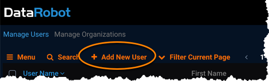

3. In the displayed dialog, enter the email address, first name, and password for the new user you want to add (other account settings are optional at this point).

	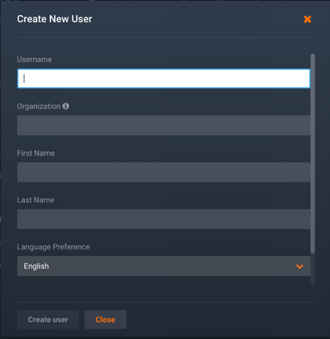

4. Click **Create user** when you're done, and then click **Close**.

You'll see the new user listed in in the users table.

Setting Admin user permissions
-------------------------------------

The Admin can set permissions and settings for both themselves and other DataRobot users within the company. These permissions give the Admin access to a list of features that can be enabled or disabled per person, as needed. (If needed, see a description of all [supported Admin Settings and Optional Features](permissions-features.md).)

Below are the steps to enable Admin access for any user. This user will have Admin access to all DataRobot functionality configured for this cluster.

1. Browse to the **Manage Users** page (if not already open) and locate the user. You can use the **Search** feature if there are a lot of users to search through:

	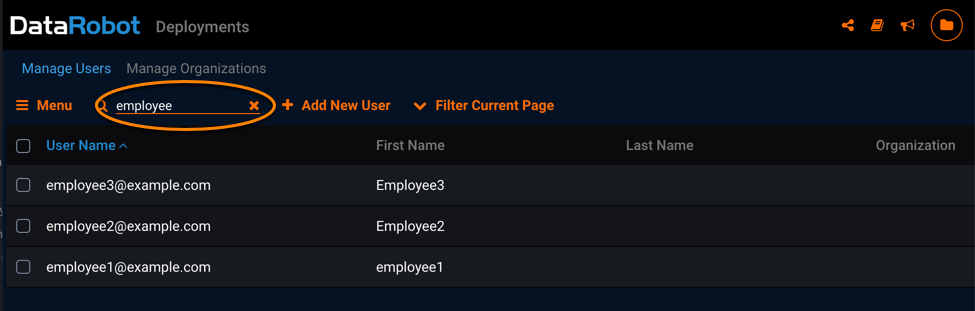

2. Select the user to open the user's profile page.

3. Click **Change Permissions**.

	

	This displays the **Manage Settings** page for this user:
	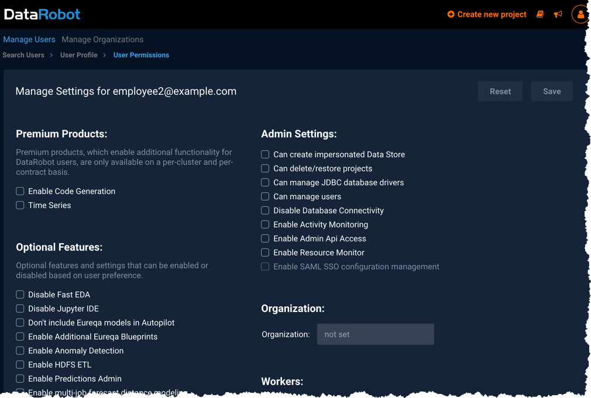

4. Select the “Can manage users” Admin Setting listed underneath **Admin Settings**, and then click **Save** (located on the far right) to ensure the permission change is set:

	

This user now can modify settings for other users by following these same instructions. (If currently logged in, the user does not need to logout and log in again.)

At any point, if you want to disable the “Can manage users” Admin Setting for this user, simply uncheck the box and click **Save**; the user will no longer have Admin capabilities.

Setting user permissions
------------------------

To set permissions and supported features for users, you repeat the previous process except, instead of giving the user the "Can manage users" Admin Setting, you make selections from the other features and permissions shown in the user's **Manage Settings** page.

For each user, you can select to add the various [Admin Settings and Optional Features](permissions-features.md) to enable them to use DataRobot features or monitor/manage selected functionality. For your reference, see the descriptions of all [supported Admin Settings and Optional Features](permissions-features.md).

**NOTE:** Make sure you consider and control how you provide "Admin Settings" to non-Admin users. One way to do this is to add settings only on an as-needed basis and then remove them setting when related tasks are completed.

Make sure to click **Save** (located on the far right) to save the permission changes.

Additional user settings
------------------------

Also from the user's **Manage Settings** page you can set an organization, number of workers, and file upload size limit for this user.

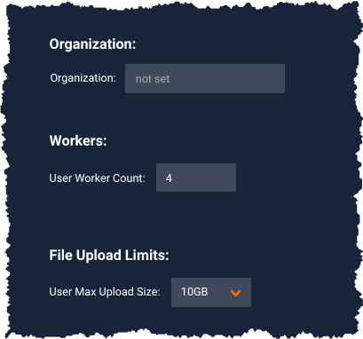

Some notes:
* Organization - Sets an organization for the user, if you wish to restrict their access to workers. Organization membership is not a requirement for DataRobot users.  Users can be defined in only one organization at a time; if you change the organization for a user, they will be removed from the other organization. If you have not yet [created organizations](managing-users.md#creating-organizations), you need to do that first.

* User Worker Count - Sets the [personal worker count](intro.md#how-workers-allocated) for this user, which is the maximum number workers available to this user at all times.

* File Upload Limits - Sets a cap on the size of datasets this user can upload. The default size is 10GB.

Changing passwords
-----------------------

You can change passwords for [Internal and Local auth user accounts](intro.md#managing-user-accounts). If LDAP authentication configuration is configured for the cluster, you will not be able to change the password for any of the user types. This means you would also not be able to change the password for the admin@datarobot.com account. If you need help generating a new password for the default Admin, contact Customer Support.

#### Change your own password

1. Click the profile icon located on the top right corner of the screen to expand a dropdown menu of profile options. Click **Settings**.

	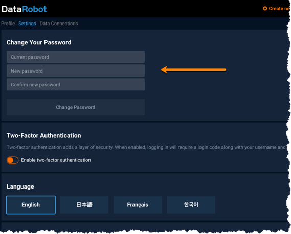

2. In the displayed page, enter your current password. Then, enter your new password two times - once to create it, and a second time to confirm it.

	**NOTE:** You will receive an error message if your current password is incorrect, and/or if the new and confirmed password fields do not match each other.

3. Click **Change Password** when you have successfully completed the fields. DataRobot will briefly display a message indicating the successful update.

**NOTE:** DataRobot enforces the following password policy for new accounts and password changes:

- Only printable ASCII characters
- Minimum one capital letter
- Minimum one number
- Minimum 8 characters
- Maximum 512 characters
- Username and password cannot be the same

#### Change a user's password

1. Browse to the **Manage Users** page (if not already open) and locate the user.

2. Select the user to open the user's profile page.

3. Click **Change Password**.

	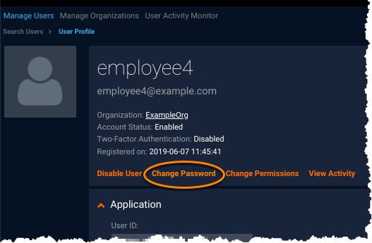

4. In the displayed page, enter a new password twice. To see the passwords, click **Show Password**.

	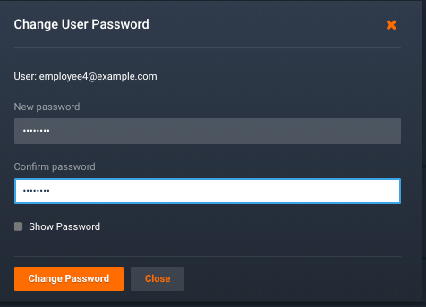

5. When finished, click **Change Password**.

Deactivating user accounts
---------------------------

You cannot delete a user account from DataRobot: this ensures that your company's data is not lost, regardless of employee movements over time.

However, the Admin can block a user's access by simply searching for the user, and clicking the padlock icon next to their name so that it is in a closed or "locked" state.

In this way, the user is now disabled and cannot log back into the system. However, the data and projects they worked on will remain intact. You can later restore the user's account to access DataRobot by re-opening or "unlocking" the padlock icon.

Here is an example that shows what the padlock icons look like for various users:

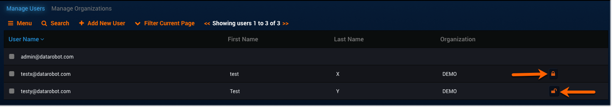

You can also disable a user by going into any user’s profile and clicking the **Disable User** button on that page. When you disable a user in this way, the button will automatically change and say **Enable User**, which you can then click again to make this user active.

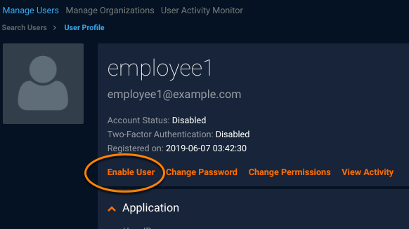

Managing Organizations
----------------------

The Admin can create organizations as a way to manage [worker allocation](intro.md#typical-admin-workflow) for groups of users so resources are controlled across the company. This is the sole purpose for organizations and they should be used only for that purpose. The ability to create and manage organizations is available to the Admin or to any users who have the "Can manage users" Admin Setting.

A user can belong to only organization at a time, and membership in an organization is optional.

Organizations are used to apply limits on the total number of workers that can simultaneously be used by all members of the organization.

Creating organizations
----------------------

1. Click the profile icon located on the top right corner of the screen to expand a dropdown menu of profile options. Click **Manage Organizations**:

	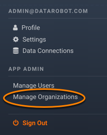

	The displayed **Manage Organizations** page is where the Admin can create and store organizations. There is also a **Search** feature to make finding specific organizations easier.

	An organization can have zero users when it is first created and also when all of the members have been removed – it just depends on the organization’s needs as they can change over time.

2. Click **Add Organization** (located next to the **Search** feature).

	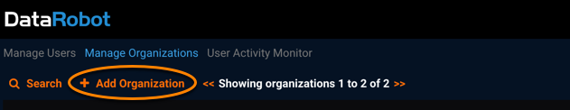

3. Enter a name and number of workers for the organization:

	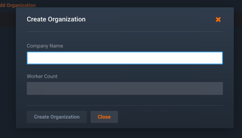

4. When the form is complete, click **Create Organization** and then click **Close** in the summary page. The new organization will appear in the organizations list.

**TIP:** To avoid worker resource issues, make sure to set the sum of workers for all organizations to less than the capacity of the system.

Adding users to organizations
-----------------------------

The Admin can also add and remove users to and from any defined organizations. This process can also be done in two ways: 1) on the **Manage Organizations** page, 2) through the user’s own profile page.

When a user is added to an organization from the **Manage Organizations** page, an invite will be sent to that user to specify which organization they've been initially added to. This initial setup can only be done through the **Manage Organizations** page.

Editing a user’s organization status through that user's own profile page is a simple change that can happen after the initial setup is complete.

1. Click the profile icon located on the top right corner of the screen to expand a dropdown menu of profile options. Click **Manage Users**:

	

2. Select the user who needs to have their organization permissions edited. This will take you to the **User Profile** page.

3. Click **User Permissions**.

4. Locate the **Organization** field and type the name for the organization. As you type, organization names starting with the same letters are shown:

	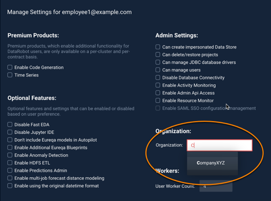

5. Select the organization you want to add the user to, and click **Save**.

When you next look at this user's profile, you see the organization to which that user was added.

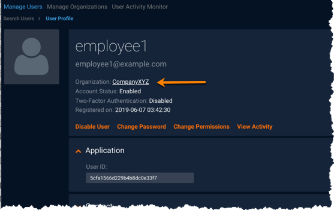

Deleting organizations
----------------------

You can delete an organization only if it has no members.

1. Click the profile icon located on the top right corner of the screen to expand a dropdown menu of profile options. Click **Manage Organizations**.

2. In the displayed **Manage Organizations** page, select that organization to open the profile page for the organization.

3. If there are defined users for the organization, you need to remove them (by clicking the "X" in the users list) before you can delete the organization:

	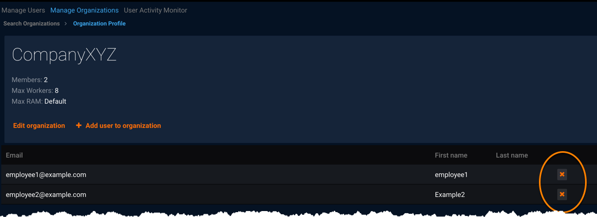

4. Click **Delete organization** (only shown if there are no defined members).

	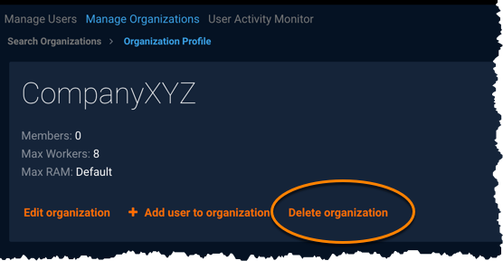
