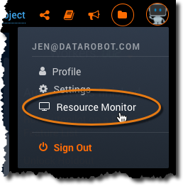
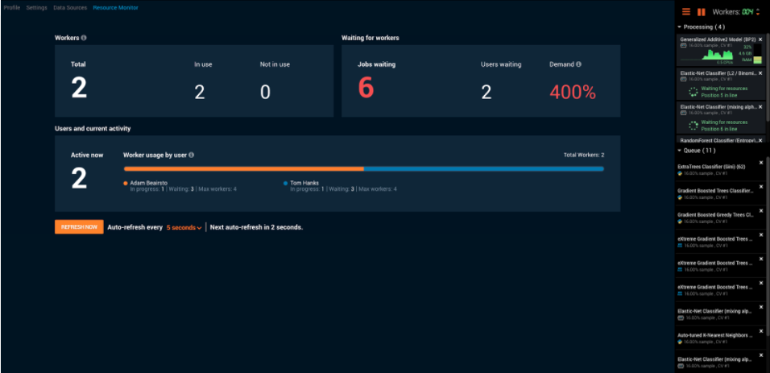
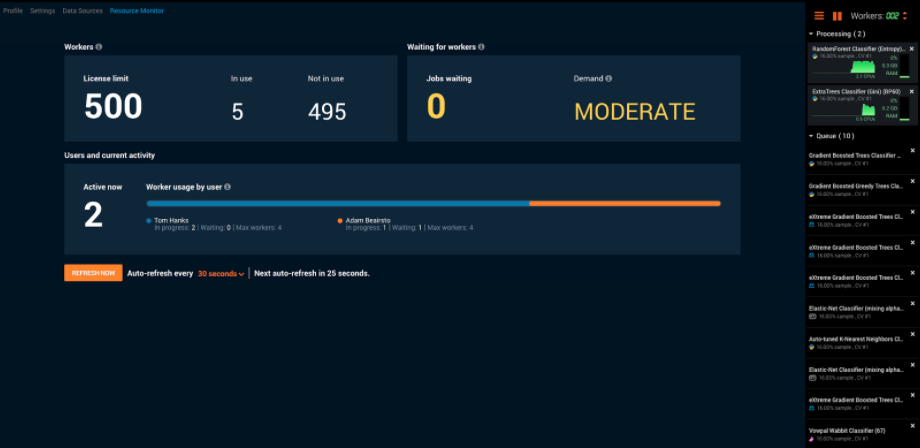
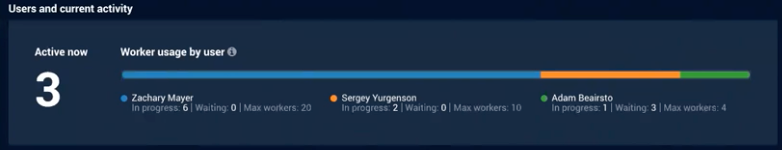

Monitoring Worker Resources
=============================

**NOTE:** Must have Admin Setting "Enable Resource Monitor".

# Monitoring modeling worker usage

The Resource Monitor provides users with visibility into DataRobot's active modeling workers across the installation. It provides general information about the current state of the application, such as whether it is ready to do work and which users are connected. It also contains specific information about the status of components: what is expected to be running and what is currently running. With this service in place, an Admin can easily track user activity on each project and know when DataRobot has available resources to begin working.

The monitor provides an estimation of where and when you are expending DataRobot resources, highlighting, for example:

* reasons behind modeling time (what is currently running and what is started but waiting for a worker)
* frequent users
* long running or delayed projects.

Additionally, monitoring resources over time helps to determine whether your organization has the correct number of modeling workers to meet usage needs.

Access the Resource Monitor from the Account Settings dropdown:

## Basic modeling worker terminology

The Resource Monitor reports on the system’s queue and workers, both overall and for individual users. Following is the terminology used to describe DataRobot activity:

Term | Description
----- | -----------
Jobs | The tasks DataRobot completes with workers, such as model building and certain calculations. Statistics are based on jobs.
Modeling worker | Jobs displayed in the Worker Queue, such as model building or Feature Impact calculations. Other worker tasks, for example, EDA, do not use modeling workers.
In Progress (or running) | A job that has received a worker and is currently executing on the worker.
Waiting for resources (or waiting for worker) | A job that is ready to execute, but has not yet received a worker. These jobs appear as “Waiting for worker” in the Processing section of the Worker Queue.
Queued | A job that is in the queue but is not ready to execute. These jobs appear in the Queue section of the Worker Queue.
Active User | A user that is the owner of at least one in-progress or waiting job.

Specifically, the Resource Monitor provides the number of currently running jobs, number of allowed concurrent jobs, and number of jobs waiting for a worker. Additionally, the tool provides information on which specific users are employing system resources. The Resource Monitor differs slightly between Standalone and Hadoop-integrated installations. Refer to your organization's installation type, below, for details.

## Using the Resource Monitor in a Standalone installation

The Resource Monitor in a standalone installation provides an at-a-glance view of modeling-worker jobs requested of DataRobot.

The following table describes the fields displayed by the standalone version of the Resource Monitor. You can use the options of the refresh function to redisplay results at any time.

<table>
  <tr>
    <td>Field</td>
    <td>Displays...</td>
  </tr>
  <tr>
    <td align="center" colspan="2"><em>Workers</em></td>
     <tr>
    <td>Total</td>
    <td>Total number of workers allocated to the installation.</td>
  </tr>
  <tr>
    <td>In use</td>
    <td>Number of workers currently in use across the system.</td>
  </tr>
   <tr>
    <td>Not in use</td>
    <td>Number of workers not currently in use and therefore available.</td>
  </tr>
<tr>
    <td align="center" colspan="2"><em>Waiting for workers</em></td>
     <tr>
    <td>Jobs waiting</td>
    <td>Number of queued jobs.</td>
  </tr>
  <tr>
    <td>Users waiting</td>
    <td>Number of individual users with at least one job waiting.</td>
  </tr>
   <tr>
    <td>Demand</td>
    <td>Number of jobs trying to run vs. the number allowed by the organization's license (capacity). To calculate, add all <em>In progress</em> and <em>Waiting</em> jobs for all active users and divide that value by the total number of available workers. </td>
  </tr>
  <tr>
    <td align="center" colspan="2"><em>Users and current activity</em></td>
     <tr>
    <td>Active now</td>
    <td>Number of users with a job running or waiting that requires a modeling worker. This value matches the total of the <em>In use</em> and <em>Jobs waiting</em> fields.</td>
  </tr>
  <tr>
    <td>Worker usage by user</td>
    <td>Graphic and breakdown of per-active-user usage. (See Interpreting "Worker usage by user".)</td>
  </tr>
   </table>

## Using the Resource Monitor in a Hadoop-integrated installation

In a Hadoop-integrated cluster environment, workers are run within the Hadoop cluster and YARN manages all modeling worker allocation. These are not managed by DataRobot.

The Resource Monitor in a Hadoop-integrated installation provides two types of usage reports. The top half of the display reports on all DataRobot jobs in Hadoop (including, for example, EDA), not just modeling worker jobs. The bottom half reports only modeling-worker jobs, such as model building or Feature Impact calculations. As a result, the top half and bottom half metrics may not match, which is not an indication of error.

When you submit a job in Hadoop, DataRobot first checks the request against your organization's license (defining the number of Hadoop jobs that can run concurrently). Once under the DataRobot job limit, DataRobot submits the job to Hadoop, where it competes for Hadoop resources from among all applications making Hadoop service requests. In other words, allowance by DataRobot to run does not translate to availability on the system-wide Hadoop cluster. DataRobot can measure and report on jobs submitted but cannot provide statistics on its own position within the cluster requests or the status of whether a job is waiting or running.

The following table describes the fields displayed by the Hadoop version of the Resource Monitor. You can use the options of the refresh function to redisplay results at any time.

<table>
  <tr>
    <td>Field</td>
    <td>Displays...</td>
  </tr>
  <tr>
    <td align="center" colspan="2"><em>Workers</em></td>
     <tr>
    <td>License limit</td>
    <td>Total number of workers allocated to the organization.</td>
  </tr>
  <tr>
    <td>In use</td>
    <td>Number of total DataRobot jobs (not just modeling jobs) submitted to Hadoop. This value includes jobs that are either running or waiting for resources.</td>
  </tr>
   <tr>
    <td>Not in use</td>
    <td>Number of workers available for processing DataRobot-related jobs.</td>
  </tr>
<tr>
    <td align="center" colspan="2"><em>Waiting for workers</em></td>
     <tr>
    <td>Jobs waiting</td>
    <td>Number of queued jobs.</td>
  </tr>
   <tr>
    <td>Demand</td>
    <td>An estimate of the current Hadoop load on the system, either LOW, MODERATE, or HIGH, based on space availability on the Hadoop cluster. DataRobot cannot report exact numbers because resource load includes non-DataRobot processes for which the application does not have status access. When HIGH, new jobs will be in state "waiting for resources" until demands lessens.</td>
  </tr>
  <tr>
    <td align="center" colspan="2"><em>Users and current activity</em></td>
     <tr>
    <td>Active now</td>
    <td>Number of users with a job running or waiting that requires a modeling worker.</td>
  </tr>
  <tr>
    <td>Worker usage by user</td>
    <td>Graphic and breakdown of per-active-user usage. (See Interpreting "Worker usage by user".)</td>
  </tr>
   </table>

## Interpreting "Worker usage by user"

The <em>Users and current activity</em> section reports on users that are actively using the system. An active user is one that has at least one running or waiting job. The bar graph is a quick visual indicator of usage, with active users listed below it. For each user name, DataRobot displays:

* <em>In progress</em>: the number of in-progress jobs. The number of jobs a user can have in progress is determined by both system availability and the individual allowance.
* <em>Waiting</em>: the number of jobs awaiting an available worker.
* <em>Max workers</em>: an individual's worker allowance. This value corresponds to the maximum setting of the **Workers** value at the top of the Worker Queue.

## Using the refresh function

DataRobot refreshes the Resource Monitor display at the interval selected from the dropdown. Expand the dropdown to change the interval or click the Refresh Now button to immediately update the page.
