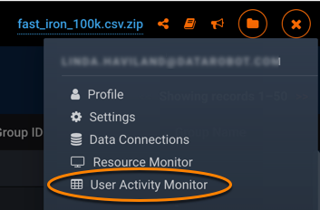
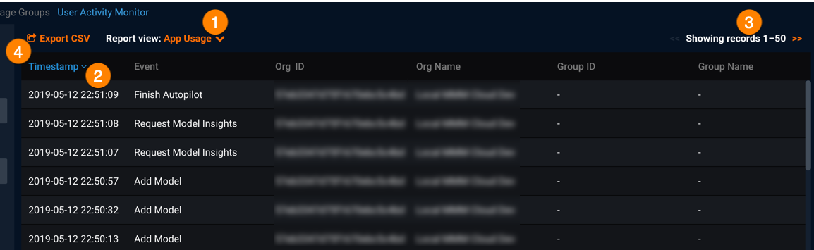
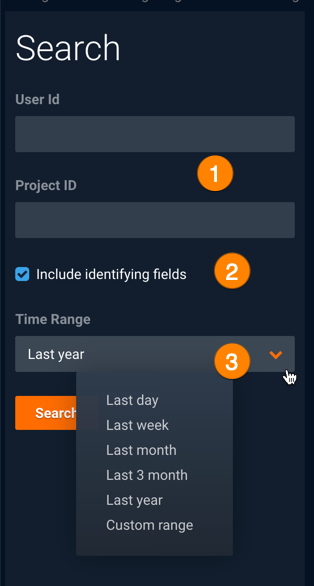
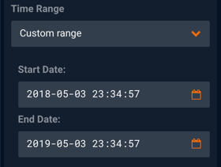
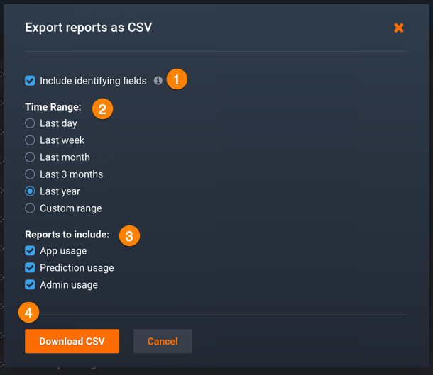

Monitoring User Activity
==========================

The User Activity Monitor provides users with a tool for accessing and analyzing the various usage data DataRobot collects during model development, deployment, and predictions.

You can use this information to understand how DataRobot is being used, troubleshoot model or prediction errors, monitor user activities, and more. User activity data is available for review online and can be downloaded for offline use as CSV files. Filters enable you to access and limit data records to specified timeframes, users, and projects. Additionally, you can exclude sensitive "identifying information" like user names, IP addresses, project names, etc. from generated reports. The information provided in these reports proves invaluable to DataRobot Support when understanding your Enterprise system and resolving issues.

Access the User Activity Monitor from the Account Settings dropdown:

## Types of user activity data
DataRobot continually collects information around user and system events, and makes this information available to you as reports you can view online and download from the User Activity Monitor. Three types of user activity are available: Admin, App, and Prediction. Filters enable you to restrict the user activity data in a report to specific users and projects during defined time ranges. In addition, you can export selected user activity data to CSV files.

Report type | Description
----- | -------------------
[Admin Usage](report-admin-usageactivity.md) | Provides a report of all administrator-initiated audited events. Information provided by this report can identify who modified an organization or an account and what changes were made.
[App Usage](report-app-usageactivity.md) | Provides information related to model development. This report can show models by user and identify the most commonly created types of models and projects, average time spent fitting each type of model, etc.
[Prediction Usage](report-pred-usageactivity.md) | Provides a report with data around predictions and deployments. Information provided by this report can show how many models a user deployed, how predictions are being used, error codes generated for prediction requests, which model types generate the most predictions, and more.

## Viewing user activity and events
When you open the User Activity Monitor, you see the 50 most recent application usage events for all users by default (with the most recent event listed first). You can change the displayed report and view different report data.

Component| Description of use
----- | -------------------
**Report view** (1) | Use to select a different report view: <em>App Usage</em>, <em>Admin Usage</em>, or <em>Prediction Usage</em>.
**Timestamp** (2) | Select to sort all records, in all pages, in ascending or descending timestamp order.
**<<** or **>>** (3) | Use to page forward or backward (respectively) through the records. For example, clicking **>>** will show records for earlier events.
**Export CSV** (4) | Use to download activity data for export to CSV files.

### Searching report preview

Use values in the Search dialog to filter the data returned for the selected online report view. Specify the filter values and click **Search** to apply the filter(s); the User Activity Monitor preview updates to show all records related to the filters. Note that these search values apply to the online report preview only.

Component| Description of use
----- | ----------------------
(1) | You can filter by a User ID and/or Project ID as follows: You can filter App Usage activity and Prediction Usage activity reports using either, or both, of these filters; you can filter the Admin Usage activity report by User ID. (If needed, you can copy the UID or Project ID values from the report preview and paste in the related search field(s).)
(2) | If checked, <em>identifying information</em> about users, projects, datasets, organizations, and so forth are shown in the preview. If DataRobot Customer Support will be accessing this report, you may consider this information "sensitive" and choose to exclude (hide) it. The columns will show in the report without values. (See the description of each report to determine the identifying information for that report ( [Admin Usage](report-admin-usageactivity.md), [App Usage](report-app-usageactivity.md), [Prediction Usage](report-pred-usageactivity.md).)
(3) | Use **Time Range** to limit the number of records shown in the preview. You can select one of the predefined time ranges, such as **Last month**, or you can specify a custom time range using the datetime picker. (See "Previewing the Prediction Usage activity report" for the restrictions when previewing the Prediction Usage activity report.)
**Search** | Use to generate the online preview of the selected report using the selected search filters.

To specify a custom range, click the **Start Date** field, use the calendar and time controls to select the starting date and time for the records, and then click **OK**. Repeat these steps for the **End Date**.

### Previewing the Prediction Usage activity report

 DataRobot can display (online report preview) up to 24 hours of data for the Prediction Usage activity report. When applying a time range search filter for the Prediction Usage activity report, select **Last day** or define a custom time range of 24 hours or less. Note that this applies only when previewing the Prediction Usage activity report online; when downloading Prediction Usage activity report data, you can select any of the **Time Range** values provided in the **Export reports as CSV** dialog.

## Saving and downloading user activity data

Use **Export CSV** to generate and download selected usage activity reports. When exporting reports, you will be prompted to filter records for report download. (The search fields for report preview do not also filter records for report download.)

The **Export reports as CSV** dialog prompts you to configure and download reports.

Component | Description
------ | -----------
(1) | Use the checkbox to include or exclude identifying information in the downloaded report.
(2) | Specify the time range of records you want to include in the report. The end time for each of these ranges is the current time. For example, **Last day** will create reports with data starting from 24 hours ago and ending at the current time.
(3) | Select one or more reports to download.
(4) | Click **Download CSV** to save the selected report(s) to your local machine. When the report(s) have  downloaded successfully, you will see the message "Report generation was successful".

Whether you select to include one or all reports in the export, DataRobot creates an archive file (ZIP file) and downloads that to your local machine. The file is named with a randomly-generated hash value and the current date (year-month-day). Within the ZIP file, you will find CSV files for the usage reports you selected for download. The filename for each of the CSV reports includes the DataRobot version number, current date, and type of data for the report.
