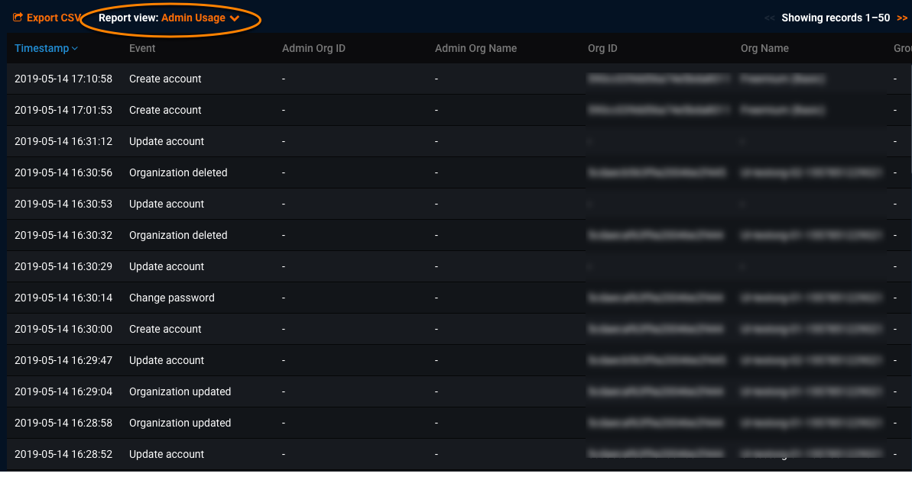

Admin Usage activity report reference
===============================================

When previewing the Admin Usage activity report, you see information similar to the following:

You can download the report using [Export CSV](monitoring-user-activity.md#exportcsv). When exporting reports, you will be prompted to filter records for report download. (The filters you apply when previewing the report apply only to the online preview.)

Both versions of the Admin Usage activity report (online preview and download) provide the following data about administrator operations and activities. Each row relates to a single audited administrator activity.

Report field | Description
------ | -----------
**Timestamp** | Timestamp when the administrator event occurred
**Event** | Type of administrator event, such as Create Account, Organization created, Change Password, Update Account, etc.
**Admin Org ID** | ID of the user's administrator organization
**Admin Org Name** | Name of the user's administrator organization
**Org ID** | ID of the user's organization
**Org Name** (\*) | Name of the user's organization
**Group ID** | ID for this user's group
**Group Name** | Name of the user's group
**Admin UID** | Admin ID for this user (if applicable)
**Admin Username** | Admin username for this user (if applicable)
**UID** | ID for this user
**Username** (\*) | Username for this user
**Old values** (\*) | User account settings before the admin made changes. For example, if the admin activity changed the workers for the related user, this field shows the "max_workers" value <em>before</em> the change.
**New values** (\*) | User account settings after the admin made changes. For example, if the admin activity changed the workers for the related user, this field shows the "max_workers" value <em>after</em> the change.

(\*) denotes an [identifying field](monitoring-user-activity.md#sensitive) for this report
