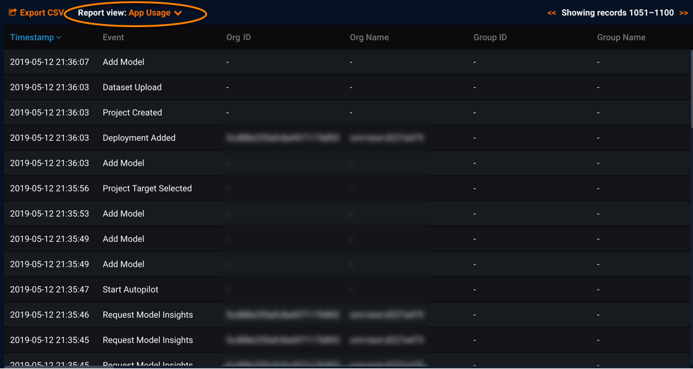

Application Usage activity report reference
===============================================

When previewing the App Usage activity report, you see information similar to the following:

You can download the report using [Export CSV](monitoring-user-activity.md#exportcsv). When exporting reports, you will be prompted to filter records for report download. (The filters you apply when previewing the report apply only to the online preview.)

Both versions of the App Usage activity report (online preview and download) provide the following data about application events. Each row relates to a single audited application event.

Report field | Description
------ | -----------
**Timestamp** | Timestamp when the application event occurred
**Event** | Type of application event, such as Add Model, Compliance Doc Generated, aiAPI Portal Login, Dataset Upload, etc.
**Org ID** | ID of the user's organization
**Org Name** (\*) | Name of the user's organization
**Group ID** | ID of the user's group
**Group Name** (\*) | Name of the user's group
**UID** | ID of the user
**Username** (\*) | Name of the user
**User Role** | Role for the user who initiated the event; values include OWNER, USER, OBSERVER
**Project ID** | ID of the project
**Project Type** | Type for the related project; possible values include Binary Classification, Regression, Time Series - Regression, Multiclass Classification, etc.
**Project Name** (\*) | Name of the project
**Metric** | Optimization metric for the related project; potential values include LogLoss, RMSE, AUC, etc.
**Partition Method** | Partition method for the related project (i.e., how data is partitioned for this project)
**Target Variable** (\*) | Target variable for the related project (i.e., what DataRobot will predict)
**Model ID** | ID of the model
**Model Type** | Type for the model; this also is the name of the model or blueprint
**Sample Type** | Type of training sample for the project; values may include Sample Percent, Row Count, Duration, etc.
**Sample Length** | Amount of sample data for training the project; values are based on Sample Type and may be percentage, number of rows, or length of time
**Model Fit Time** | Amount of time (in seconds) used to build the model
**Recommended Model** | Identifies if this is the recommended model for deployment (true) or not (false)
**Insight Type** | Type of insight requested for this model; possible values may include Variable Importance, Compute Series Accuracy, Compute Accuracy Over Time, Dual Lift, etc.
**Custom Template** | Identifies if the compliance document (for the event) was developed with a custom template (true) or not (false); applies to Compliance Doc Generated events
**Deployment ID** | ID for the deployment; applies to Replaced Model events
**Deployment Type** | Type of deployment; applies to events such as Replaced Model and Deployment Added, and possible values include Dedicated Prediction (deployment to a dedicated prediction server) or Secure Worker (in-app modeling workers used for predictions)
**Client Type** | Client (DataRobotPythonClient or DataRobotRClient) used to interface with DataRobot; applies to events such as DataSet Upload, Project Created, Project Target Selected, Select Model Metric, etc.
**Client Version** | Version of the related client (DataRobotPythonClient or DataRobotRClient)
**Catalog ID** |  <em>Placeholder</em>
**Catalog Version** | <em>Placeholder</em>
**Dataset ID** | ID of dataset
**Dataset Name** (\*) | Name of dataset
**Dataset Size** | Size of project dataset
**Materialized State** | <em>Placeholder</em>
**Grantee** | <em>Placeholder</em>
**With Grant** | <em>Placeholder</em>

(\*) denotes an [identifying field](monitoring-user-activity.md#sensitive) for this report
