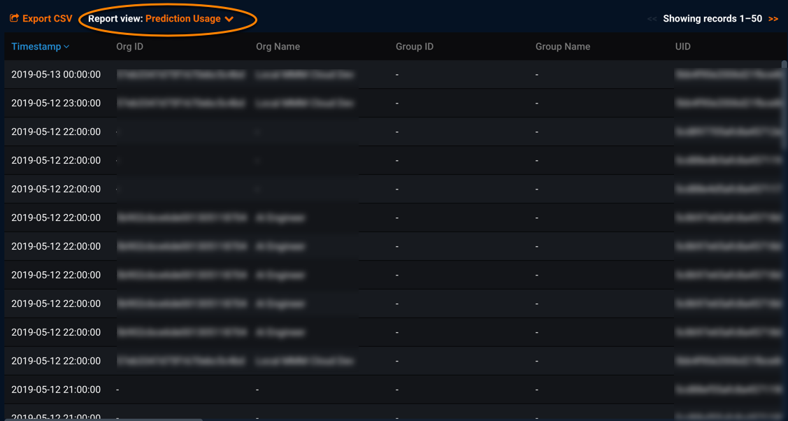

Prediction Usage activity report reference
===============================================

When previewing the Prediction Usage activity report, you see information similar to the following:

You can download the report using [Export CSV](monitoring-user-activity.md#exportcsv). When exporting reports, you will be prompted to filter records for report download. (The filters you apply when previewing the report apply only to the online preview.)

Both versions of the Prediction Usage activity report (online preview and download) provide the following data about prediction statistics. Each row relates to a single audited prediction statistic event.

Report field | Description
------ | -----------
**Timestamp - UTC** | Timestamp when the prediction event occurred
**UID** | ID for the user who initiated this event
**Username** (\*) | Name for the user who initiated this event
**Project ID** | ID of the project
**Org ID** | ID of the user's organization
**Org Name** (\*) | Name of the user's organization
**Group ID** | ID of the user's group
**Group Name** (\*) | Name of the user's group
**User Role** | Role for the user who initiated the prediction event; values include OWNER, USER, OBSERVER
**Model ID** | ID of the model
**Model Type** | Type for the model; this also is the name of the model or blueprint
**Blender Model Types** | Type of blender model, if applicable
**Recommended Model** | Identifies if this is the recommended model for deployment (true) or not (false)
**Project Type** | Type for the project; possible values include Binary Classification, Regression, Time Series - Regression, Multiclass Classification, etc.
**Deployment ID** | ID of the deployment
**Deployment Type** | Type of deployment; possible values include dedicated (deployment to a dedicated prediction server) or Secure Worker (in-app modeling workers used for predictions)
**Dataset ID** | ID of the dataset
**Prediction Method** | Method for making predictions for the related project; possible values are Modeling Worker (predictions using modeling workers) or Dedicated Prediction (predictions using dedicated prediction server)
**Prediction Explanations** | Identifies if Prediction Explanations were computed for this project model (true) or not (false)
**# of Requests** | Number of prediction requests the deployment has received (where a single request can contain multiple prediction requests); provides statistics for deployment service health
**# Rows Scored** | Number of dataset rows scored (for predictions) for this deployment
**User Errors** | Number of user errors (4xx errors) for this deployment; provides statistics for deployment service health
**Server Errors** | Number of server errors (5xx errors) for this deployment; provides statistics for deployment service health
**Average Execution Time** | Average time (in milliseconds) DataRobot spent processing prediction requests for this deployment; provides statistics for deployment service health

(\*) denotes an [identifying field](monitoring-user-activity.md#sensitive) for this report
