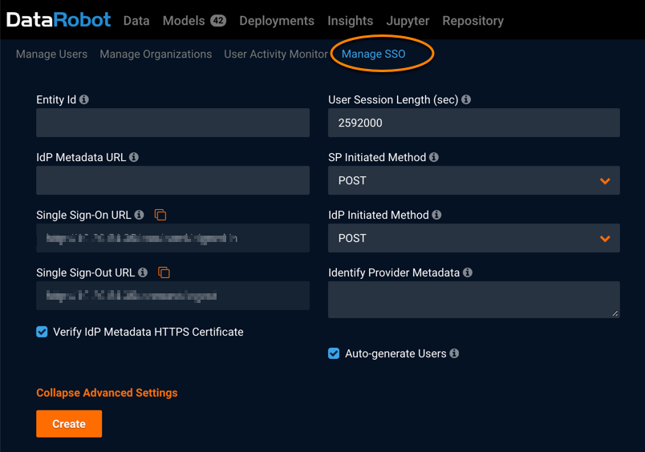

Configuring SSO SAML for users
------------------------------
**NOTE:** This configuration is applicable only if the cluster configuration includes the feature "Enable SAML SSO configuration management".

DataRobot can use external services (Identity Providers, or IdP) for user authentication through Single Sign-On (SSO) technology. DataRobot supports SSO using the SAML (Security Assertion Markup Language) standard protocol.

If supported, you will need to configure the identify provider integration settings.

1. Click the profile icon in the top right corner of the application screen, and select **Manage Users** from the dropdown menu.

2. Click **Manage SSO**.

	

3. Configure the SSO settings and when finished, click **Create**.

| Field  | Description |
|-------|------------|
| **Entity Id**     | Unique identifier. Provided by Identity Provider      |
| **IdP Metadata URL**   | Link to XML document with integration specific information      |
| **Single Sign-On URL**     | DataRobot URL to redirect user after successful authentication on Identity Provider’s side     |
| **Single Sign-Out URL**     | DataRobot URL to redirect user after sign out on Identity Provider’s side     |
| **Verify IdP Metadata HTTPS Certificate**  | If selected, the public certificate of the Identity Provider is required      |
| **User Session Length (sec)**    | Session cookie expiration time. Default is one month.      |
| **SP Initiated Method**    | SAML method used to start authentication negotiation      |
| **IdP Initiated Method**  | SAML method used to move user to DataRobot after successful authentication      |
| **Identify Provider Metadata**  | XML document with integration specific information (needed if the Identity Provider doesn't provide `IdP Metadata URL`)      |

When users log in to a DataRobot cluster configured for SSO, they click a Single Sign-On button which redirects them to the Identity Provider's authentication page. After signing in successfully, users are then redirected to DataRobot.
