<a name="architecture-overview"></a>
アーキテクチャの概要
=====================

基本アーキテクチャ:
--------------

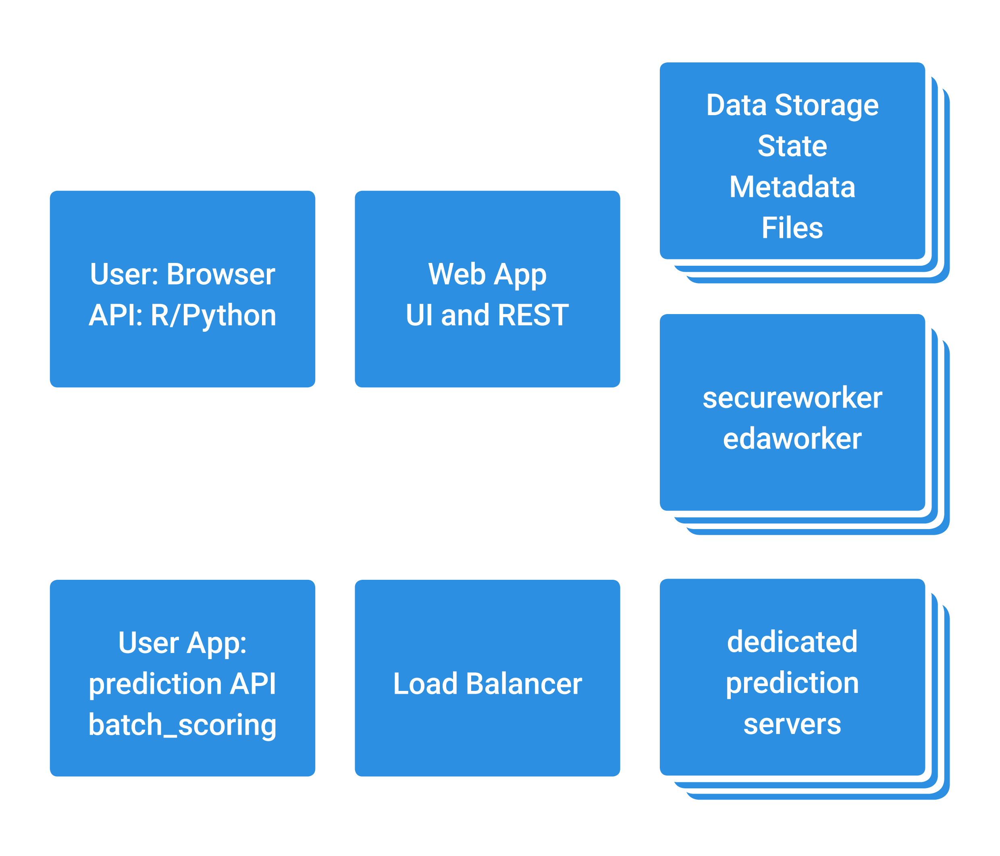

<a name="basic-explanation"></a>
基本情報:
------------------

<a name="cores"></a>
###​CPU（コア）

DataRobotエンタープライズエディションは、顧客のハードウェア（オンプレミスまたはプライベートクラウド）上にデプロイされるソフトウェアライセンス形態で提供されます。DataRobotエンタープライズエディションは、パブリッククラウドサービスを分析に使用できないという規制を受ける業界や企業、および組織を対象としています。

価格はわかりやすく、予測を目的としたデプロイに加えて、正確な予測モデルの構築に必要な演算処理の並列度等が反映されています。価格は、DataRobotをデプロイするCPUコアの数に基づきます。

<a name="memory"></a>
###メモリ

事実上、DataRobotでは最大100GBのデータでモデルをトレーニングできます。このサイズのデータセットでは、インメモリと分散型の両方のアルゴリズムを試して、どちらが特定のデータセットに適しているかを判断する必要があります。データのダウンサンプリングを行い、使用可能なメモリに合わせて調整し、シングルインスタンス・アルゴリズムを使用してモデルをトレーニングします。また、Sparkクラスター上でデータセット全体（またはその中で可能な限りのサブセット）を実行して、MLlibの分散型アルゴリズムでトレーニングします。その後、結果を**リーダーボード**でレビューおよび計算できます。

<a name="queues"></a>
###キュー

_ワーカー使用状況_インターフェース（アプリケーションの右側のサイドバー）は、ファイルのインポートおよびモデル構築処理の状況をリアルタイムで表示します。このインターフェースは、アプリケーションの右側に常に表示されます。

<a name="workers-types"></a>
ワーカータイプ
-------------

<a name="eda"></a>
###EDA 

新しいプロジェクトを開始（データセットファイルをインポート）した場合、ワーカー使用状況インターフェースが下記のように３ステップで表示されます。（1）データのアップロード、（2）元のデータの読み取り、および（3） EDA（探索的データ解析）の3つのステップが処理されていることを確認できます。ファイルのインポートが完了すると、（ワーカー使用状況インターフェース上に）これらの3つの各ステップがそれぞれ終了するまでに要した時間を確認できます。番号が示された各ステップの下にタイムスタンプが直接書き込まれます。また、緑のチェックマークも表示され、各ステップが終了したことが示されます。

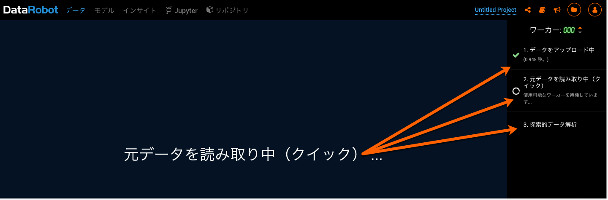

<a name="modeling"></a>
###モデリング

予測ターゲットを（データセットの列名から）選択し、分析上の設定を選択した後、モデル構築プロセスを**開始**ボタンを押下することで​開始できます。


DataRobotでモデルの構築が開始すると、ワーカー使用状況インターフェースには、各モデルの構築を開始するステップを示すもう1つの番号付きリストが表示されます。

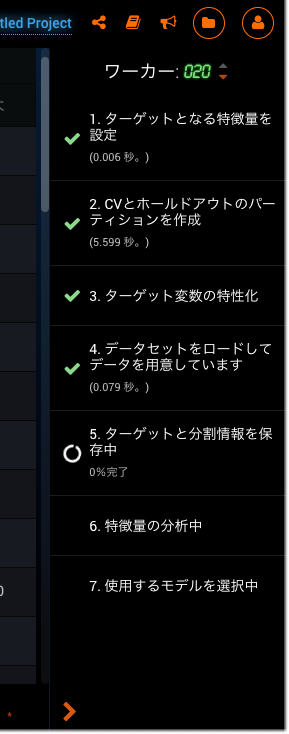

次に、モデリングキューが開始されます。処理はキューに入れられデータセットに対して処理されているモデルのライブリストが表示されます（モデルは名前で識別する事ができます）。ワーカー（CPUインスタンス）上で現在実行されているモデルに加えて、まだ実行されていないモデルのキューも確認できます。

各プロジェクトは、_ジョブキュー_があります。ジョブキューは、対応するモデリングダッシュボードインスタンスからのモデル計算リクエストを処理します。各ジョブ（処理中のジョブまたはキュー内のジョブ）は、いつでも削除できます。キュー内のジョブには、実行するモデルのタイトル、サンプルサイズの割合、および交差検定（CV）セットを表す番号が表示されます。

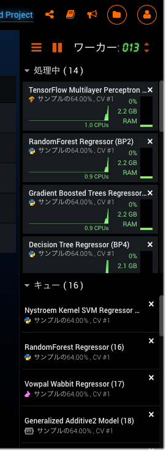

DataRobotのモデル構築を制御できる3つの_モデリングモード_があります。

|開始モード| 説明|
|----------|:----------:|
|オートパイロット| 完全自動のオートパイロットモードでは、指定した特徴量に対して最適な予測モデルが選択されます。デフォルトでは、オートパイロットは有用な特徴量の特徴量セットに対して実行されます。この自動モードは、モデリング処理を開始する最も一般的な方法です。|
|クイック|32%と64%のサンプルサイズを使用します。指定されたターゲット特徴量とパフォーマンス指標に基づいてモデルのサブセットを実行します。このモードでは、モデルのベースセットとインサイトがすばやく提供されます。データセットが5000行未満の場合、64%でのみ実行されます。|
|手動| 手動モードでは、実行するモデルを完全に管理できます、例えば、初期設定で選択されたモデルを実行する代わりに、特定のモデルをタスクリポジトリから選択することができます。|

***注意:*** オートパイロットまたはクイックモードのいずれかを選択した場合、対象のデータセットと予測ニーズに適しているモデルのみが選択されます。

<a name="prediction"></a>
###予測

構築された各モデルは、**リーダーボード**（**モデル**タブの下）に追加されます。**リーダーボード**には、データセットに対して構築された各モデルが精度と速度の順にリストされます（最速で最も精度の高いモデルがリストの一番上に表示されます）。これで、**リーダーボード**モデルに基づいて予測を作成できます。使用できる方法は、（1）新しいデータセットをインポートして、そのデータに対する予測を作成するか、（2）元のデータセット上で予測を作成する方法の2つです。

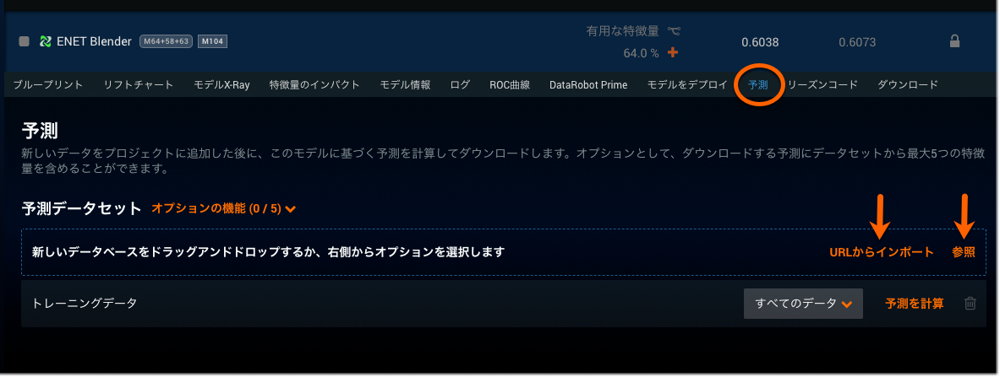

これらモデルから予測処理を実行する場合、画面の右側にキューが再度表示され、処理の進捗状況と終了した処理のライブフィードが示されます。

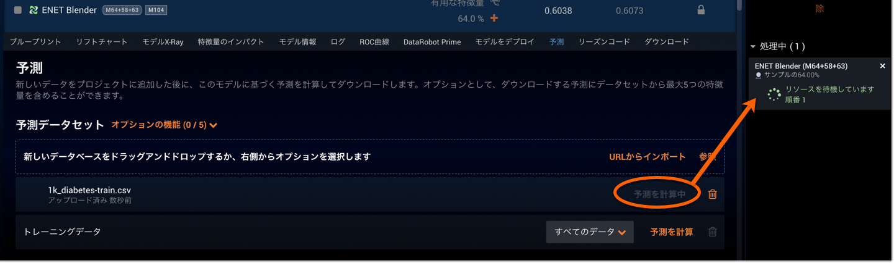

<a name="worker-count-vs-worker-availability-for-shared-projects"></a>
###共有プロジェクトのワーカー数とワーカーの可用性

ワーカー使用状況インターフェースの上部には、_ワーカー数_（この例では4つのワーカーに設定されている）が表示されます。これは、プロジェクト上で現在4つのワーカーが使用されていることを示します。ワーカーの数は、ワーカー数の表示の横にあるオレンジの上向きまたは下向きの矢印をクリックして増減できます。ワーカー数を多くすると、プロジェクトの処理速度が速くなります。また、ワーカー数の表示の左側にあるオレンジの**再生/一時停止**ボタンをクリックすると、ワーカーのモデル構築を一時停止することや処理を再開することができます。

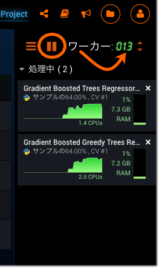

管理者はワーカー数を変更できます。ワーカー数を変更することにより、組織内のすべてのユーザーがワーカーに公平にアクセスできるようにすることができます。また、管理者は、管理コンソールにアクセスして、組織内でグループを作成することもできます。これらのグループベースのワーカー割り当てを作成した後、グループのモデリング制限を設定できます。したがって、管理者は各グループが使用できる共有ワーカーの数の制限を設定し、組織全体でリソースが局所的に集中することを抑えることができます。

各ユーザーの独自のワーカー数は、プロジェクトおよび組織で使用可能なワーカーの数に関係なく維持されます。したがって、ユーザー個人のワーカー数（ユーザーのプロファイル設定に表示されます）は、（管理者が変更しない限り）すべての場合においてそのユーザーが使用できる最大のワーカー数です。
以下に例を挙げます。ワーカー数が4つのユーザーの場合、1～4の間の任意の数のワーカーを使用できます。このユーザーが、12のワーカーが割り当てられているプロジェクトまたは組織に属している場合、これらの12のワーカーのうち使用できるのは最大4つだけです。

Hadoop アーキテクチャ:
---------------

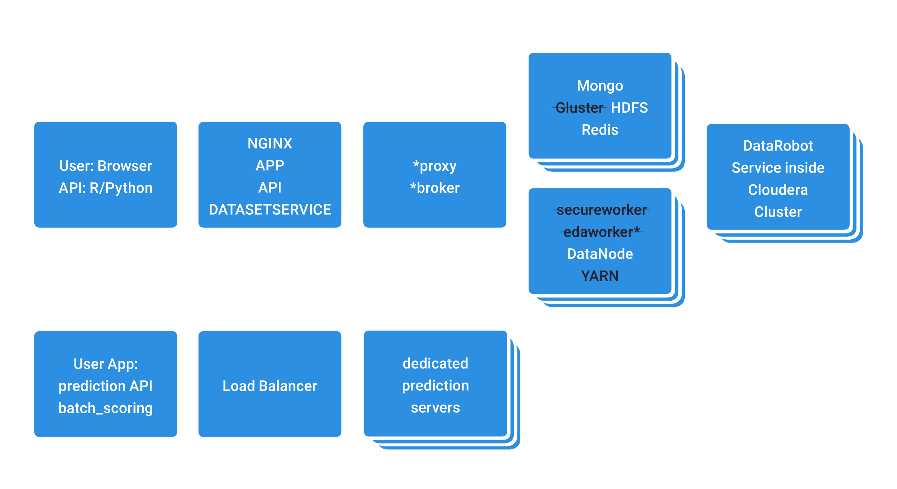

<a name="hadoop-explanation-as-it-differs-from-basic"></a>
###基本とは異なるHadoopの説明

Hadoop版のDataRobot Enterpriseと標準DataRobot Enterpriseには4つの主な違いがあります。

1. モデル構築（DataRobot上）は、既存のHadoopデータノードリソースを使用します。
2. Hadoopでは、Sparkを使用して高スループットのスコアリングを実行できます。
3. HadoopのクラスターリソースとDataRobotは両方ともYARNによって管理されます。
4. DataRobotでは、Hadoopリソースを活用して大規模なデータ取込みとモデル構築を行うことができます（標準DataRobot Enterprise : 5GB  Hadoop版 DataRobot Enterprise : 10GB）。

<a name="security"></a>
セキュリティ
---------

<a name="ldap"></a>
###LDAP

LDAP（Lightweight Directory Access Protocol）は、一元化された認証またはシングルサインオン認証のいずれかで使用されるディレクトリサービスアクセスプロトコルです。

**注意:** SLDAPとLDAPSは両方ともにSSLを介したLDAP（LDAPサーバーへのSSL暗号化接続）を意味する同じ用語です。

DataRobotはLDAPをサポートしますが、さまざまなディレクトリサービス製品に対してそれぞれ異なるLDAP属性を使用します。このようなディレクトリサービス製品には、MS AD（Microsoft Active Directory）、Open LDAP、Oracle Internet Directory、iPlanet、Oracle Virtual Directory、IBM Directoryなどがあります。したがって、属性設定も製品ごとに異なります。

LDAPは、ディレクトリサービスと通信するプロトコルです。LDAPを利用する構成では、アプリケーションログイン時のユーザ認証のためにディレクトリサーバーとLDAPクライアント(DataRobot)が通信させる事ができます。

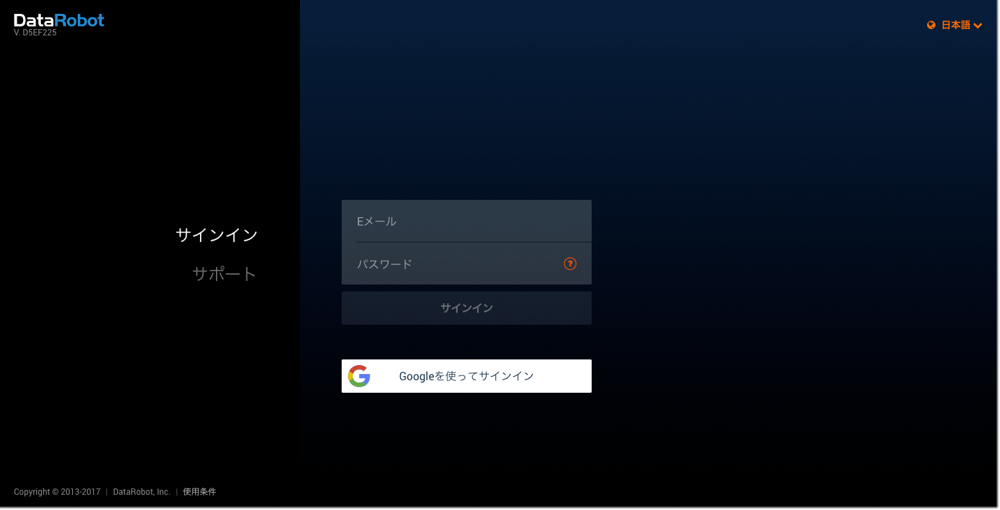

通常、LDAPはLDAPコンテナ（またはグループ）を使用して設定されるので、エンタープライズLDAPユーザーのサブセットだけがDataRobotインスタンスにアクセスできます。DataRobotへのアクセスを無効にするには、ユーザーをLDAPコンテナから削除する必要があります。

DataRobotは、設定済みのLDAPを通してユーザーを認証できます。DataRobotへのユーザーログインは、LDAPを介してディレクトリサービスで認証されます。ユーザー情報が有効である場合、結果が返され、そのユーザーのエントリがDataRobotに作成されます。

**注意:** LDAPで初めて認証を受けるユーザーの場合、そのユーザーのユーザー名だけが作成されDataRobotに保存されます。パスワードは作成および保存されません。これは初回ログイン時に1回のみ行われる処理です。

DataRobotでは、DataRobot内部の認証を目的として、ユーザーが電子メール形式（所属組織を表すドメイン）でも保存されます。

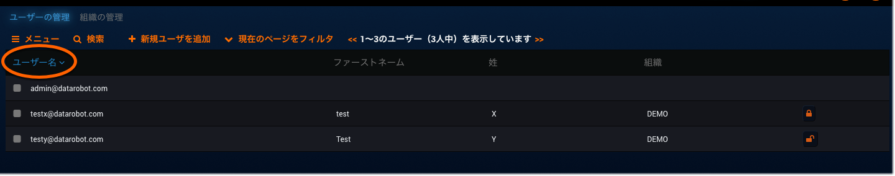

しかし、各LDAPユーザーには、DataRobotのリストに表示されるシンプルなユーザー名だけが提供されます。


ユーザーが初回LDPAログインで認証されると、組織の管理者はDataRobotにアクセスして、プロファイルドロップダウンメニューにある**ユーザーの管理**ページで、そのユーザーに対するアクセス許可を設定できます。


1. ユーザー名をクリックして、そのユーザーのアカウント情報にアクセスします。

	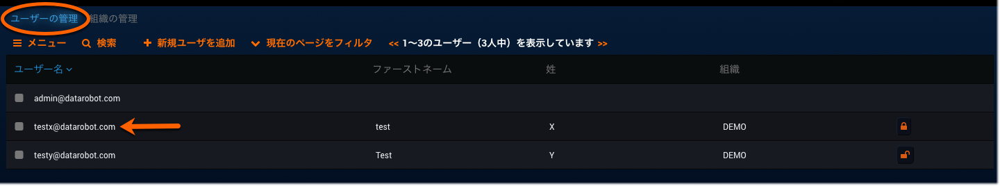
	
	そのユーザーのプロファイルが**ユーザープロファイル**ページに表示されます。

2. **アクセス許可の変更**をクリックして、個々のアクセス許可のリストを表示します。

	

3. ボックスをオンにするか、空白のままにすることによって、そのユーザーの機能を有効または無効にできます。

	
	
**注意:** この同じページから、このユーザーの組織、ワーカーの数、およびファイルアップロードサイズ制限を設定することもできます。

LDAP対応のディレクトリサービスでは、すべてのユーザーおよび組織が分類され、アクセス可能になります。LDAPディレクトリサーバーで行われた更新は、自動的に各アプリケーションに反映されます。個々のアプリケーションを手動で検索して編集する必要はありません。たとえば、ディレクトリサーバーからユーザーを削除すると、（この特定のディレクトリサーバーに対して認証するよう設定された）アプリケーションでは、そのユーザーがログインできなくなります。したがって、管理者は、効果的に大規模な企業の正確なDataRobotアプリケーション認証を管理することができます。

<a name="about-configyaml"></a>
###config.yamlについて

config.yamlは、LDAP対応ディレクトリサービスからのユーザーのログイン情報（ユーザー名とパスワード）の読み取りおよび認証の方式を定義するLDAP設定の一部を含みます。

Config.yamlは、DataRobotクラスターのマスター設定ファイルです。一元化されたユーザー認証を行うために、Config.yamlによってDataRobotと組織のLDAP対応ディレクトリの間でのユーザーの情報の連携が行われます。

MS AD 用のLDAP 設定が行われたconfig.yamlファイルの例を以下に示します。

```
app_configuration:

 drenv_override:

   USER_AUTH_LDAP_BIND_DN: tuser1@example.com

   USER_AUTH_LDAP_BIND_PASSWORD: &#039;&lt;クリアテキスト形式のパスワード&gt;&#039;

   USER_AUTH_LDAP_GLOBAL_OPTIONS: &#039;[]&#039;

   USER_AUTH_LDAP_SEARCH_BASE_DN: ou=datarobot,dc=example,dc=com

   USER_AUTH_LDAP_SEARCH_FILTER: (&amp;(objectClass=user)(sAMAccountName=$username))

   USER_AUTH_LDAP_URI: ldap://ad-controller.example.com:389

   USER_AUTH_TYPE: ldapsearch
```

**注意:** LDAPを有効にすると、電子メールとローカルアカウントの両方の作成が無効になります。
LDAPアカウントにリンクする必要のあるDataRobotアカウントをサポートに連絡してください。
 