<a name="managing-user-accounts"></a>
ユーザーアカウントの管理 
======================

 
<a name="creating-user-accounts"></a>
ユーザーアカウントの作成 
----------------------

自分のプロファイルで「ユーザーの管理」アクセス許可が既に許可されている場合、管理者ユーザーは、新しいユーザーを作成してDataRobotエンタープライズプラットフォームに追加できます。管理者は、どのユーザーがシステムにアクセスできる（およびアクセスできない）かを管理できます。

1. 画面の右上にあるプロファイルアイコンをクリックして、プロファイルオプションのドロップダウンメニューを展開します。**ユーザーの管理**をクリックします。

	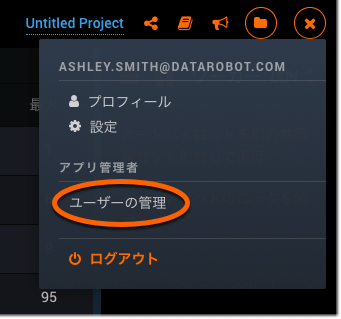

2. **新規ユーザーを追加**をクリックして、追加するユーザーの電子メールアドレスとパスワードを入力します。

	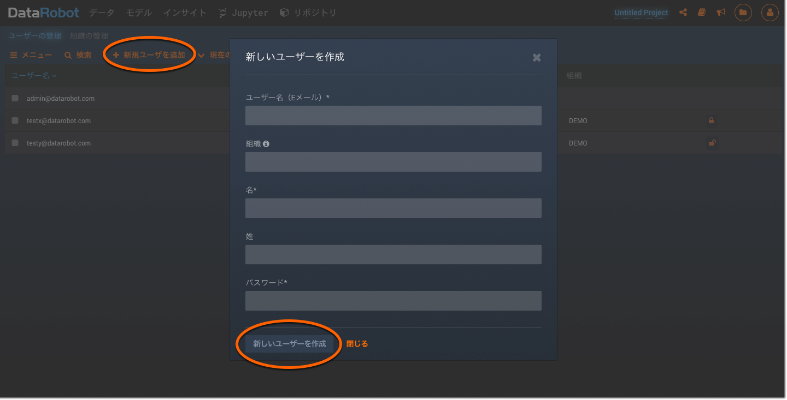

必要な情報を入力後、​**ユーザーの作成**をクリックします。


<a name="setting-user-permissions"></a>
ユーザー権限の設定
-------------------------

管理者ユーザーは、自分と組織内のその他のユーザー権限を設定できます。管理者ユーザーは、必要に応じてユーザーごとに有効または無効にできる機能のリストにアクセスできます。

管理者がユーザーのアクセスを有効にする手順を以下に示します。

1. 画面の右上にあるプロファイルアイコンをクリックして、プロファイルオプションのドロップダウンメニューを展開します。**ユーザーの管理**をクリックします。

	

2. **ユーザーの管理**ページが表示されます。**検索**バーに目的のユーザーのユーザー名を入力します。

	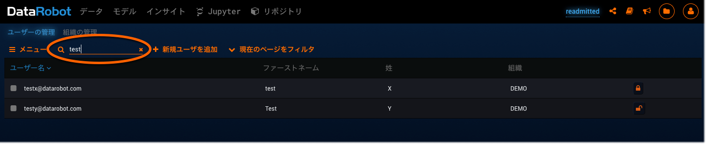

3. 検索結果のリストで目的のユーザーをクリックします。そのユーザーのプロファイルページが表示されます。

4. （登録日の下にある）**​ユーザー権限**をクリックします。**ユーザー権限**ページが表示されます。

	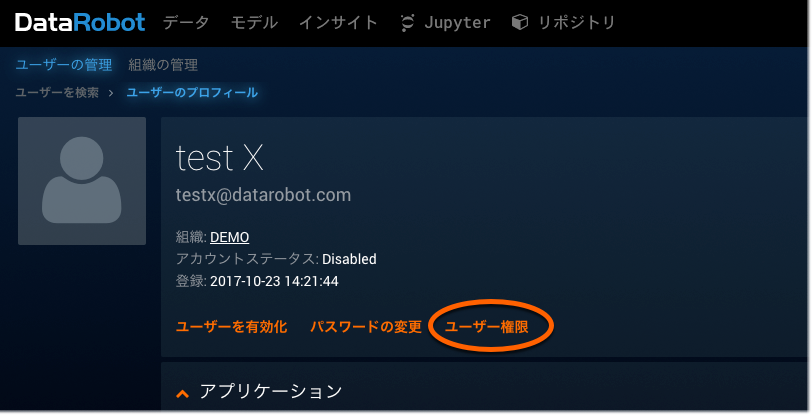

5. 「有効化された機能」の下にリストされる**Can Manage App Users**オプションを選択して、（右側にある）**保存**ボタンをクリックします。このアクセス許可の変更が設定されたことと確認します。

	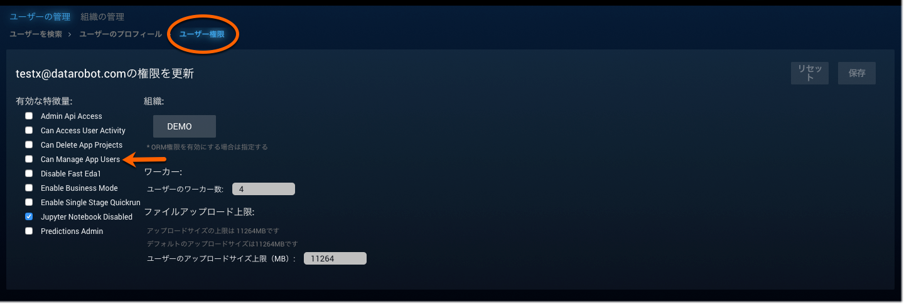

**Can Manage App Users**機能を有効にして保存すると、そのユーザーは、同じ手順を使用してその他のユーザーの設定を変更できるようになります。

**Can Manage App Users**権限を無効にするには、ボックスをオフにします。そのユーザーの管理者権限が無効になります。

<a name="changing-your-password"></a>
 パスワードの変更
-----------------------

1. 画面の右上にある自分のアバターの下にある**設定**をクリックします。**設定**ページの上部に「パスワードの変更」フォームが表示されます。

	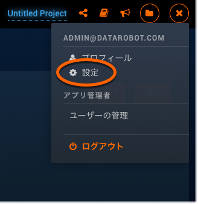

2. 最初に、現在のパスワードを入力します。次に、新しいパスワードを2回入力します。最初の入力で新しいパスワードが作成され、2回目の入力で新しいパスワードが確認されます。

	**注意:** 現在のパスワードが間違っている場合、または新しいパスワードフィールドと新しいパスワードの確認入力フィールドに入力したパスワードが一致しない場合、エラーメッセージが表示されます。

3. すべてのフィールドに入力したら、**パスワードの変更**をクリックします。更新内容を示すメッセージが表示されます。

	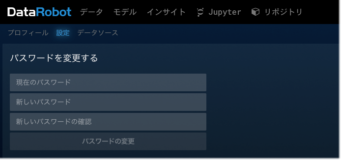

**注意:** DataRobotでは、新規アカウントおよびパスワード変更に関して以下のパスワードポリシーが適用されます。

‐ 印字可能なASCII文字のみを含む
‐ 少なくとも1つの大文字を含む
‐ 少なくとも1つの数字を含む
‐ 8文字以上の長さ
‐ 最大512文字
‐ ユーザー名とパスワードを同じに設定することはできない


<a name="deactivating-user-accounts"></a>
ユーザーアカウントの非アクティブ化
---------------------------

DataRobotからユーザーアカウントを削除することはできません。これにより時間の経過とともに発生する従業員の異動に関係なく、組織のデータは失われることなく保持されます。

しかし、管理者はユーザーのアクセスをブロックできます。ユーザーのアクセスをブロックするには、目的のユーザーを検索して、そのユーザー名の横にある鍵アイコンをクリックして、アイコンを閉じた状態（ロック状態）にします。

これによりユーザーは無効化され、システムにログインできなくなります。しかし、そのユーザーが作業したデータとプロジェクトはそのまま維持されます。無効にしたユーザーのDataRobotへのアクセスは、鍵アイコンを開く（ロック解除する）ことにより復元できます。

組織内のさまざまなユーザーの鍵アイコンの状態を表す例を以下に示します。

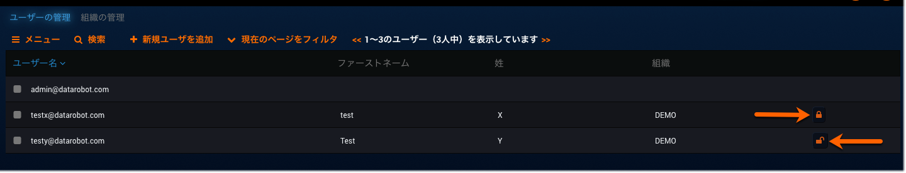

ユーザーのプロファイルにアクセスし、そのページで**ユーザーを無効化**ボタンをクリックしてユーザーを無効にすることもできます。この方法でユーザーを無効にすると、ボタンが自動的に変更され、**ユーザーを有効化**と表示されます。このボタンをクリックすると、そのユーザーを再度アクティブにすることができます。

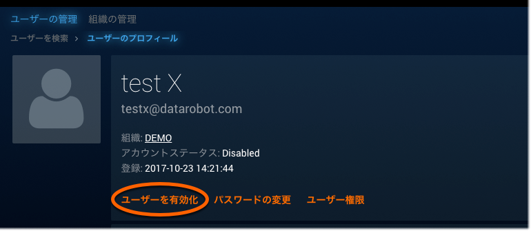

<a name="common-admin-tasks"></a>
一般的な管理タスク
------------------

<a name="activity-monitor"></a>
###アクティビティモニタ 
_アクティビティモニタ_は、DataRobotで発生する特定のイベントに関する通知を特殊なログファイルシステムを通して送信するシステムです。これらの特定のイベントには、アプリケーションで発生するログオンステップからインサイトと予測イベントまでにわたるプロセスが含まれます。アクティビティモニタは、各イベントでアクセスされたすべてのリソースを追跡してログに記録します。

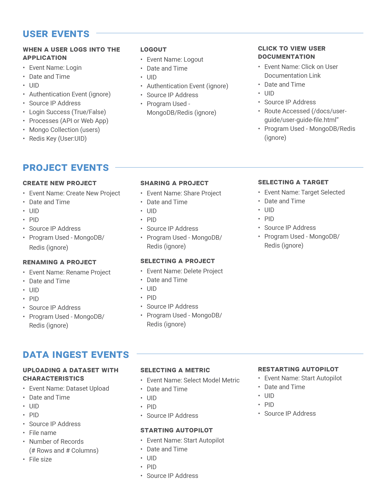
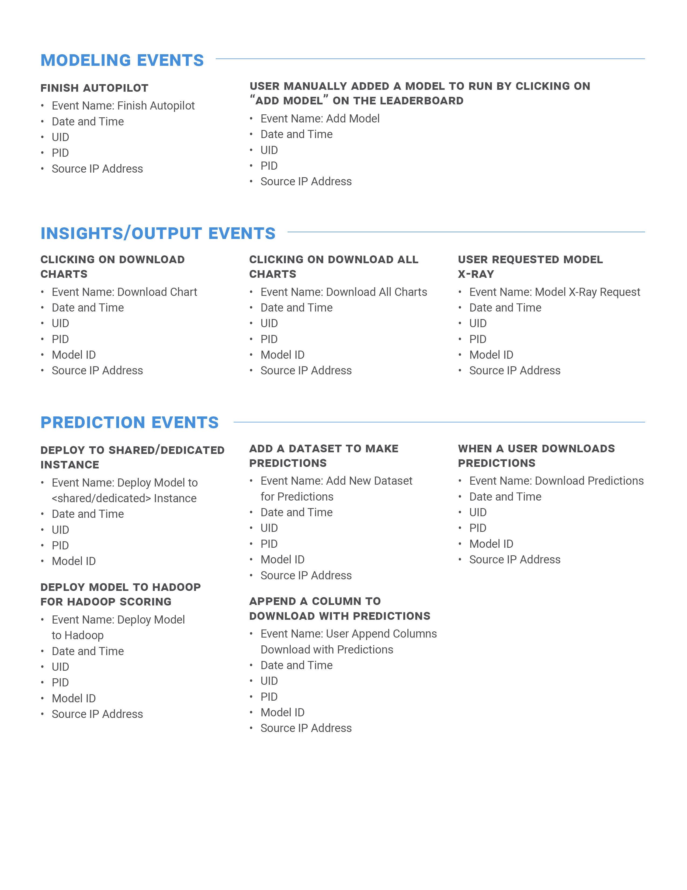


<a name="administrative-settings-on-jupyter"></a>
Jupyterの管理設定
---------------------------------


<a name="jupyter"></a>
###Jupyter

**Jupyter**タブは、すべてのDataRobotユーザーに対して自動的に有効になり、すべてのユーザーが表示できます。しかし、最初は組織内のすべてのユーザーに対して管理者がこの機能を無効にしておくことが推奨されます。こうすることで、管理者は、Jupyterツールを実際に使用するユーザーだけにこのツールを有効にすることができます。これは、強力なツールを管理し、潜在的な混乱を防止するための適切な方法です。

DataRobotでは、最高水準のアルゴリズムの多様なセットとともに、革新的な多くの強力な予測モデルが構築されます。ユーザーは、DataRobotで使用できない追加モデルを統合できます。このようなカスタムモデルは、その他のモデルとの比較を行うために**リーダーボード**で使用可能にするこもできます。

カスタムモデルは、インタラクティブなNotebook Webアプリとその他の関連コンポーネントを含むオープンソースプロジェクトの_Jupyter_を使用して作成できます。言語の独立性をサポートするためにIPythonの派生プロジェクトとして開発されたJupyterは、さまざまな言語Kernelで機能します。

DataRobotでは、Jupyter Notebook環境を使用して、新規モデルおよびカスタムモデルを開発することや、既存のRおよびPythonモデルとの統合を行うことができます。

**Jupyter**タブは、DataRobotアプリケーションページの上部にあります。**Jupyter**タブが表示されている場合、この機能にアクセスしてカスタムモデルを作成できます。

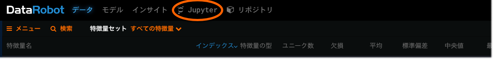

**Jupyter**タブが表示されていない場合、このツールは無効化されていて使用できません。ユーザーがこのプログラムを使用したいと考える場合は、管理者は、そのユーザーのプロファイルにアクセスして、この機能を有効にすることができます。

1. 画面の右上にあるプロファイルアイコンをクリックして、プロファイルオプションのドロップダウンメニューを展開します。**ユーザーの管理**をクリックします。

	

2. **ユーザーの管理**リストで目的のユーザーを選択して、そのユーザーのプロファイルとアクセス許可を表示します。

	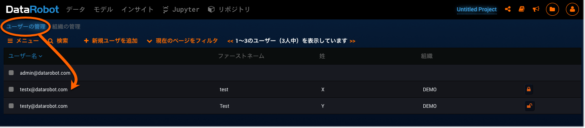

3. **​ユーザー権限**をクリックして、そのユーザーが使用できる機能の完全なリストを表示します。

	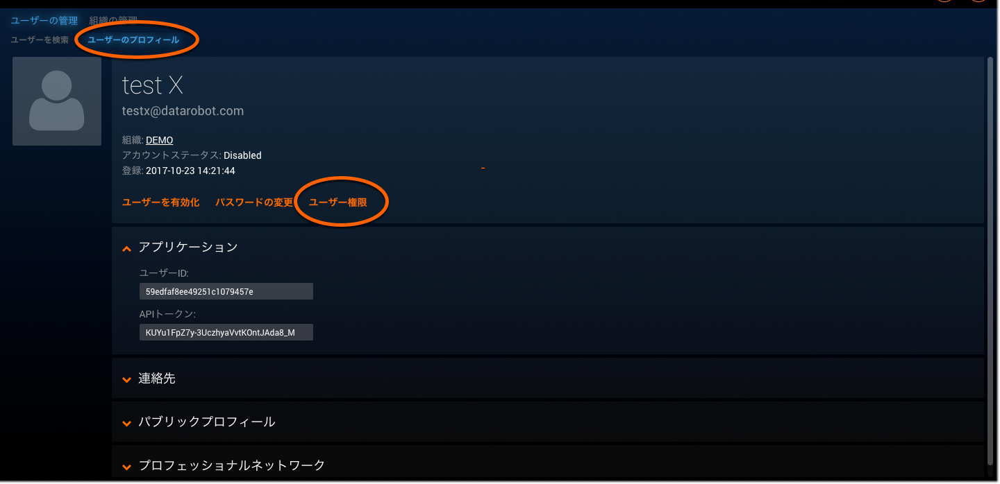

4. 下にスクロールして_​Jupyter Notebook Disabled_機能を表示します。このボックスがチェックされている場合、そのユーザーはJupyter機能を表示および使用することができません。このボックスのチェックを外すと、この機能が有効になります。

	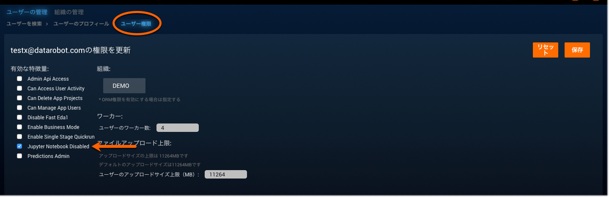

5. 次に、**ユーザー権限**ページの右上にある**保存**ボタンをクリックします。

	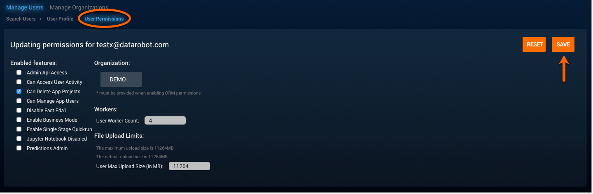

Jupyter Notebookが有効になり、このユーザーがアクセスできるようになります。この機能は、ユーザーのアプリケーション画面の上部バーのタブ（**インサイト**と**リポジトリ**の間）に表示されます。


<a name="per-organization-resource-constraints"></a>
組織ごとのリソースの制約
---------------------------------

この機能は、組織のさまざまなプロジェクトニーズに応じて管理者が管理します。エンタープライズ管理者は、この機能に**ユーザーの管理**ページからアクセスできます。このページには、**組織の管理**タブがあります。

1. 画面の右上にあるプロファイルアイコンをクリックして、プロファイルオプションのドロップダウンメニューを展開します。**ユーザーの管理**をクリックします。

	
	
2. **組織の管理**をクリックします（**ユーザーの管理**の右側にあります）。

	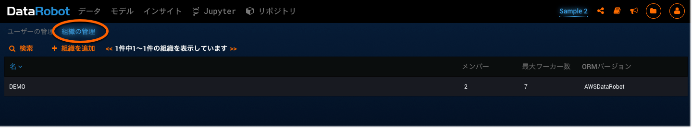

**組織の管理**ページでは、管理者が組織を作成して保存できます。ページの上部には、特定の組織を容易に検索できる検索バーがあります。

新規作成した組織の場合、および（時間の経過とともに変化する組織のニーズに応じて）すべてのメンバーを削除した場合、組織のユーザーの数はゼロです。

**組織の管理**タブで（検索バーの横にある）**組織を追加**をクリックすると、作成する組織の情報を入力するフォームが表示されます。

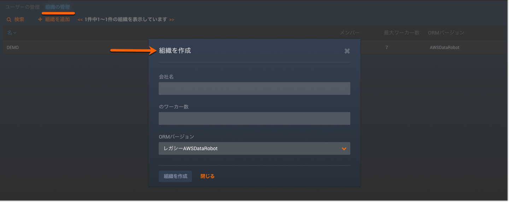

フォームに必要な情報を入力して**組織を作成**をクリックすると、作成済の組織のリストに新しい組織が保存されます。

管理者は、組織にユーザーを追加することや組織からユーザーを削除することができます。このプロセスは、1）**組織の管理**ページ、または2）ユーザーのプロファイルページから行うことができます。

**組織の管理**ページから組織にユーザーを追加すると、ユーザーが組織に追加されます。この初期セットアップを行うことができるのは、**組織の管理**ページからだけです。

初期セットアップが完了した後、そのユーザーのプロファイルページでユーザーの組織のステータスを編集できます。

1. 画面の右上にあるプロファイルアイコンをクリックして、プロファイルオプションのドロップダウンメニューを展開します。**ユーザーの管理**をクリックします。

	

2. 組織のアクセス許可を編集するユーザーを選択します。

	**ユーザー権限**ページが表示されます。このページで、変更するフィールドをクリックして、そのユーザーの_組織ID_と_組織名_を直接編集できます。

	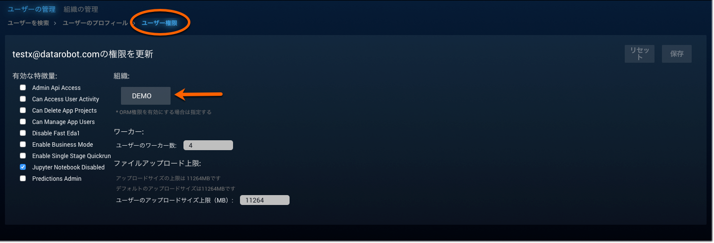


<a name="starting-stopping-and-managing-services"></a>
サービスの開始、停止、および管理
------------------------------------
問題の回避、変更や修正の適用、および正常性のチェックを行うために、DataRobotのサービスを停止、開始、および管理できることは重要です。

**注意:** これらのDataRobotサービスはDockerに対してのみ使用され、Hadoopに対しては影響しません。


<a name="starting-services"></a>
###サービスの開始:

コマンド名: ```make start-services```

これは初期開始コマンドです。これはクラスター全体のコマンドで、config.yamlファイルが格納されているディレクトリの下にあるプロビジョニングホストから実行する必要があります。このコマンドは、このファイルからすべてのホストのレジストリおよびDockerコンテナサービスを開始します。


<a name="stopping-services"></a>
###サービスの停止:
コマンド名: ```make stop-services```

これはもう1つのクラスター全体のコマンドで、このコマンドもconfig.yamlファイルが格納されているディレクトリの下にあるプロビジョニングホストから実行する必要があります。このコマンドは、このファイルからすべてのホストのレジストリおよびDockerコンテナサービスを停止します。


<a name="restart-services"></a>
###サービスの再開:
コマンド名: ```make restart-services```

サービスを適切に再開するには、最初にstop-servicesコマンドを実行し、その後にstart-servicesコマンドを実行します。サービスを再開するには、そのサービスが停止している必要があります。この2段階のプロセスの詳細については、上記のサービスの開始と停止のセクションを参照してください。


<a name="check-services-status"></a>
###サービスステータスの確認:

このコマンドは、config.yamlファイルで定義されているDockerのコンテナステータスをチェックします。

Dockerではコンテナ内にアプリケーションを容易にデプロイできます。その場合、仮想マシン（VM）と同じ分離を提供できますが、演算能力はほぼ低下しません。コンテナの状態をチェックして、デプロイが正常に行われたことを確認することが推奨されます。コンテナが正常に停止していない場合、サービス（Redis、Mongo、Gluster、HDFS、およびAWS Cloud）を再開できないことがあります。その場合、再起動が必要です。

DataRobotは、Dockerで実行するMongoを介し依存性を考慮した配布を使用します（docker.ioからMangoがPullされて開始します）。また、ローカルレジストリも作成されます。イメージはレジストリに読み込まれ、インストール中に利用されます。


<a name="backup-and-recovery"></a>
バックアップと復元
----------------------------------
プリケーション上のストレージデータベースのために、DataRobotでは以下の各サービスが使用されます。


<a name="redis"></a>
###Redis
Redisは、さまざまなデータ構造（文字列、ハッシュ、リスト、セット、範囲クエリを含むストアドセット、ビットマップなど）をサポートするオープンソースのストレージサービスです。RedisはビッグデータにフォーカスしたNoSQLサービスです。DataRobotは、ユーザーセッションやキューの詳細などの情報を格納するためにRedisを使用します。


<a name="mongo"></a>
###Mongo
Mongo（もう1つのストレージサービス）は、データを管理するMongoDBのプライマリコンポーネントです。MongoDBでは多くのストレージエンジンが提供されるので、アプリケーションのニーズに最適なエンジンを選択できます。このストレージサービスにはメタデータ（マッピング）構造があり、NoSQLとしても分類されます。Mongoは、JSONドキュメントを使用してDataRobotにプロジェクトIDを格納します（プロジェクトファイルそのものではありません）。

<a name="gluster"></a>
###Gluster
Glusterは、追加のメタデータを格納するために使用する特殊なアーカイブ形式である増分tarを行うことができるストレージサービスです。アーカイブからプルすることにより、ファイルシステムの正確な状態を復元することができます。Glusterの分散ファイルストレージシステムには、DataRobotのデータファイルおよびモデルが格納されます。アプリケーションにアップロードしたデータセットは、Glusterに保存されます。メタデータ（Mangoに保存されます）とサポートされるデータ構造情報（Redis）を除くデータセット内のすべての情報はGlusterに保存されます。


<a name="hdfs-hadoop-distributed-file-system"></a>
###HDFS（Hadoop Distributed File System）
分散ファイルシステムであるHDFSは、Hadoopアプリケーションのプライマリストレージシステムで、すべてのHadoopクラスターに高いデータアクセス性能を提供します。このサービスは、DataRobot上で同じタイプのデータ（データファイルおよびモデル）を格納するためにも使用されるので、Glusterに似ています。

そのため、HDFSとGlusterはDataRobotプラットフォーム上で相互に排他的なサービスです。Hadoop（HDFSとの組み合わせ）サービスが使用されている場合、Glusterが置き換えられます（逆の場合も同様です）。これらの両方のサービスが同時に使用されることはありません。


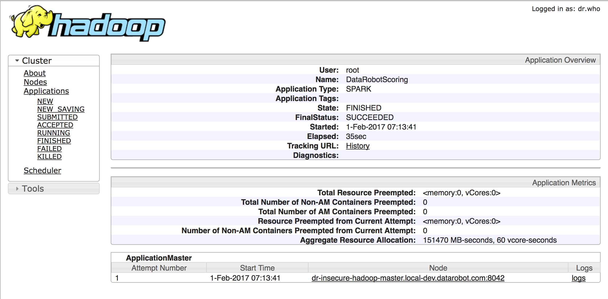


<a name="aws-amazon-web-services-cloud"></a>
###AWS（Amazon Web Services）Cloud
AWSは、ビジネスのスケールと成長に役立つコンピュート能力、データベースストレージ、コンテンツ配信、およびその他の機能を提供するセキュアなクラウドサービスプラットフォームです。DataRobotプラットフォーム上で使用するためにAWSの仮想マシンがレンタルされます。これはDataRobot製品のインストール先候補のうちの1つです。（他にはオンプレミスの構成を取ることができます。インストールは物理的な企業またはサイトの場所で行われます。）Glusterのインストールが推奨されるので、通常、Hadoopインストールは使用されません。

AWS上でインスタンスのタイプを変更する場合、最初にサービスを停止し、インスタンスを変更した後にサービスを再開します。
ファイルシステムの拡張（ディスク容量の追加など）については、Amazonのガイドラインに従ってください。ファイル復旧（スナップショット復旧）については、AWSのガイドラインに従ってください。AWSの負荷分散サービスであるELB（Elastic Load Balancing）も予測サーバー用に使用されます。ELBでは、トラフィックの需要を満たすために受信トラフィックが自動的に分散され、リソースのスケールが行われます。

<a name="disaster-recovery-config"></a>
障害復旧の設定
------------------------
###Mongoの再構築およびGlusterのミラー
障害復旧を設計する上で最初のステップは予防です。障害発生を防止し、冗長性を確立するために、高可用性を念頭にすべてのコンポーネントが適切にセットアップされていることを確認します。各ストレージデータベース（Redis、Mongo、およびGluster）の1つのインスタンスを設定するのではなく、問題が発生した場合に対応できるように各データベースの複数のインスタンスを追加します。追加のインスタンスを設定することにより、障害が発生したときに環境全体が壊れることなく、処理を継続することができます。

<a name="recovery-from-backups"></a>
###バックアップからの復元
本当の意味での障害は、環境全体が完全に壊れ、使用できるインスタンスがなくなった場合に発生します。このような状況に対処するための唯一かつ最善のオプションは、最新のバックアップを復元する手順を使用して、最近保存されたバージョンに復元することです。このシナリオではタイムリーなバックアップを毎日行うことが重要です。完全な障害が発生した場合、バックアップが唯一の方法です。このため、予防措置が非常に重要なのです。


<a name="snapshot-recovery"></a>
###スナップショットの復元
スナップショットは、最新のスナップショットの後にデバイス上で変更されたブロックだけが保存される増分バックアップです。スナップショットの復元は、スナップショットを作成するために必要な時間を最小限に抑え、データの重複を防止してストレージコストを節約することのできる優れたツールです。取得された各スナップショットには、新しいEBSボリュームにデータを復元するために必要なすべての情報が含まれています。
DataRobotエンタープライズをAWSにインストールする場合、AWS EBSスナップショットツールが使用されます。障害復旧用のスナップショット復元は、Redis、Mongo、およびGlusterをここに復元するよりも高速です。バックアップを作成するには、インスタンスを停止してボリュームのスナップショットを取得します。


<a name="monitoring-datarobot"></a>
DataRobotのモニタ
--------------------

<a name="nagios"></a>
###Nagios
Nagiosは、システム、ネットワーク、およびインフラストラクチャのモニタに使用される無償のオープンソースコンピューティングソフトウェアアプリケーションです。また、サーバー、スイッチ、アプリケーション、およびサービスのモニタおよびアラートサービスも提供されます。


<a name="linux"></a>
###Linux
Nagiosは、Linuxオペレーティングシステム（OS）およびディストリビューションの完全なモニタリングを提供します。これには、OSの指標、サービス状態、プロセス状態、ファイルシステムの使用状況などが含まれます。

Linuxは、DataRobot OSサービス（CPU、メモリ、I/O、ネットワーク、ディスクスペース）およびハードウェアイベントをモニタし、DockerサービスとO/Sログをチェックします。この処理は、エンタープライズシステムモニタリング（Nagios、Datadog、Patrolなど）を通して行われます。

<a name="datarobot"></a>
###DataRobot
DataRobotのアベイラビリティモニタは、アプリケーションに関する全般情報（アプリケーションを使用する準備ができているかどうか、接続しているユーザーの数、どのユーザーが接続しているかなど）を提供します。
REST APIが呼び出され、現在行われている処理のステータスが要求されます。APIからは、要求された情報が返されます。アベイラビリティモニタのREST APIは、Nagiosのようなモニタリングソフトウェアとも統合する事ができます。


<a name="nagios-configuration"></a>
###Nagiosの設定

<a name="nagios-health-check"></a>
_Nagios - 正常性チェック_

DataRobotは、定期的かつ予防措置的にオンプレミスシステムの正常性をチェックし、早期に識別できる潜在的な問題を検出して障害発生を防止します。
DataRobot上では、NagiosはアベイラビリティモニタのREST APIにアクセスします。Nagiosは、管理者に代わってサービスに指示を出し、その結果を返すことができます。これらのコンポーネントが相互に通信することにより、容易で正確なチェックが可能になります。


<a name="customer-usage-report"></a>
##顧客の利用状況レポート
顧客の利用状況レポートはCustomer Successチームによって毎日更新され、DataRobot上でのユーザーのアクティビティに関するインサイトをCFDSおよびSalesチームに提供します（各担当者にその情報を尋ねる必要はありません）。

特定のユーザーに関する質問については、カスタマーサポート（ Support@datarobot.com）にお問い合わせください。

レポートは顧客ごとにExcelスプレッドシートの形式で整理され、組織、プロジェクト、および発生したその他のアクティビティ統計に関する有益な一連の情報が含まれます。

_利用状況レポートの列定義:_

|列名| 定義|
|------------|:-----------|
|```Notes``` | 内部メモ|
|```Domain```| ユーザーの電子メールアドレスのドメイン|
|```PID```| プロジェクトID|
|```CreationTime```| プロジェクトが作成された日時|
|```Email```| プロジェクト所有者|
|```total_models```| この特定のプロジェクト用に作成されたモデルの量|
|```num_model_errors```| モデルエラーの数|
|```latest_model_training_time```| 最後のモデルが作成された日|
|```total_user_models```| オートパイロットの後に構築されたカスタムモデルの数|
|```PID Errors```| プロジェクトIDエラー|
|```PID Has Error```| 以下のいずれかが「FALSE」の場合、この列には「Error」と表示されます。|
|```has metadata```| メタデータレコードが存在する|
|```has eda```| EDAレコードが存在する|
|```has low info var```| 低情報特徴量がデータベースで識別された|
|```has vartypes```| 特徴量の型文字列が存在する（現在はスキーマの変更が原因で失敗する）|
|```has summary```| 全ての低情報特徴量にサマリーデータ（最小、最大、平均など）が存在する|
|```has profile```| 全ての非低情報特徴量にプロファイル情報（チャート）が存在する|
|```has metric```| プロジェクトに対して指標が設定されている|
|```has mode```| プロジェクトに対してモード（自動、半自動、手動）が設定されている|
|```has target```| プロジェクトに対してターゲット特徴量が設定されている|
|```has info```| プロジェクトを開始した後に情報スコア（アプリの緑のバー）が計算されている|
|```total_models```| 作成されたモデルの数|
|```num_model_errors```| モデルエラーの数|
|```latest_model_training_time```| 最後のモデルが作成された日|
|```total_user_models```| オートパイロットの後に構築されたカスタムモデルの数|
|```target variable```| ユーザーが選択したターゲット
|```metric```| プロジェクトに対して選択された指標|


<a name="availability-monitoring"></a>
###​アベイラビリティモニタ
DataRobotの正常性のリクエストでは、インストールされたクラスターが適切に稼働しているかどうかを判断するために、最初、スモークテストと手動ユニットテストが使用されます。これらの方法は容易ではありませんが、この情報はユーザーと組織の両方にとって有益です。したがって、アベイラビリティモニタはDataRobotと共にデプロイされる新しいサービスとして作成されました。
DataRobotのアベイラビリティモニタは、アプリケーションの現在の状態に関する全般情報（アプリケーションを使用する準備ができているかどうか、接続しているユーザーの数、どのユーザーが接続しているかなど）を提供します。この情報には、コンポーネントのステータスに関する特定の情報（実行しているべきコンポーネント、現在実行しているコンポーネント）も含まれます。管理者は、このサービスを使用して各プロジェクトでのユーザーアクティビティを容易に追跡して、作業を開始するためのリソースがDataRobotで利用できるときを判断できます。


<a name="managing-projects"></a>
プロジェクトの管理
-----------------


<a name="permanently-deleting-projects"></a>
###プロジェクトの恒久的な削除
「アプリプロジェクトの削除」は、管理者が**ユーザー権限**ページでユーザーに対して有効にできる機能です。この機能が有効化されたユーザーは、プロジェクトを完全に削除できます。プロジェクトを削除することによって、新しいプロジェクト用のスペースを確保できます。

この機能を有効にするには 

1. アプリケーション画面の右上にあるプロファイルアイコンをクリックして、ドロップダウンメニューから「ユーザーの管理」を選択します。

	

2. ユーザーの管理ページで目的のユーザーを選択します。

	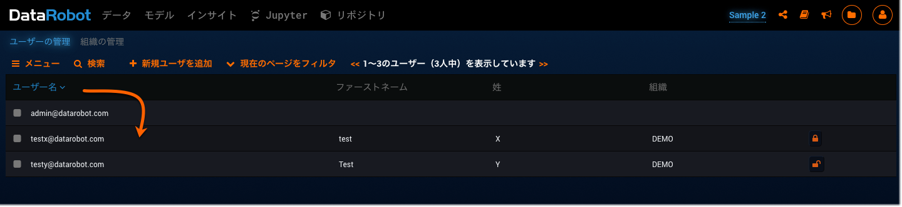

3. そのユーザーの「ユーザー権限」をクリックし、付与されているユーザー権限を表示して編集します。

	

4. 「Can Delete App Projects」ボックスをチェックして、この機能を有効にします。

	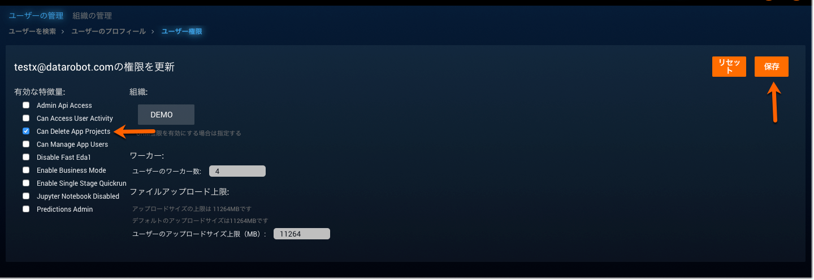

この機能が有効化されたユーザーは、不要なプロジェクトを完全に削除して、新しいプロジェクト用のスペースを作成できます。

1. アプリケーション画面の右上にあるフォルダアイコンをクリックして、「プロジェクトの管理」を選択します。**すべてのプロジェクト**ページが開き、DataRobotで作成されたすべてのプロジェクトがリストされます。

	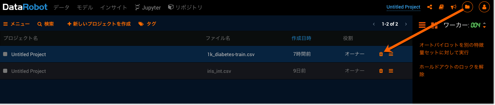

	各プロジェクトの右側にごみ箱アイコンがあります。	このアイコンを使用してプロジェクトを削除できます。 

2. 削除するプロジェクトのごみ箱アイコンをクリックします。削除処理を確認する確認画面が表示されます。

	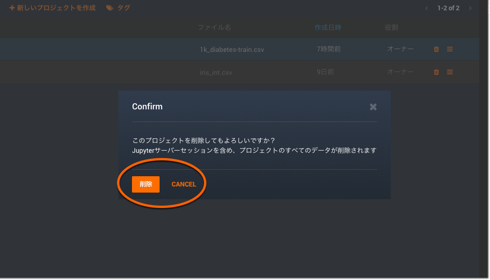
	
	この時点でプロジェクトが削除されますが、恒久的に削除されたわけではありません。プロジェクトを_恒久的_に削除するには、いくつかの追加手順を実行する必要があります。

3. **すべてのプロジェクト**の横にある**削除済みプロジェクトの管理** をクリックします。ここには、削除されたすべてのプロジェクトが格納されています。
4. 各プロジェクトの右側に「x」アイコンの列があります この「x」アイコンをクリックすると、プロジェクトが完全に削除されます。

	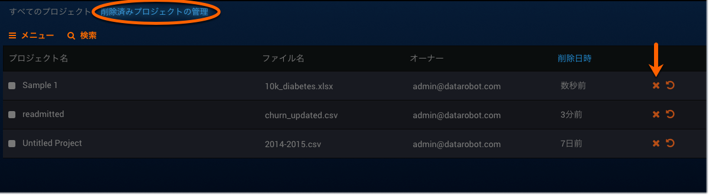

5. 「x」アイコンをクリックして、プロジェクトを完全に削除します。プロジェクトが完全に削除される前に、確認を求める警告メッセージが表示されます。

	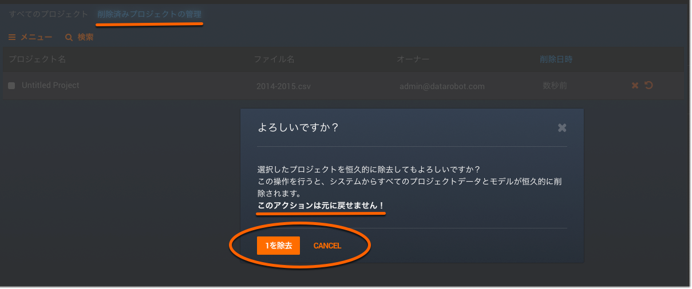

**注意:** **削除済みプロジェクトの管理**ページから削除したプロジェクトは恒久的に削除されるので復元できません。


<a name="restoring-projects"></a>
###プロジェクトの復元
**削除済みプロジェクト**ページからは、削除したプロジェクトを復元することもできます。

**すべてのプロジェクト**ページでプロジェクトを削除した後、**削除済プロジェクトの管理**タブをクリックします。このページに表示されるプロジェクトを復元できます。

「x」（恒久的な削除）アイコンの右側に、反時計回りの矢印が付いた円アイコンがあります。この矢印アイコンをクリックして、削除済みプロジェクトを復元して、**すべてのプロジェクト**ページに戻すことができます。

復元するプロジェクトの反時計回り矢印アイコンをクリックします。

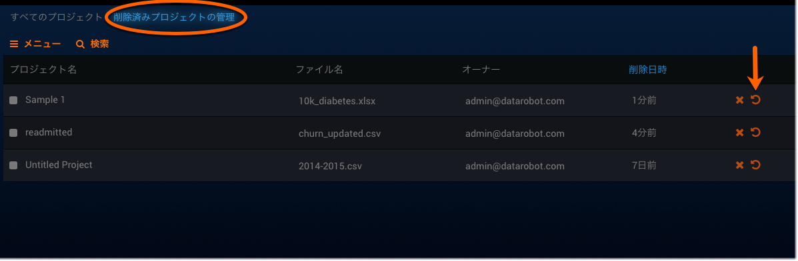

プロジェクトの復元を確認する画面が表示されます。復元プロセスを完了するには、「復元1」をクリックします。プロセスをキャンセルするには、「キャンセル」をクリックします。

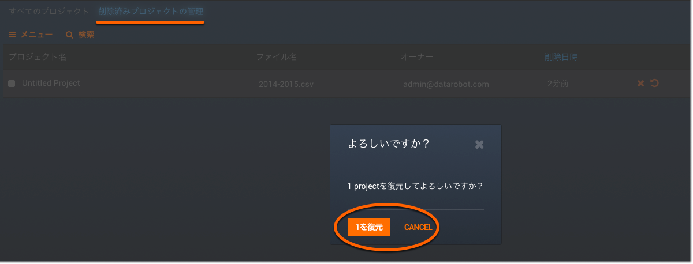

**注意:** **削除済みプロジェクトの管理**ページで（「x」アイコンをクリックして）削除したプロジェクトは恒久的に削除されるので、復元することはできません。


<a name="supporting-transgerable-models"></a>
移行可能なモデルのサポート
------------------------------

この機能はエンタープライズ版DataRobotでのみ使用可能で、モデルをDataRobotアプリケーション（プロジェクトを作成したアプリケーション）から別のアプリケーション（予測を作成するためにモデルを使用するアプリケーション）に移行できます。予測システムに分離型の安定した環境を作成する場合は、モデルの移行機能を使用してください。

**注意:** __________以下のバージョンで使用する場合は既知の問題があります。


<a name="standalone-servers"></a>
###スタンドアロン予測サーバー

モデルをスタンドアロン予測サービスに移行すると、予測サーバーとモデル開発サーバーの間における競合と予期しないインタラクションの両方が回避されるので堅牢性が向上します。
ファイルをスタンドアロン予測サーバ・クラスターにインポートすると、DataRobotは後の予測を目的としてモデルを共有します。スタンドアロン予測サーバーはインポートしたファイルにアクセスしてDataRobotアプリケーションを実行し、モデルによる予測を作成します。

これらのモデルファイルをエクスポートおよびインポートするには、特定のアクセス許可が必要です。

* モデルをエクスポートするには、3つのアクセス許可（所有者、データサイエンティスト、および管理者）に加えて プロジェクトへのアクセス許可が必要です。
* モデルをインポートするには、スタンドアロン予測サーバー（ターゲットマシン）に対するPredictions Admin権限が必要です。

**注意:** 移行するモデルのファイルインポートサイズは5GB以下である必要があります。ユーザーモデルまたはオープンソースモデル（あるいはユーザーモデルまたはオープンソースモデルを含むアンサンブルモデル）はエクスポートできません。


<a name="assigning-admin-functions"></a>
###管理機能の割り当て
モデルの移行機能を使用するには、管理者がユーザーのアクセス許可ページでこの機能を有効にする必要があります。

1. アプリケーション画面の右上にあるプロファイルアイコンをクリックして、ドロップダウンメニューから「ユーザーの管理」を選択します。

	

2. リストで目的のユーザーを選択し、「ユーザー権限」を選択して、そのユーザーのアクセス許可ページを表示します。

	

3. 「有効化された機能」の下で、「Predictions Admin」の横にあるボックスをチェックします。
4. 「保存」をクリックして、そのユーザーの更新されたアクセス許可を保存します。

	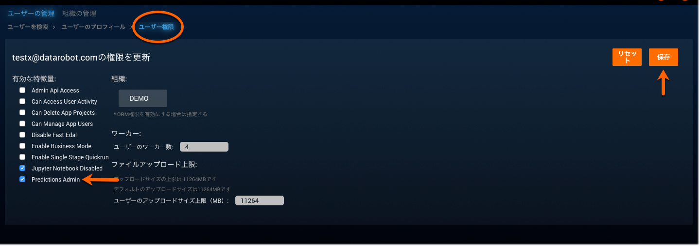
 
5. プロファイルアイコン（アプリケーション画面の右上）をクリックすると、ドロップダウンメニューに「予測の管理」という新しいオプションが表示されます。

	

このオプションが表示された場合、この機能が正常に適用されたことを意味し、そのユーザーはモデルの移行を行うことができます。


<a name="import-to-scoring-engine-cluster"></a>
###スコアリングエンジンクラスターへのインポート
アプリケーション画面の右上にあるプロファイルアイコンをクリックして、ドロップダウンメニューから「予測の管理」を選択します。


画面上部にある「モデルのインポート」をクリックします。インポートダイアログが開きます。


インポートする.drmodelファイルを画面にドラッグするか、「モデルの参照」ボタンをクリックし、ファイルを指定して追加します。この時点で「インポートのキャンセル」をクリックすると、インポートをキャンセルできます。ファイルのインポートが完了すると、***予測の管理***ページにモデルが表示されます。

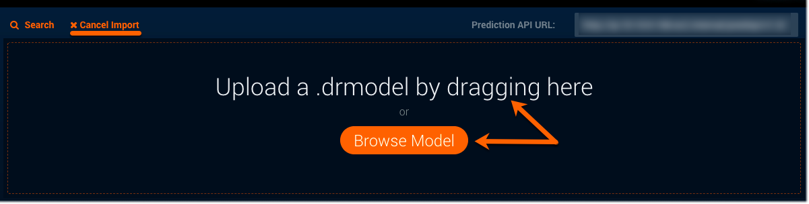

画面に表示されるリストで、インポート済みのモデルをクリックすると、そのモデルが展開してモデルのソースコードのスニペットが表示されます。このモデルコードを使用して、スタンドアロン予測環境で予測を作成できます。

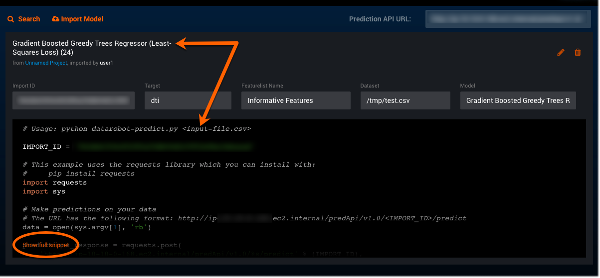

コード画面の下部にある「完全なスニペットを表示」をクリックすると、モデルのソースコード全体が表示されます。


