<a name="managing-user-accounts"></a>
Managing User Accounts 
======================

 
<a name="creating-user-accounts"></a>
Creating user accounts 
----------------------

Admin users are capable of creating and adding new users to the DataRobot Enterprise Platform, as long as they already have the “Manage Users” permission enabled on their own profile. This allows the Admin to maintain who can (and cannot) have access to the system. 

1. Click the profile icon located on the top right corner of the screen to expand a dropdown menu of profile options. Click **Manage Users**:

	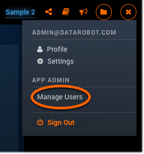

2. Click **Add New User** and fill out the email address and password for the new user you want to add:

	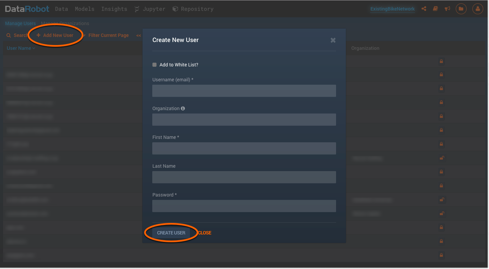

Click **Create User** when you're done.


<a name="setting-user-permissions"></a>
Setting user permissions
-------------------------

An Admin user is able to set permissions and settings for both themselves and other users within their organization. These permissions give the Admin access to a list of features that can be enabled or disabled per person, as needed.

Below are the steps to enable Admin access for any user.

1. Click the profile icon located on the top right corner of the screen to expand a dropdown menu of profile options. Click **Manage Users**:

	

2. You are now on the **Manage Users** page. In the **Search** bar, enter the user’s username:

	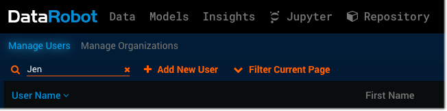

3. Click a user listed from the search results table below. This will take you to that user’s profile page. 

4. Click **Change Permissions** (located underneath the registration date), and this will take you to the **User Permissions** page:

	

5. Select the **Can Manage App Users** option listed underneath "Enabled features", and then press the **Save** button (located on the far right) to ensure that this permission change is set:

	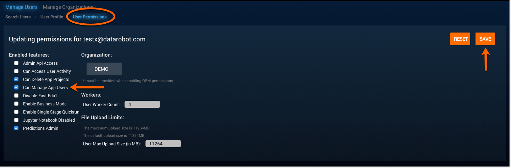

Once the **Can Manage App Users** feature is enabled and saved, that user can then change settings for other users by following these same instructions. 

If you want to disable the **Can Manage App Users** permission feature, simply uncheck the box, and that user will no longer have Admin capabilities.

<a name="changing-your-password"></a>
Changing your password
-----------------------

1. Click **Settings** located under your avatar on the top right corner of the screen. You will see the “Change Your Password” form at the top of the **Settings** page:

	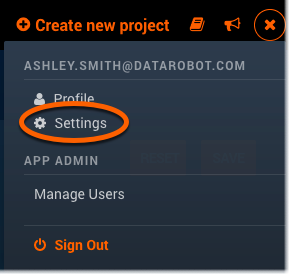

2. First, enter your current password. Then, enter your new password two times - once to create it, and a second time to confirm it. 

	**Note:** You will receive an error message if your current password is incorrect, and/or if the new and confirmed password fields do not match each other.

3. Click **Change Password** when you have properly completed all of the fields. DataRobot will briefly display a message indicating the update:

	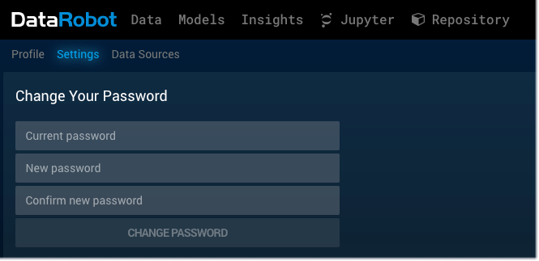

**Note:** DataRobot enforces the following password policy for new accounts and password changes:

- Only printable ASCII characters
- Minimum one capital letter
- Minimum one number
- Minimum 8 characters
- Maximum 512 characters
- Username and password cannot be the same


<a name="deactivating-user-accounts"></a>
Deactivating user accounts
---------------------------

You cannot delete a user account from DataRobot. This ensures that your organization's data is not lost, regardless of employee movements over time.

However, the Admin can block a user's access, by simply searching for the user, and clicking the padlock icon next to their name so that it is in a closed or "locked" state. 

In this way, the user is now disabled and cannot log back into the system. However, the data and projects they worked on will remain intact. You can later restore the user's account to access DataRobot by re-opening or "unlocking" the padlock icon. 

Here is an example that shows what the padlock icons look like for various users within an organization:

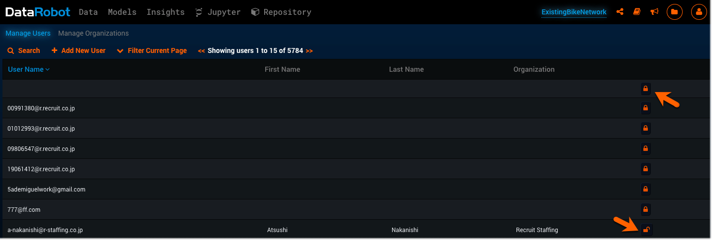

You can also disable a user by going into any user’s profile and clicking the **Disable User** button on that page. When you disable a user in this way, the button will automatically change and say **Enable User**, which you can then click again to make this user active. 

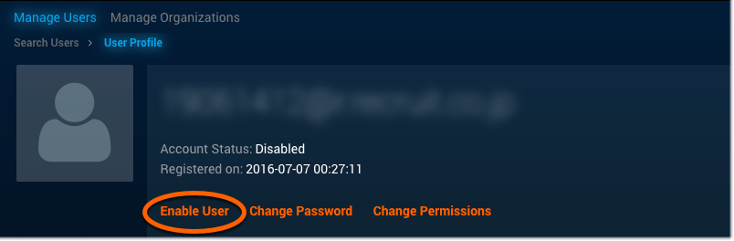

<a name="common-admin-tasks"></a>
Common Admin Tasks
------------------

<a name="activity-monitor"></a>
###Activity monitor 
The _activity monitor_ is a system that sends notifications, for certain events happening in DataRobot, through a specialized log file system. These specific events encompass the processes that take place on the application ranging from the signon step, all the way to insights and prediction events. The activity monitor tracks and logs each of the resources that were accessed during each event. 


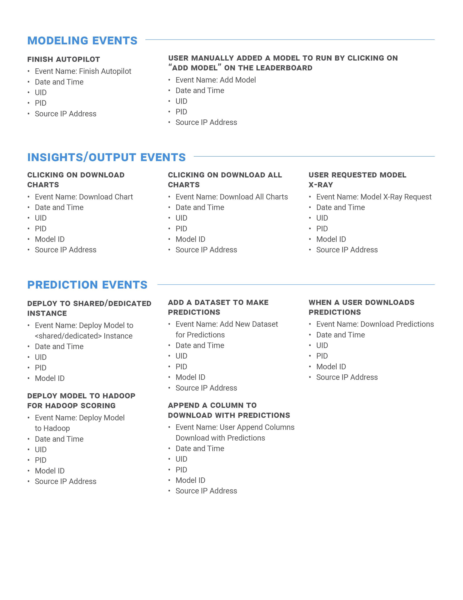


<a name="administrative-settings-on-jupyter"></a>
Administrative settings Jupyter
---------------------------------


<a name="jupyter"></a>
###Jupyter

The **Jupyter** tab is automatically enabled and viewable on DataRobot for all users. However, we suggest that the Admin initially disable this feature for every user within their organization. This way, only the users who plan to actually utilize the Jupyter tool can then have it enabled for them by their Admin. This is a more organized way to manage the powerful tool and prevent any potential confusion.

DataRobot builds hundreds of powerful predictive models that are “out of the box”, along with a diverse set of “best in class” algorithms. Users are able to integrate additional models that may not be available on DataRobot. These custom models are also made available on the **Leaderboard** for making comparisons alongside the other models.

You can create custom models by using _Jupyter_, which is an open source project that includes an interactive notebook web app and other related components. Jupyter works with various language kernels, and was developed as an offshoot of IPython to support language independence. 

DataRobot allows you to use the Jupyter Notebook environment to develop new and custom models, or for integrating existing R and Python models. 

The **Jupyter** tab can be found on the top of DataRobot application page. If the **Jupyter** tab is visible, the user has access to this feature and can create custom models with it. 

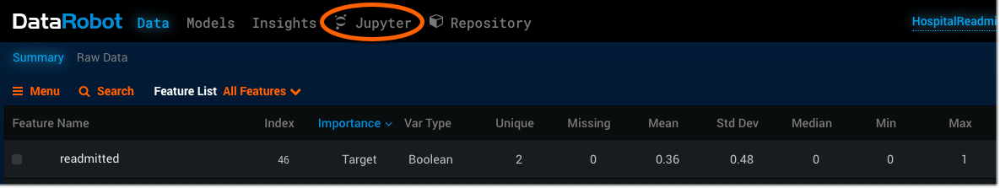

If the **Jupyter** tab is not visible, it means that this tool has been disabled, and cannot be used. The Admin can go into the user’s profile to enable the feature, if the user wants to utilize this program. 

1. Click the profile icon located on the top right corner of the screen to expand a dropdown menu of profile options. Click **Manage Users**:

	

2. Select a user from the **Manage Users** list to view that user's profile and permissions:

	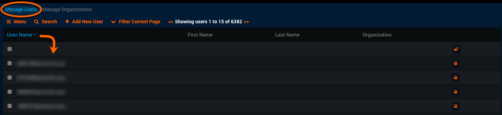

3. Click **Change Permissions** in order to see the full list of features for that user:

	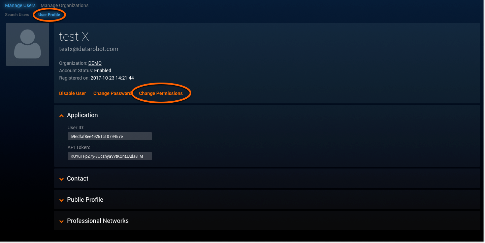

4. Scroll down until you see the _Jupyter Notebook Disabled_ feature. If the box is already checked, it means that the user cannot see or use the Jupyter feature. Uncheck the box to enable the feature:

	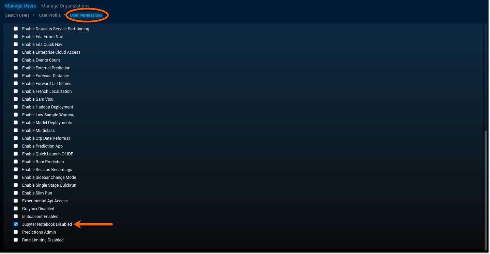

5. Then, click the **SAVE** button on the top right corner of the **User Permissions** page:

	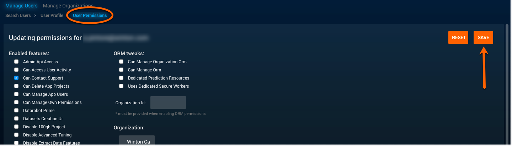

Jupyter Notebook is now enabled and accessible to this user, which means that it will now appear as a tab on the top bar of the application screen (located between **Insights** and **Repository**).


<a name="per-organization-resource-constraints"></a>
Per-organization resource constraints
-------------------------

This feature is managed by the Admin and depends on the organization’s various project needs. Enterprise Admin can access this feature under the **Manage Users** page, where the **Manage Organizations** tab is located. 

1. Click the profile icon located on the top right corner of the screen to expand a dropdown menu of profile options. Click **Manage Users**:

	
	
2. Click **Manage Organizations** (located to the right of **Manage Users**):

	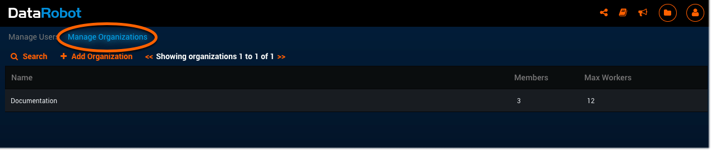

The **Manage Organizations** page is where the Admin can create and store organizations. There is also a search bar built onto this page to make finding specific organizations easier. 

An organization can have zero users when it is first created and also when all of the members have been removed – it just depends on the organization’s needs as they can change over time. 

When you go to the **Manage Organizations** tab and click on **Add Organization** (located next to the search bar), a form will appear for you to fill out with information on the organization you’d like to create. 

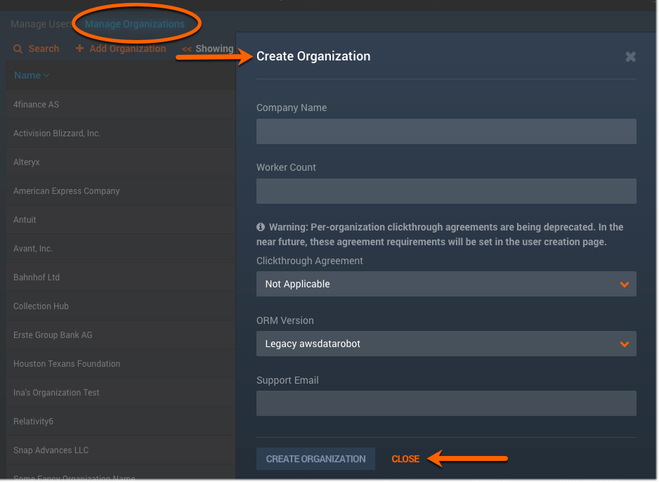

When the form is complete, click **CREATE ORGANIZATION** and it will be saved to a list where all organizations go once they've been created. 

The Admin can also add and remove users to and from any of their organizations. This process can also be done in two ways: 1) on the **Manage Organizations** page, 2) through the user’s own profile page. 

When a user is added to an organization from the **Manage Organizations** page, an invite will be sent to that user to specify which organization they've been initially added to. This initial setup can only be done through the **Manage Organizations** page.

Editing a user’s organization status through that user's own profile page is a simple change that can happen after the initial setup is complete. 

1. Click the profile icon located on the top right corner of the screen to expand a dropdown menu of profile options. Click **Manage Users**:

	

2. Select the user who needs to have their organization permissions edited. 

	This will take you to the **User Permissions** page, where you can directly edit the _Organiztion ID_ and _Organization name_ for that user by clicking on each field to make the changes:

	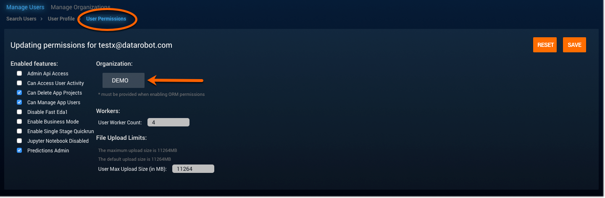


<a name="starting-stopping-and-managing-services"></a>
Starting, stopping, and managing services
---------------------------------
It is important to be able to stop, start, and manage services on DataRobot in order to avoid problems, make changes or fixes, and check to make sure that everything is in good condition. 

**Note:** These DataRobot services are just used for Docker, and do not affect the Hadoop site. 


<a name="starting-services"></a>
###Starting services:

Command name: ```make start-services```

This is the initial start command. It is a cluster-wide command that needs to be executed from the provisioner host, under the same directory from where the config.yaml file is located. This command starts the registry and docker containers services for all of the hosts from that file. 


<a name="stopping-services"></a>
###Stopping services:
Command name: ```make stop-services```

This is another cluster-wide command that also needs to be executed from the provisioner host, under the same directory from where the config.yaml file is located. This command stops the registry and the docker containers cleanly for all of the hosts from that file. 


<a name="restart-services"></a>
###Restart services:
Command name: ```make restart-services```

For this command, you simply need to run the stop-services command first, then then run start-services command, in order to properly restart the services. Restarting something, indicates that it has stopped. This two-step process is detailed above for the start and stop services. 


<a name="check-services-status"></a>
###Check services status:

This command checks the container state on docker, which is defined in a config.yaml file. 

Docker easily deploys the application inside the container, which can provide the same isolation as with virtual machines (VM), but at a fraction of the computation power. It is beneficial to check on the container state to ensure that the deployment goes well. The services (Redis, Mongo, Gluster, HDFS, and AWS Cloud) may fail to restart if the container isn’t cleanly stopped. In this case, you’ll need to reboot. 

DataRobot uses dependency delivery through Docker-run mongo, which pulls mongo from docker.io and starts it. It also creates a local registry. Images are loaded to the registry, and then pulled during the install. 


<a name="backup-and-recovery"></a>
Backup and recovery
-------------------
For the storage database on the application, DataRobot uses each of the following services:


<a name="redis"></a>
###Redis
Redis is an open source storage service that supports a variety of data structures (strings, hashes, lists, sets, sorted sets with range queries, bitmaps, etc.). It focuses on big data things, and is a NoSQL service. DataRobot uses Redis to store information such as user sessions and queue details.


<a name="mongo"></a>
###Mongo
Mongo (another storage service) is the primary component of MongoDB for managing data. MongoDB offers a selection of storage engines so that you can choose the one that best fits your application needs. This storage service has a metadata (mapping) structure, and is also categorized as NoSQL. Mongo uses JSON documents to store Project IDs on DataRobot (NOT the project file itself).  

<a name="gluster"></a>
###Gluster
Gluster is a storage service that can do incremental tar, which is a special archive form used for storing additional metadata, so that the exact state of the file system can be restored when pulling from the archive. Gluster’s distributed file storage system holds DataRobot’s .csv files, cv’s, and models. When you upload a dataset to the application, it is saved to Gluster. Everything on the dataset goes to Gluster; with the exceptions of the metadata (stored in Mongo), and the supported data structures information (stored in Redis). 


<a name="hdfs-hadoop-distributed-file-system"></a>
###HDFS (Hadoop Distributed File System)
HDFS, a distributed file system, is the primary storage system for Hadoop applications that provides high-performance access to data across all Hadoop clusters. This service is similar to Gluster because it’s also used for storing the same types of data (.csv, cv’s, and models) on DataRobot. 

As a result of this overlap, HDFS and Gluster are mutually exclusive services on the DataRobot platform. When the Hadoop (with HDFS) service is being used, it replaces Gluster, and vice-versa. Both of these services are never used at the same time. 
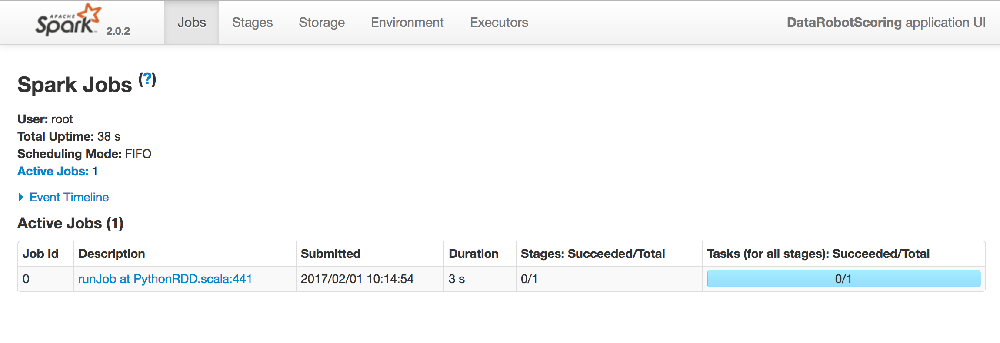


<a name="aws-amazon-web-services-cloud"></a>
###AWS (Amazon Web Services) Cloud
AWS is a secure cloud services platform that provides computing power, database storage, content delivery, and other functionalities in order to help businesses scale and grow. We rent virtual machines on AWS in order to use the DataRobot platform, and also because AWS is one of two methods for hosting this product for the install. (On-premise is the other method for product install, which takes place at a physical company or site location.) Gluster install is preferred, so Hadoop install generally isn’t used at all. 

When changing instance types on AWS, stop services first, change the instances, and then start again. 
We follow Amazon’s guidelines for growing filesystems (ex: adding disk space), and the AWS guidelines for file recovery (via snapshot recovery). We also use ELB (Elastic Load Balancing), the load-balancing service on AWS, for our prediction servers. ELB can automatically distribute incoming traffic and scale resources to meet traffic demands. 

<a name="disaster-recovery-config"></a>
Disaster recovery config
------------------------
###Rebuild Mongo and Gluster mirrors
The first step in disaster recovery is prevention. Ensure that everything is setup properly with high availability to prevent disaster and redundancy. Instead of having one instance of each storage database (redis, mongo, and gluster), add multiple instances of each so that there are extras to pick up the slack if things go wrong. Instead of completely breaking, the additional instances can keep things going without any breaks. 

<a name="recovery-from-backups"></a>
###Recovery from backups
A real disaster occurs when everything completely fails and there are no extra instances left to use. For a situation like this, the best and only option is to backup to the most recently saved version using restore procedures to the most recent backup. Timely backups are important for this scenario and happen on a daily basis. In the event of complete disaster, the backup is the only method, which is why preventative measures are very important.  


<a name="snapshot-recovery"></a>
###Snapshot recovery
Snapshots are incremental backups, which means that they save only the blocks on the device that changed after your most recent snapshot. Snapshot recovery is a great tool to have because it minimizes the time required to create the snapshot and saves on storage costs by not duplicating data. Each snapshot taken contains all of the information you need to restore the data to a new EBS volume. 
When DataRobot Enterprise is installed in AWS, the customer often uses the AWS EBS snapshot tool. Snapshot for disaster recovery is faster than restoring redis, mongo, and gluster individually. If you want to make a backup, simply stop the instance and take snapshot of the volume.


<a name="monitoring-datarobot"></a>
Monitoring DataRobot
--------------------

<a name="nagios"></a>
###Nagios
Nagios is a free and open source computer software application used to monitor systems, networks, and infrastructure. It also offers monitor and alert services for servers, switches, applications, and services. 

<a name="linux"></a>
###Linux
Nagios provides complete monitoring for Linux operating systems (os) and distributions. This includes os metrics, service state, process state, file system usage, and more.

Linux monitors the DataRobot os services (CPU, memory, I/O, networks, and disk space) and hardware events, in addition to checking the Docker service and O/S logs. This can be done through Enterprise System Monitoring (Nagios, Datadog, Patrol, etc.).

<a name="datarobot"></a>
###DataRobot
The AvailabilityMonitor on DataRobot provides general information about the application such as whether the application is ready to do work, how many users are connected, and which users they are. 
It calls the REST APIs to request a status for what’s going on, and the API comes back with the requested information. The AvailabilityMonitor REST API can also integrate with monitoring software applications like Nagios.


<a name="nagios-configuration"></a>
###Nagios Configuration

<a name="nagios-health-check"></a>
_Nagios - Health Check_

DataRobot periodically and proactively checks the health of the on-premise customers to ensure that any potential problem(s) can be identified early, preventing any potential blocker issues. 
On DataRobot, Nagios has access to the AvailabilityMonitor REST API. It can tell the service to do something on your behalf and returns result of what it did. Having these two components communicate with each other allows for easy and accurate checks. 


<a name="customer-usage-report"></a>
##Customer Usage Report
The Customer Usage Report is updated daily by the Customer Success team, and provides the CFDS and Sales teams with insights into users’ activities on DataRobot, without needing to take the time to reach out and ask each person for that information. 

If you have any questions regarding a specific user, please contact Customer Support: Support@datarobot.com.

The report is organized on an Excel spreadsheet for each customer along with a series of useful information pertaining to their organization, project, and other activity statistics that have occurred. 

_Column definitions on the usage report:_

|Column names| Definitions|
|------------|:-----------|
|```Notes``` | Internal notes|
|```Domain```| Domain of user's email address|
|```PID```| Project ID|
|```CreationTime```| when project was created|
|```Email```| Project owner|
|```total_models```| the amount of models created for this particular project|
|```num_model_errors```| how many model errors|
|```latest_model_training_time```| date of last model created|
|```total_user_models```| number of custom models built after Autopilot|
|```PID Errors```| Project ID errors|
|```PID Has Error```| If any of the below are set to "FALSE" then this column will say "Error"|
|```has metadata```| metadata record exists|
|```has eda```| eda record exists|
|```has low info var```| low info variables were identified in the dataset|
|```has vartypes```| var type string exists (fails currently due to schema change)|
|```has summary```| all non low info variables have summary data (min, max, mean, etc)|
|```has profile```| all non low info variables have profile information (charts)|
|```has metric```| metric has been set for the project|
|```has mode```| mode (auto, semi-auto, manual) has been set for the project|
|```has target```| target variable has been set for the project|
|```has info```| info scores (green bars in the app) have been computed after starting the project|
|```total_models```| how many models were created|
|```num_model_errors```| how many model errors|
|```latest_model_training_time```| date of last model created|
|```total_user_models```| number of custom models built after Autopilot|
|```target variable```| target selected by the user
|```metric```| metric selected for the project|


<a name="availability-monitoring"></a>
###Availability Monitoring
Requesting the health of DataRobot initially relied on smoke tests and manual UAT in order to tell if any of the installed clusters was running properly. Even though those tactics were challenging, the the information was valuable for both the users and the organizations. So, the Availability Monitor was created as a new service deployed alongside DataRobot. 
The Availability Monitor on DataRobot provides general information to customers about the current state of the application such as whether the it is ready to do work, how many users are connected, and which users they are. It also contains specific information about the status of components: what is expected to be running, and what is currently running. With this service in place, the Admin can easily track user activity on each project, and know when DataRobot has available resources to begin working. 


<a name="managing-projects"></a>
Managing projects
-----------------


<a name="permanently-deleting-projects"></a>
###Permanently deleting projects
"Deleting App Projects" is a feature that the Admin can enable for any user through the **User Permissions** page. Once this feature is enabled, the user can delete any project that they want. Deleting projects is a valuable feature that can help clear space for new projects. 

To enable this feature, the Admin needs to... 

1. Click the profile icon on the top right corner of the application screen, and select “Manage Users” from that dropdown menu:

	

2. Select a user from the Manage Users page:

	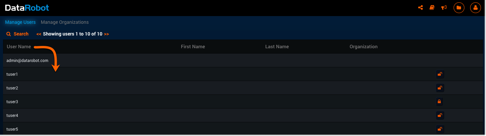

3. Click “Change Permissions” for the user to view and edit their permissions:

	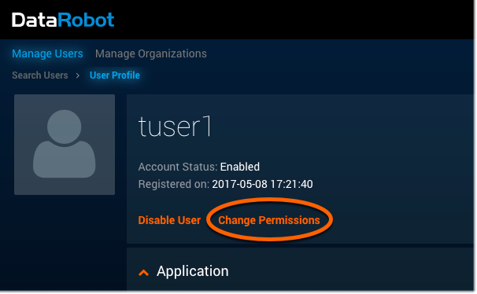

4. Check the box next to the feature named “Can Delete App Projects”, which enables this feature:

	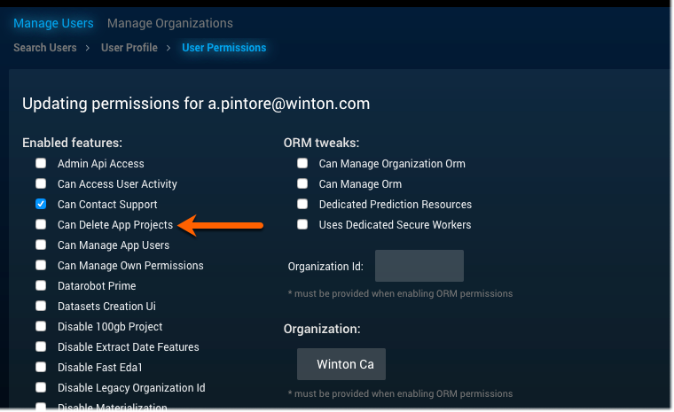

Now that you’ve enabled this feature, that user can delete unnecessary projects and make space for new ones...

1. Click on the folder icon located on the top right corner of the application screen and select "Manage Projects". This will take you to the **All Projects** page, which lists every project you’ve made on DataRobot: 

	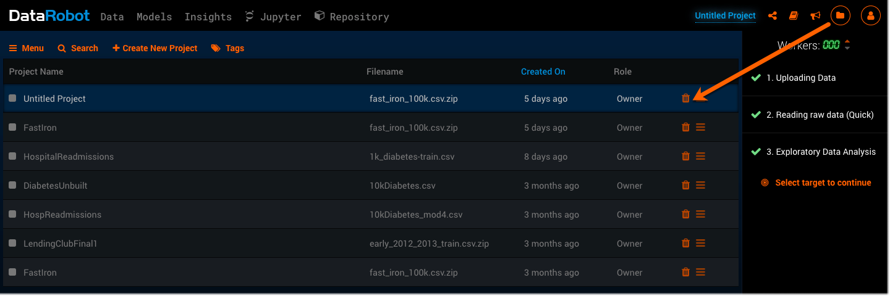

	To the right of each project is a trash can icon 	that allows you to delete the project. 

2. Click the trashcan for the corresponding project to delete it. A confirmation screen will appear as a warning before you decide to complete the deletion. 

	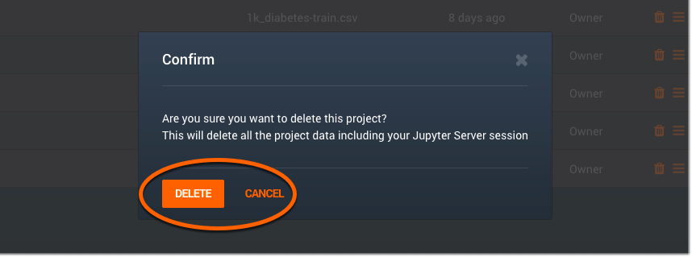
	
	At this point, the project has been deleted, but 	it hasn't been _permanently_ deleted. In order 	to permanently delete a project, a few 	additional steps are needed.

3. Click on the **Manage Deleted Project** tab located next to **All Projects**. This is where all of the deleted projects are stored.
4. You will see a row of "x" icons located to the far right of each project. The "x" icon will permanently delete the project:

	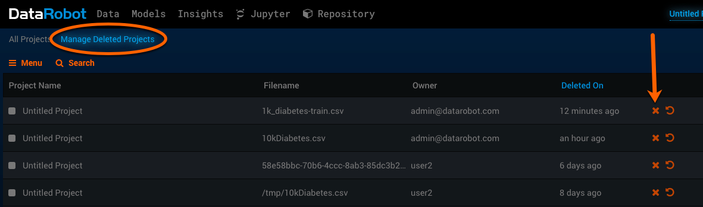

5. Click on the "x" icon to permenantly delete the project. Another warning message will appear before the project is permanently deleted, in case you change your mind and want to keep it:

	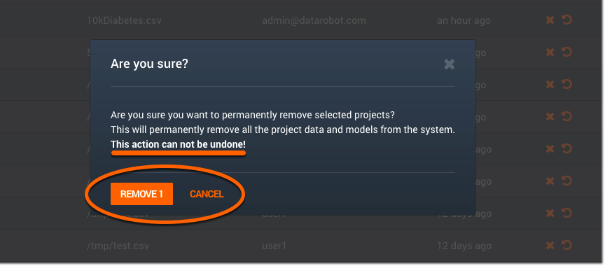

**Note:** Once you delete a project from the **Manage Deleted Projects** page, it is permanently deleted and cannot be recovered.  


<a name="restoring-projects"></a>
###Restoring projects
You can also restore a project that's been deleted from the **Manage Deleted Projects** page. 

Once you’ve deleted a project from the **All Projects** page, click on the **Manage Deleted Projects** tab. Any and all of the deleted projects on this page can be restored.

To the right of the “x” (permanently delete) icon is a circular back arrow pointing in a counter-clockwise direction. This arrow icon allows you to restore a deleted project, and bring it back to the **All Projects** page.

Click the back arrow icon for the project you want to restore:

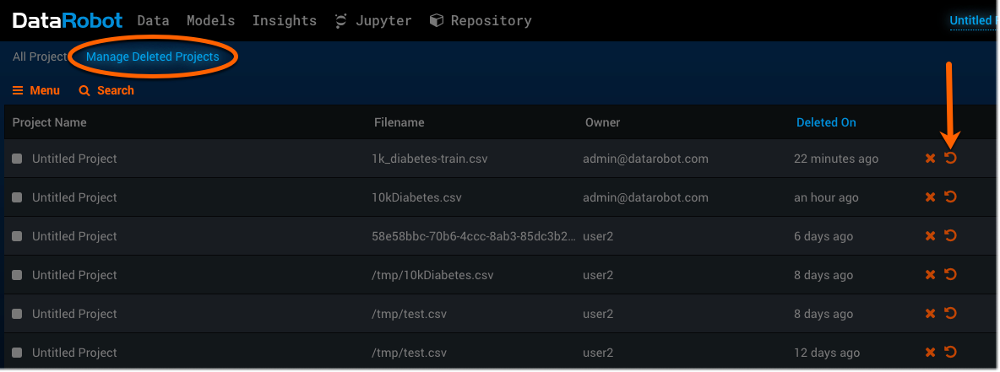

A screen will appear to make sure that you want to follow through with the restoration. You can complete the restoration by clicking "RESTORE 1" or cancel the process by clicking "CANCEL":

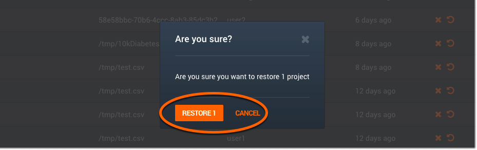

**Note:** Once a project is deleted from the **Manage Deleted Projects** page (by clicking the "x" icon), it cannot be restored because it's been permanently deleted.


<a name="supporting-transgerable-models"></a>
Supporting transferable models
------------------------------

This feature is only available on Enterprise, and allows users to transfer models from the DataRobot application (where they were built), to another application (where those models can be used for making predictions). Use the model transfer feature when you want to create an isolated and stable environment for your prediction systems.

**Note:** There are known issues with using versions less than __________


<a name="standalone-servers"></a>
###Standalone servers

Transferring a model to a standalone prediction service increases its robustness by avoiding both contention and unplanned interactions between the prediction server and the model development server. 
Once you import the file to the standalone predictions cluster, DataRobot stores the model for later predictions. The standalone prediction server has access to the imported model file, and it can then run the DataRobot application to make predictions with that model. 

Certain permissions are required for the export and import of these model files:

- A user who wants to export a model needs to have access to the project in addition to these three permissions: Owner, Data Scientist and Admin. 
- A user who wants to import a model must have prediction admin permissions to the standalone prediction server (target machine). 

**Note:** The file import size for transferring models cannot exceed 5GB. You also cannot export user models and open-source models (or blender models containing user or open-source models). 


<a name="assigning-admin-functions"></a>
###Assigning admin functions
In order to use the model transfer feature, an Admin needs to enableit from the user permissions page.

1. Click the profile icon on the top right corner of the application screen, and select "Manage Users" from that dropdown menu:

	

2. Select a user from the list, then go to their User Permissions page, by selecting "Change Permissions":

	

3. Check the box next to "Prediction Admin", which is located inderneath the "Enabled features" list.
4. Click "SAVE" to complete the updated permission for this user:

	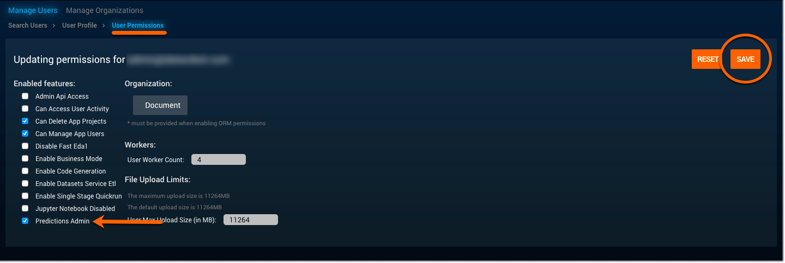
 
5. Now, when you click on the profile icon (on the top right corner of the application screen), a new option will appear on the dropdown menu – "Manage Predictions":

	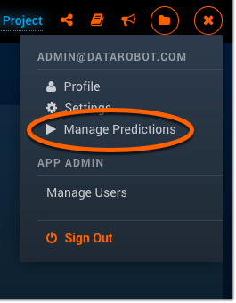

Seeing this means that the feature has been successfully applied, and this user can now transer models to and from DataRobot. 


<a name="import-to-scoring-engine-cluster"></a>
###Import to scoring engine cluster
Click the profile icon on the top right corner of the application screen, and select “Manage Predictions” from the dropdown menu:


Click “Import Model” at the top of the page. This will open an import dialog:

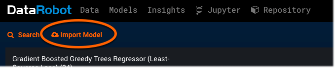

Select a .drmodel file to import by either dragging it onto the screen, or by clicking the “Browse Model” button to locate the file and add it from there. You can also cancel the import at this time, by simply clicking “Cancel Import”. When the file import is complete, the model will appear on the ***Manage Predictions*** page:

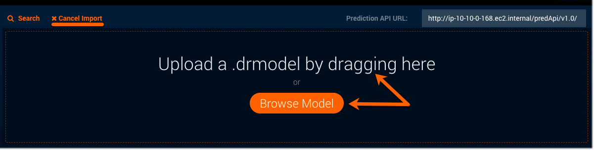

Click on the imported model listed on the screen, which will expand it – showing a snippet of that model’s source code. You can now use the model code to make predictions on a standalone predictions environment:

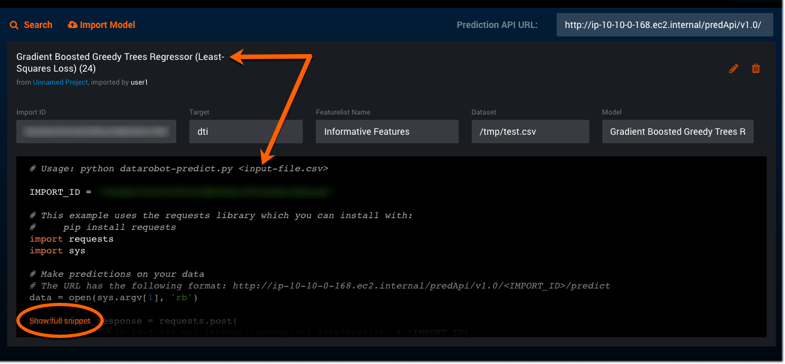

Click “Show full snippet” at the bottom of the code screen to view the entire source code for the model.


