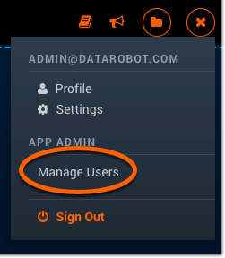
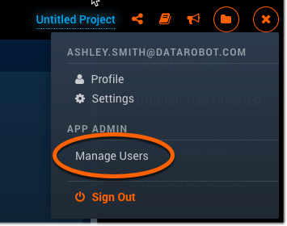

Managing User Accounts 
======================

Creating user accounts 
----------------------

Admin users are capable of creating and adding new users to the DataRobot Enterprise Platform, as long as they have the “Manage Users” permission enabled on their profile. This allows the Admin to maintain who can have access to the system. 

**Note:** If you are using LDAP or Active Directory, please contact Support to configure your system. 

1. Click the profile icon located on the top right corner of the screen to expand a menu of profile options. Click **Manage Users**:

2. Click **Add New User** and fill out the email address and password for the new user you want to add:

Click **Create User** when you're done.

Setting user permissions
------------------------

An Admin user is able to set permissions and settings for both themselves and other users within their organization. These permissions give the Admin access to a list of features that can be enabled or disabled per person, as needed.

Below  are the steps to enable Admin access for any user.

1. Click the profile icon located on the top right corner of the screen to expand a menu of profile options. Click **Manage Users**:

2. You are now on the "Manage Users" page. In the **Search** bar, enter the user’s username:

3. Click a user listed in the search results table below. This will take you to that user’s profile page. 

4. Click **Change Permissions** located underneath the registration date, and this will take you to the "User Permissions" page:

5. Select the **Can Manage App Users** option listed underneath "Enabled features", and then press **Save** located to the far right to ensure that this permission change is saved:

Once the **Can Manage App Users** feature is enabled and saved, that user can then change settings for other users by following these same instructions. If you want to disable the **Can Manage App Users** permission feature, simply uncheck the box, and that user will no longer have Admin capabilities.

Changing your password
-----------------------

Any user on DataRobot can change their password any time through their profile settings page of the application. 

1. Click **Settings** located under your avatar on the top right corner of the screen. You will see the “Change Your Password” form at the top of the "Settings" page:

2. First, enter your current password. Then, enter your new password twice - once to create it, and a second time to confirm it. 

**Note:** You will receive an error message if your current password is incorrect, and/or if the new and confirmed password do not match.

3. Click **Change Password** when you have completed all fields. DataRobot will briefly display a message indicating the update:

DataRobot enforces the following password policy for new accounts and password changes occurring after October 5, 2016. Passwords **must** adhere to the following:

- Only printable ASCII characters
- Minimum one capital letter
- Minimum one number
- Minimum 8 characters
- Maximum 512 characters
- Username and password cannot be the same

Deactivating user accounts
-------------------------

You cannot delete a user account from the DataRobot Enterprise platform. This ensures that your organization's data is not lost, regardless of employee movement.

However, the Admin can block a user's access, by simply searching for the user, and clicking the padlock icon next to their name so that it is in a closed or "locked" state. 

In this way, the user is now disabled and cannot log in to the system, but the data and projects remain intact. You can later restore the user's account to access the data by re-opening or "unlocking" the padlock icon. 

You can also disable a user by going into any user’s profile and clicking the **Disable User** button on that page. When you disable a user this way, the button will automatically change to **Enable User**, which you can click again to make this user active again. 

Common Admin Tasks
------------------

###Activity monitor (Audit log/Event tracking)

**User Events**

- When a user logs into the application
	- Event Name: Login
	- Date and Time
	- UID
	- Authentication Event (ignore)
	- Source IP Address
	- Login Success (True/False)
	- Processes (API or Web App)
	- Mongo Collection (users)
	- Redis Key (User:UID)
- Logout
	- Event Name: Logout
	- Date and Time
	- UID
	- Authentication Event (ignore)
	- Source IP Address
	- Program Used - MongoDB/Redis (ignore)
- Click to view User Documentation
	- Event Name: Click on User Documentation Link
	- Date and Time
	- UID
	- Source IP Address
	- Route Accessed (/docs/user-guide/user-guide-file.html"
	- Program Used - MongoDB/Redis (ignore)

**Project Events**

- Create New Project
	- Event Name: Create New Project
	- Date and Time
	- UID
	- PID
	- Source IP Address
	- Program Used - MongoDB/Redis (ignore)
- Renaming a Project
	- Event Name: Rename Project
	- Date and Time
	- UID
	- PID
	- Source IP Address
	- Program Used - MongoDB/Redis (ignore)
- Sharing a Project
	- Event Name: Share Project
	- Date and Time
	- UID
	- PID
	- Source IP Address
	- Program Used - MongoDB/Redis (ignore)
- Deleting a Project
	- Event Name: Delete Project
	- Date and Time
	- UID
	- PID
	- Source IP Address
	- Program Used - MongoDB/Redis (ignore)
- Selecting a Target
	- Event Name: Target Selected
	- Date and Time
	- UID
	- PID
	- Source IP Address
	- Program Used - MongoDB/Redis (ignore)

**Data Ingest Events**

- Uploading a Dataset with characteristics
	- Event Name: Dataset Upload
	- Date and Time
	- UID
	- PID
	- Source IP Address
	- File name
	- Number of Records (# Rows and # Columns)
	- File size
- Selecting a Metric
	- Event Name: Select Model Metric
	- Date and Time
	- UID
	- PID
	- Source IP Address
- Starting Autopilot
	- Event Name: Start Autopilot
	- Date and Time
	- UID
	- PID
	- Source IP Address
- Restarting Autopilot
	- Event Name: Start Autopilot
	- Date and Time
	- UID
	- PID
	- Source IP Address

**Modeling Events**

- Finish Autopilot
	- Event Name: Finish Autopilot
	- Date and Time
	- UID
	- PID
	- Source IP Address
- User manually added a model to run by clicking on "Add Model" on the leaderboard
	- Event Name: Add Model
	- Date and Time
	- UID
	- PID
	- Source IP Address

**Insights/Output Events**

- Clicking on Download Charts
	- Event Name: Download Chart
	- Date and Time
	- UID
	- PID
	- Model ID
	- Source IP Address
- Clicking on Download All Charts
	- Event Name: Download All Charts
	- Date and Time
	- UID
	- PID
	- Model ID
	- Source IP Address
- User Requested Model X-Ray
	- Event Name: Model X-Ray Request
	- Date and Time
	- UID
	- PID
	- Model ID
	- Source IP Address

**Prediction Events**

- Deploy to Shared/Dedicated Instance
	- Event Name: Deploy Model to <shared/dedicated> Instance
	- Date and Time
	- UID
	- PID
	- Model ID
- Deploy Model to Hadoop for hadoop scoring
	- Event Name: Deploy Model to Hadoop
	- Date and Time
	- UID
	- PID
	- Model ID
	- Source IP Address
- Add a Dataset to make Predictions
	- Event Name: Add New Dataset for Predictions
	- Date and Time
	- UID
	- PID
	- Model ID
	- Source IP Address
- Append a Column to download with predictions
	- Event Name: User Append Columns Download with Predictions
	- Date and Time
	- UID
	- PID
	- Model ID
	- Source IP Address
- When a user Downloads Predictions
	- Event Name: Download Predictions
	- Date and Time
	- UID
	- PID
	- Model ID
	- Source IP Address

Administrative settings on Enterprise and Jupyter
-----------------------------------------

###Enterprise
###Jupyter

Per-organization resource constraints
-------------------------------------

This feature is managed by the Admin and depends on the organization’s various project needs. Enterprise Admin can access this feature under the "Manage Users" page, where the "Manage Organizations" tab is located. 

The "Manage Organizations" page is where you create and store organizations. There is also a **Search** bar built onto this page to make finding specific organizations easier. 

An organization can have zero users when it is first created and also when all of the members have been removed - it just depends on the organization’s needs, which can change over time. 

When you go to the "Manage Organizations" tab and click on **+Add Organization** (located next to the **Search** bar), a form will appear for you to fill out with information on the organization you’d like to create. 

When the form is complete, click **CREATE ORGANIZATION** and it will be added to a list of every organization you've created. 

The Admin can also add and remove users to and from organization. This process can be done on the "Manage Organizations" page, as well as the user’s own profile page. When a user is added to an organization from the "Manage Organizations" page, an invite will be sent to that user to specify which organization they will initially be associated with. Editing a user’s organization status through that user's profile page is a simple change that happens after the initial association is made. 

Starting, stopping, managing services
-------------------------------------
###Backup and recovery
- Redis
- Mongo
- Gluster (can do incremental tar)
- HFDS (add screenshots of Cloudera Mgr GUI)
- AWS

Disaster recovery config
------------------------
- Rebuild Mongo and Gluster Mirrors
- Recovery from backups
- Snapshot recovery

Monitoring DataRobot
--------------------
- Linux
- DataRobot
- Nagios
- Usage reporting (ask support for copy of script)
- Availability (Monitoring) Guide (on confluence release page)
The Availability Monitor on DataRobot provides general information about the application such as whether the application is ready to do work, how many users are connected, and which users they are. 

Managing projects
-----------------

###Permanently deleting projects
Deleting projects is a valuable feature that can help clear space for new projects. Over time, old projects that are no longer needed or are out of date can take up space limiting the development of newer projects. 
The ability to Delete App Projects is a feature that the admin can enable for any user through the User Permissions page. Once this feature is enabled, the user can go view their projects under the Manage Projects page and click the trashcan icon to delete a specified project. 
When you select Manage Projects, you will see the All Projects page, which lists every project you’ve made on DataRobot. To the right of each project is a trash can icon that will allow you to delete the project. 
Once you’ve deleted a project from the All Projects page, click on Manage Deleted Projects tab. This is where all of the deleted (trashcan icon) projects live. To the right of each deleted project is an “x” icon, which will permanently delete that file. A warning will appear to let you know that once a file is permanently deleted, it cannot be recovered. 

###Recovering projects
Project deletion is a two-step process with the first moving the deleted projects from the All Projects tab to Manage Deleted Projects tab, and the second step being permanent project deletion from the Managed Deleted Projects tab. 
You can only recover a deleted project from the Manage Deleted Projects tab. Next to the “x” icon is a circular back arrow, which allows you to restore that project. Clicking the circular back arrow will restore that project and add it back to the list on the All Projects tab. 

Supporting transferable models
------------------------------

This feature is only available on Enterprise, and allows users to transfer models from the DataRobot application (where they were built), to another application (where those models can be used for making predictions). 

A user who wants to make a model transfer in this situation needs to have access to the project, and these three permissions: Owner, Data Scientist and Admin. 

Use the model transfer feature when you want to create an isolated and stable environment for your prediction systems. Transferal to a standalone prediction service increases robustness by avoiding both conventional and unplanned interactions between the prediction server and the model development server. 

Assigning admin functions
Import to scoring engine cluster
Standalone servers

