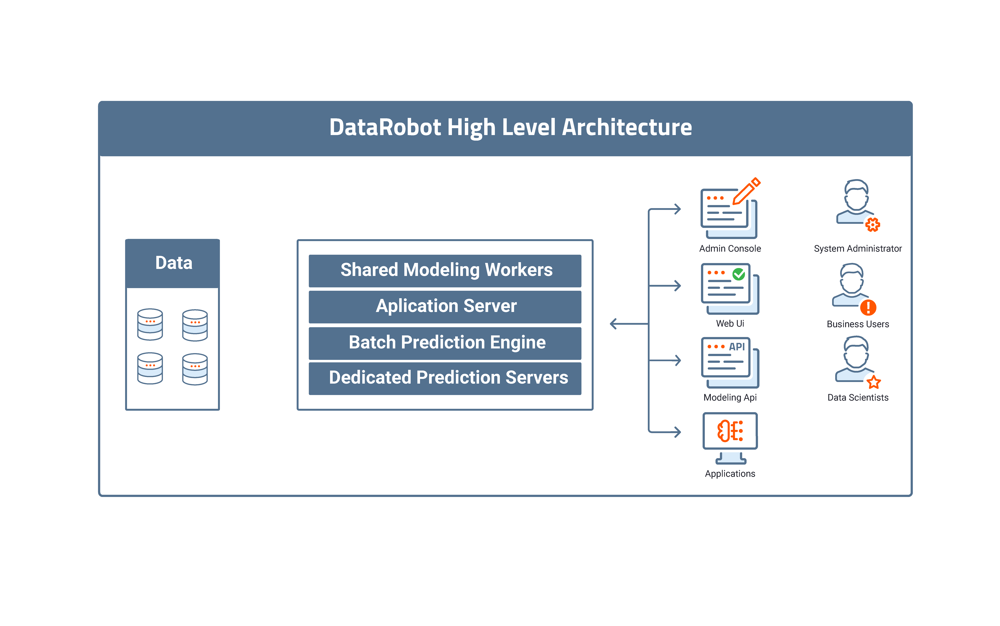

# DataRobot Installation and Administration Guide

Welcome to the DataRobot Administration Guide.

This manual describes how to install, configure, and maintain your DataRobot
installation.

## Platform Overview

The DataRobot platform is highly flexible and supports multiple environment
types, from single-node Linux systems to large Hadoop environments.

All installations require at the minimum a Linux application server running
DataRobot services in Docker containers. Services in Docker can be distributed
across multiple Linux servers for fault tolerance, resource isolation, and
greater computational resources.

In addition, the computational workload and object storage may be distributed
across a Hadoop cluster. In this case, you will install an additional artifact
on your Hadoop environment and configure your application server to
integrate with your Hadoop cluster.

## DataRobot Architecture

### Linux

The following diagram illustrates the high-level architecture of the DataRobot
Linux installation.

**NOTE**: Unless otherwise specified, "Linux" is applicable to all supported
Linux distributions and versions. Where there is something specific to a
particular distribution or version, it is mentioned explicitly.

### Hadoop

When DataRobot is integrated with Hadoop, the DataRobot cluster architecture is
modified to add a YARN Application Master that handles resources in Hadoop.

**NOTE**: Unless otherwise specified, "Hadoop" is applicable to both Cloudera
and Ambari clusters. Where there is something specific to Cloudera or
Ambari, it is mentioned explicitly.
