# Ambari (Hortonworks) Installation

## Transfer Files from Edgenode to Ambari

Connect to the edge node via SSH:

```bash
ssh [USERNAME]@[EDGE NODE IP ADDRESS]
```

Transfer the installation files from the edge node to the Ambari Manager:

```bash
scp ~/hadoop/DataRobot-RELEASE-hadoop-*.tar [AMBARI MANAGER SERVER IP ADDRESS]:/tmp
```

## Configure DataRobot Service for Ambari

Connect to the Ambari Manager Server via SSH:

```bash
ssh [USERNAME]@[AMBARI MANAGER IP ADDRESS]
```

Extract Ambari configuration descriptor:

```bash
cd /tmp
tar xvf DataRobot-RELEASE-hadoop-*.tar
cd ambari
tar xvf datarobot-ambari-*-RELEASE.tar.gz
```

Copy Ambari configuration descriptor to services directories:

```bash
find /var/lib/ambari-server/resources/stacks/*/*/services -maxdepth 0 \
    | xargs -n 1 cp -r DATAROBOT
```

Add to `/var/lib/ambari-server/resources/stacks/*/*/role_command_order.json`:

```bash
"DATAROBOT_CLIENT-INSTALL": ["NAMENODE-START", "DATANODE-START"],
```

Restart Ambari server:

```bash
sudo service ambari-server restart
```

If that fails, restart the service directly:

```bash
sudo ambari-server start --skip-database-check
```

The restart process may require several minutes to complete.

## Log in to Ambari

You should now be able to log in to the Ambari UI in your web browser.

1. Go to the Ambari UI in your web browser. The UI is available on port 8080.
2. Enter your username and password, then click **Sign in**:

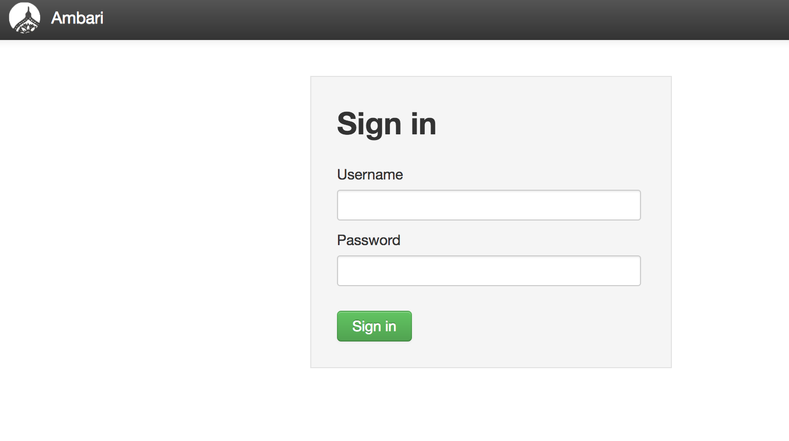

## Provide Additional Configuration

1. Go to the _MapReduce2_ service:

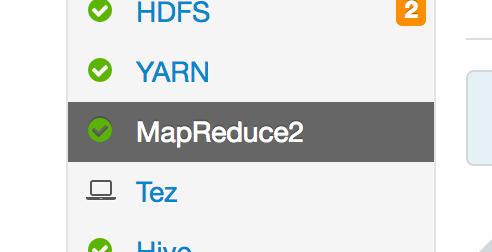

2. Navigate to the configuration:

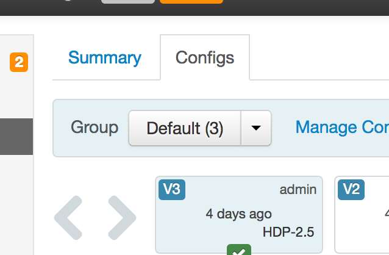

3. Append to the `mapreduce.application.classpath` parameter:
  `:/usr/hdp/current/hadoop-mapreduce-client/*`

4. Save changes:

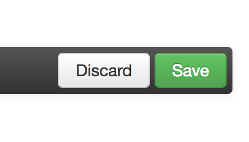

### Update Proxy-User Settings in `core-site.xml`.

DataRobot requires proxy-user settings in both secure (= Kerberos enabled) and nonsecure clusters. Update the proxy-user settings in `core-site.xml`.

1. Select the HDFS service:


2. Navigate to the configurations via the Configs tab:


3. Select the Advanced tab:

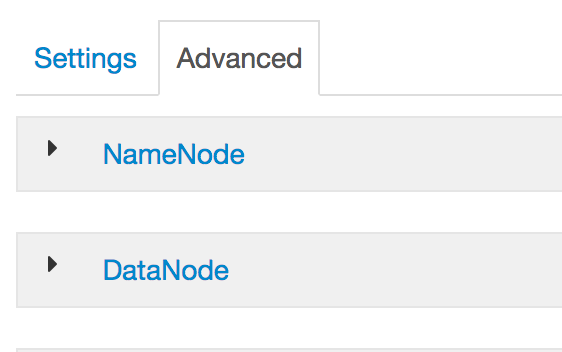

4. Expand the "Custom core-site" option:

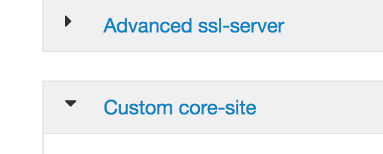

5. At the bottom of the window, click the "Add property..." link.

6. Click the bulk property icon in the right of the "Add Property" window:

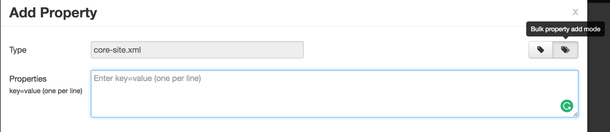

7. In the "Properties" box, add proxyuser properties for DataRobot:

    ```bash
    hadoop.proxyuser.datarobot.groups=*
    hadoop.proxyuser.datarobot.hosts=*
    hadoop.proxyuser.datarobot.users=*
    ```

    Adding the above properties enables DataRobot to impersonate any user. These permissions can be narrowed, if needed, via `groups` and `users` but DataRobot must be in the respective lists. 

8. (Optional) Add proxyuser properties for YARN. In nonsecure clusters without the Linux Container Executor (LCE) setup, you also need to allow the YARN user to proxy DataRobot.

    ```bash
    hadoop.proxyuser.yarn.groups=datarobot
    hadoop.proxyuser.yarn.users=datarobot
    hadoop.proxyuser.yarn.hosts=*
    ```

  * (Optional) If you want DataRobot to use [HttpFS](https://hadoop.apache.org/docs/stable/hadoop-kms/index.html) instead of [webhdfs](http://hadoop.apache.org/docs/stable/hadoop-project-dist/hadoop-hdfs/WebHDFS.html), add proxyuser properties for HttpFS as described [here](special-topics/httpfs.md).

  * (Optional) If your secure cluster has a [Key Management Server (KMS)](https://hadoop.apache.org/docs/stable/hadoop-kms/index.html), add proxy user properties for KMS as described [here](special-topics/kms.md).

---
**NOTE**

In clusters without Kerberos authentication, by default, the LCE runs all jobs as user "nobody". This user can be changed by setting "yarn.nodemanager.linux-container-executor.nonsecure-mode.local-user" to the desired user. However, it can also be configured to run jobs as the user submitting the job. In that case "yarn.nodemanager.linux-container-executor.nonsecure-mode.limit-users" should be set to false. See [here](https://hadoop.apache.org/docs/r2.7.2/hadoop-yarn/hadoop-yarn-site/NodeManagerCgroups.html) for more detailed information.
DataRobot submits YARN applications from within a YARN container thus either the owner of the process needs to be the service user "datarobot" or the user owning the process needs to be able to proxy "datarobot". If this is not the case, the submitted YARN applications wont be owned by "datarobot".

If Kerberos is enabled, DataRobot needs to be able to run Spark jobs on behalf of the currently authenticated user, on any available Yarn host. This can be enabled by listing all Yarn worker hosts and all DataRobot users in the config file, or by using "*" for those properties.

---

---
**NOTE**

If you use [Transparent Encryption in HDFS](http://hadoop.apache.org/docs/stable/hadoop-project-dist/hadoop-hdfs/TransparentEncryption.html) you must use [HttpFS](special-topics/httpfs.md) instead of webhdfs.

---

9. Save changes.


10. Restart all required services:

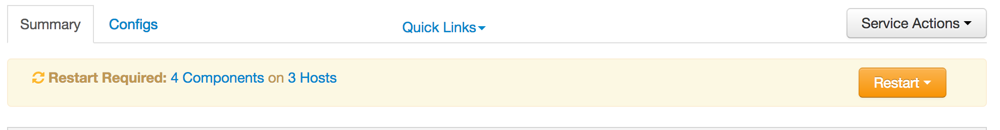

### Update YARN configuration (Ambari 2.7+)
In Ambari 2.7 (HDP3) an additional parameter must be set in YARN configuration
which allows the _datarobot_ user to submit YARN applications:

1. Go to the configuration of the YARN service (the same way as for HDFS).
2. Search for the `yarn.scheduler.capacity.root.default.acl_submit_applications` parameter.
3. Add the datarobot user to the comma-separated list.
4. Save configuration changes and restart YARN with all dependent services.

## Distribute Parcel to Hosts

There are a few different possibilities for distributing parcel to hosts.
Either `scp` the file to all hosts, or run a small webserver.

### Copying Parcel to All Hosts

For each host in Ambari that could run DataRobot service, copy the parcel
from edgenode to that host:

```bash
scp ~/hadoop/DataRobot-*.{parcel,parcel.sha} \
    [AMBARI HOST IP ADDRESS]:/tmp
```

In this case, the parcel URL used will look like:

```
file:////tmp/DataRobot-[PARCEL VERSION].parcel
```

### Run Temporary Webserver

Alternatively, a simple HTTP webserver on an edgenode can host the parcel.
For example:

```bash
cd [PATH TO DIRECTORY WITH PARCEL IN IT]
python -m SimpleHTTPServer [SERVER PORT]
```

**NOTE**: If `[SERVER PORT]` is not provided it will bind to port `8000`.

In this case, the parcel URL used will look like:

```
http://[IP OF SIMPLE WEBSERVER]:[SERVER PORT]/DataRobot-[PARCEL VERSION].parcel
```

**NOTE**: If using this approach, the edgenode must allow incoming traffic on `[SERVER PORT]` from the Hadoop hosts.

## Install DataRobot Service

1. Click on **actions** and then **add service**:

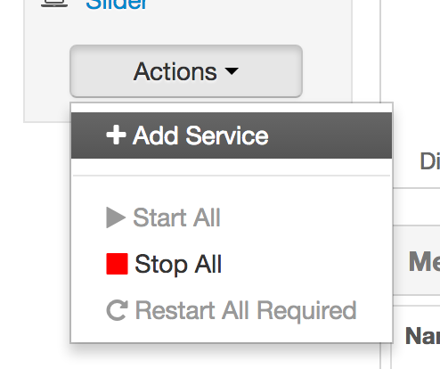

2. Select DataRobot for installation:

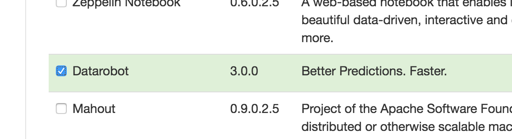

3. Click **Next**.

4. Select where to install DataRobot Master and click **Next**.

5. Select all YARN nodes as clients and nodes for ETL roles. Then click **Next**:

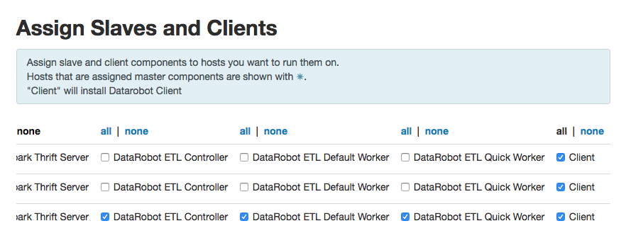

6. Provide the URL to the parcel package and datarobot install directory in the `datarobot-env` configuration:

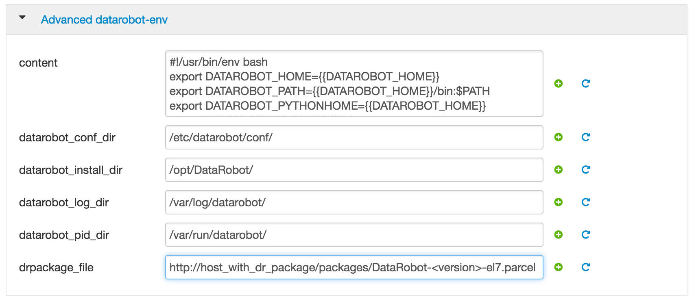

7. Set up all required parameters (App Node Location) in the `datarobot-master`
configuration:

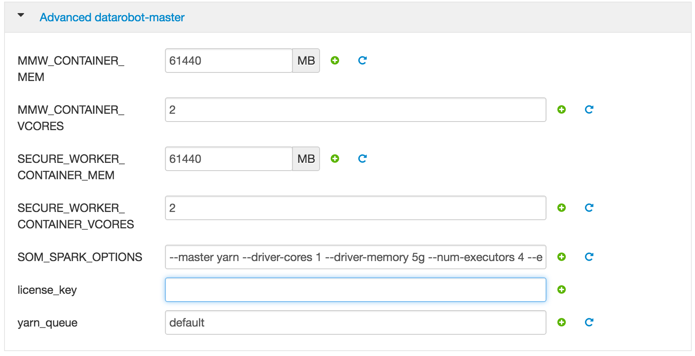

* For HA HDFS clusters, set the following (options not shown in screen above):
  - To explicitly pick an active namenode, fill in a value for the `ACTIVE_NAMENODE_ADDRESS` field. If not specified, DataRobot will automatically pick the active namenode.
  - If multiple nameservices exist, use the `NAMESERVICE` variable to specify the one you want DataRobot to use.

* For [HttpFS](https://hadoop.apache.org/docs/stable/hadoop-kms/index.html), set the following (options not shown in screen above):
  - Check the `PREFER_HTTPFS` field and fill in a value for `HTTPFS_HOST`, specifying the HttpFS destination (for example, 'https://hostname:14000').

8. Click **Next**.

9. If the cluster is secured by Kerberos, provide the admin credentials:

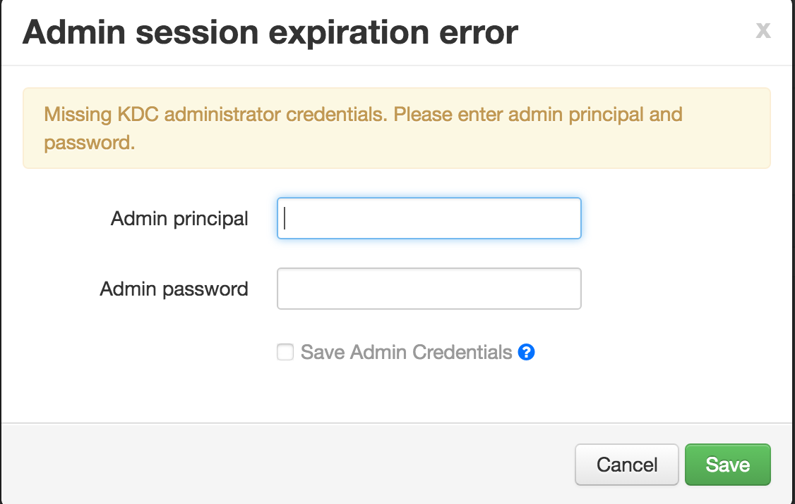

10. Proceed to the installation.

Ambari should report that all DataRobot services were installed successfully.

## Reconfigure

Continue by [Reconfigure](./hadoop-install.md#reconfigure)
