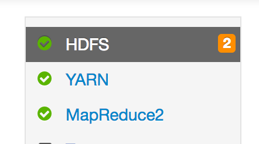

# Ambari (Hortonworks/BigInsights) Installation

## Transfer Files from Edgenode to Ambari

Connect to the edge node via SSH:

```bash
ssh [USERNAME]@[EDGE NODE IP ADDRESS]
```

Transfer the installation files from the edge node to the Ambari Manager:

```bash
scp ~/hadoop/datarobot-ambari-*.tar.gz \
.  [AMBARI MANAGER SERVER IP ADDRESS]:/tmp
```

## Configure DataRobot Service for Ambari

Connect to the Ambari Manager Server via SSH:

```bash
ssh [USERNAME]@[AMBARI MANAGER IP ADDRESS]
```

Extract Ambari configuration descriptor:

```bash
cd /tmp
tar xvf datarobot-ambari-*.tar.gz
```

Copy Ambari configuration descriptor to services directories:

```bash
find /var/lib/ambari-server/resources/stacks/*/*/services -maxdepth 0 \
    | xargs -n 1 cp -r DATAROBOT
```

Add to `/var/lib/ambari-server/resources/stacks/*/*/role_command_order.json`:

```bash
"DATAROBOT_CLIENT-INSTALL": ["NAMENODE-START", "DATANODE-START"],
```

Restart Ambari server with:

```bash
sudo service ambari-server restart
```

If that fails, restart the service directly:

```bash
sudo ambari-server start --skip-database-check
```

The restart process may require several minutes to complete.

## Login to Ambari

You should now be able to log in to the Ambari UI in your web browser.

1. Go to the Ambari UI in your web browser. The UI is available on port 8080.
2. Enter your username and password, then click **Sign in**:


## Provide Additional Configuration

1. Go to the _MapReduce_ service:

2. Navigate to the configuration:


3. Append to the `mapreduce.application.classpath` parameter:
  * Using BigInsights: `:/usr/iop/current/hadoop-mapreduce-client/*`
  * Using Hortonworks: `:/usr/hdp/current/hadoop-mapreduce-client/*`

4. Save changes:


5. Update proxy-user settings in core-site.xml

DataRobot requires proxy-user settings in both secure (= Kerberos enabled) and nonsecure clusters.

5.1. Go to the HDFS service:


5.2. Navigate to the configuration:


5.3. Navigate to the advanced tab:


5.4. Find “custom core-site”:


5.5. In the bottom, click on the “Add Property...“ link.

5.6. Select “bulk property mode”:


5.7. Add proxyuser properties for datarobot:

```bash
hadoop.proxyuser.datarobot.groups=*
hadoop.proxyuser.datarobot.hosts=*
```

The above properties will mean that datarobot can impersonate any user. This can be narrowed if needed but datarobot itself needs to be in the list.

5.8. (Optional) Add proxyuser property for yarn:
In nonsecure clusters without Linux Container Executor setup you also need to allow the yarn user to proxy datarobot.

```bash
hadoop.proxyuser.yarn.groups=datarobot
hadoop.proxyuser.yarn.hosts=*
```

Save changes.


6. Restart all required services:


## Distribute Parcel to Hosts

There are a few different possibilities for distributing parcel to hosts.
Either `scp` the file to all hosts, or run a small webserver.

### Copying Parcel to All Hosts

For each host in Ambari which could run DataRobot service, copy the parcel
from edgenode to that host:

```bash
scp ~/hadoop/DataRobot-*.{parcel,parcel.sha} \
    [AMBARI HOST IP ADDRESS]:/tmp
```

In this case, the parcel URL used will be like:

```
file:////tmp/DataRobot-[PARCEL VERSION].parcel
```

### Run Temporary Webserver

Alternatively, a simple HTTP webserver on edgenode can host the parcel.
For example:

```bash
cd [PATH TO DIRECTORY WITH PARCEL IN IT]
python -m SimpleHTTPServer [SERVER PORT]
```

**NOTE**: If `[SERVER PORT]` is not provided it will bind to port `8000`.

In this case, the parcel URL used will be like:

```
http://[IP OF SIMPLE WEBSERVER]:[SERVER PORT]/DataRobot-[PARCEL VERSION].parcel
```

**NOTE**: If using this approach, the edgenode must allow incoming traffic on `[SERVER PORT]`
from the Cloudera hosts.

## Install DataRobot Service

1. Click on **actions** and then **add service**:

2. Select DataRobot for installation:

3. Click **Next**.
4. Select where to install DataRobot Master and click **Next**.
5. Select all YARN nodes as clients and click **Next**:

6. Provide URL to the parcel package in the `datarobot-env` configuration:

7. Set up all required parameters and provide the license in the `datarobot-master`
configuration:

3. Click **Next**.
4. In case if cluster is secured by Kerberos, provide credentials:

5. Proceed to the installation.

## Synchronize Configuration

Continue by [Synchronizing Configuration](./hadoop-install.md#synchronize-configuration)
