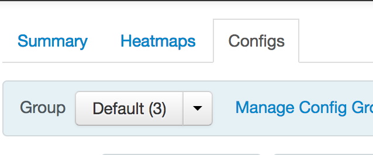
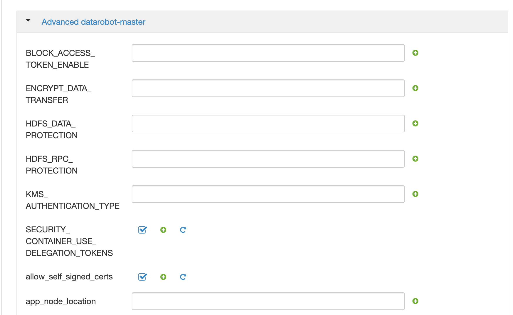

# Ambari (Hortonworks/BigInsights) Installation


## Requirements {#requirements}

1.  Administrator Access for Ambari:

| Port | Protocol | Component |
| --- | --- | --- |
| 22 | TCP | SSH Access |
| 8080 | TCP | Ambari web interface |

Communication from Edge Node to the Ambari Cluster, required for HDFS client:

| Port | Hadoop Configuration Variable | Comment |
| --- | --- | --- |
| 8080 | HTTP Port for Admin Console | Ambari |
| 2181 | clientPort | ZooKeeper client port |
| 7680 | Not configurable | DR Application Manager |
|  | Required for HDFS client |  |
| 8020 | fs.default.name, fs.defaultFS | NameNode IPC Port |
| 50010 | dfs.datanode.address | Data transfer |
| 1019 | dfs.datanode.address | Data transfer (HDFS HA) |
| 50020 | dfs.datanode.ipc.address | Metadata operations |
| 8485 | dfs.journalnode.rpc-address | Required if using HA HDFS |
|  | Required for WebHDFS client |  |
| 50070 | dfs.namenode.http-address | NameNode Web UI without HTTPS |
| 50075 | dfs.datanode.http.address | Data transfer without HTTPS |
| 1022 | dfs.datanode.http.address | Data transfer without HTTPS (HDFS HA) |
| 50470 | dfs.namenode.https-address | NameNode Web UI with HTTPS |
| 50475 | dfs.datanode.https.address | Data Transfer with HTTPS |
| 50090 | dfs.namenode.secondary.http-address | Secondary NameNode without HTTPS |
| 50091 | dfs.namenode.secondary.https-address | Secondary NameNode with HTTPS |

## Required files {#required-files}

| Description | Filename | Notes |
| --- | --- | --- |
| Parcel | DataRobot-&lt;version&gt;-el7.parcel | Use the file ending in **el7.parcel** for CentOS/RHEL 7.x. |
| Service Descriptors | datarobot-ambari-&lt;version&gt;.tar.gz | Configuration files used to integrate an add-on service. |
| Edge Node Package | DataRobot-release-2.9.x.y.tar.gz | A tarball containing the code for use on the edge node. |

## HW and BI distributions Requirements {#hw-and-bi-distributions-requirements}

DataRobot is installable as a parcel that can run on your organization’s hadoop cluster. Your hadoop cluster must meet the following requirements:

* The administrator must have permission to access the Ambari via SSH and perform superuser actions such as moving files, changing permissions, and restarting services.
* If your cluster is based on Hortonworks - it must be version 2.5.
* If your cluster is based on BigInsights - it must be version 4.2.
* Hadoop cluster must be running on CentOS/RHEL version 7 or greater.
* For Java 7 systems, Oracle Java JDK version greater than or equal to 1.7.0_75 must be installed.
* For Java 8 systems, Oracle Java JDK version greater than or equal to 1.8.0_60 must be installed.
* HDFS, Yarn, Spark on Yarn and ZooKeeper must be installed.
* The fully qualified domain name (FQDN) or IP address of the Ambari must be known.
* The /tmp directory on the Ambari must be writable and have 5GB of available space.
* Set yarn.nodemanager.resource.memory-mb to at least 60GB.
* Set yarn.scheduler.maximum-allocation-mb to at least 60GB.
* Set yarn.nodemanager.resource.cpu-vcores to at least 4.
* Set yarn.scheduler.maximum-allocation-vcores to at least 4.
* DataRobot worker nodes must have a minimum of 128GB of memory.


## Installation on Ambari based cluster. {#installation-on-ambari-based-cluster}

1.  Connect to the edge node via SSH:

```bash
ssh [USERNAME]@[EDGE NODE IP ADDRESS]
```

1.  Transfer the installation files from the edge node to the Ambari server:

```bash
scp ~/hadoop/dataRobot-ambari-*.tar.gz \
    [AMBARI MANAGER SERVER IP ADDRESS]:/tmpscp ~/hadoop/DataRobot-2.*.{jar,parcel,parcel.sha} \
    [AMBARI MANAGER SERVER IP ADDRESS]:/tmp
```

1.  Connect to the Ambari Manager Server via SSH:

```bash
ssh [USERNAME]@[AMBARI MANAGER IP ADDRESS]
```

1.  Extract Ambari artifact:

```bash
cd /tmp
```

1.  Copy ambari artifact to services dirs:

```bash
find /var/lib/ambari-server/resources/stacks/*/*/services -maxdepth 0 | xargs -n 1 cp -r DATAROBOT
```

1.  Add to /var/lib/ambari-server/resources/stacks/BigInsights/4.2/role_command_order.json:

```bash
"DATAROBOT_CLIENT-INSTALL": ["NAMENODE-START", "DATANODE-START"],
```

1.  Restart ambari server with:

```bash
sudo service ambari-server restart
```

The restart process may require several minutes to complete.

## Log In to Ambari {#log-in-to-ambari}

You should now be able to log in to the Ambari UI in your web browser.

1.  Go to the Ambari UI in your web browser. The UI is available on port 8080.
2.  Enter your username and password, then click Sign in:

## Provide additional configuration {#provide-additional-configuration}

1.  Go to the MapReduce service:
2.  Navigate to the configuration:

1.  Append to the mapreduce.application.classpath parameter: :/usr/iop/current/hadoop-mapreduce-client/* if you’re using BigInsights or:/usr/hdp/current/hadoop-mapreduce-client/* if you’re using Hortonworks.
2.  Save changes:
3.  Restart all required services:

## Additional Configuration for Clusters With Kerberos Enabled {#additional-configuration-for-clusters-with-kerberos-enabled}

Skip this section if your cluster does not have Kerberos enabled.

The steps in this section are required to configure clusters with Kerberos enabled to work with the DataRobot application.

1.  Go to the HDFS service:
2.  Navigate to the configuration:
3.  Navigate to the advanced tab:
4.  Find “custom core-site”:
5.  In the bottom, click on the “Add Property...“ link.
6.  Select “bulk property mode”:
7.  Add following:

```bash
hadoop.proxyuser.datarobot.groups=*
```

1.  Save changes.

## Install DataRobot service {#install-datarobot-service}

1.  Click on **actions** and then **add service**:
2.  Select DataRobot for installation:
3.  Click Next.
4.  Select where to install DataRobot Master; Click Next.
5.  Select all YARN nodes as clients; Click Next:
6.  Run a tiny webserver on edge node to host parcel file.

1.  cd &lt;path-to-parcel-file&gt;
2.  python -m SimpleHTTPServer

1.  Provide URL to the parcel package in the datarobot-env configs:
2.  Set up all required parameters and provide the license in the datarobot-master config:
3.  Click Next.
4.  In case if cluster is secured by Kerberos - provide credentials:
5.  Proceed to the installation.


## Synchronize Configuration

Continue by [Synchronizing Configuration](./hadoop-install.md#synchronize-configuration)
