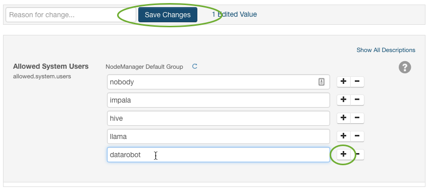
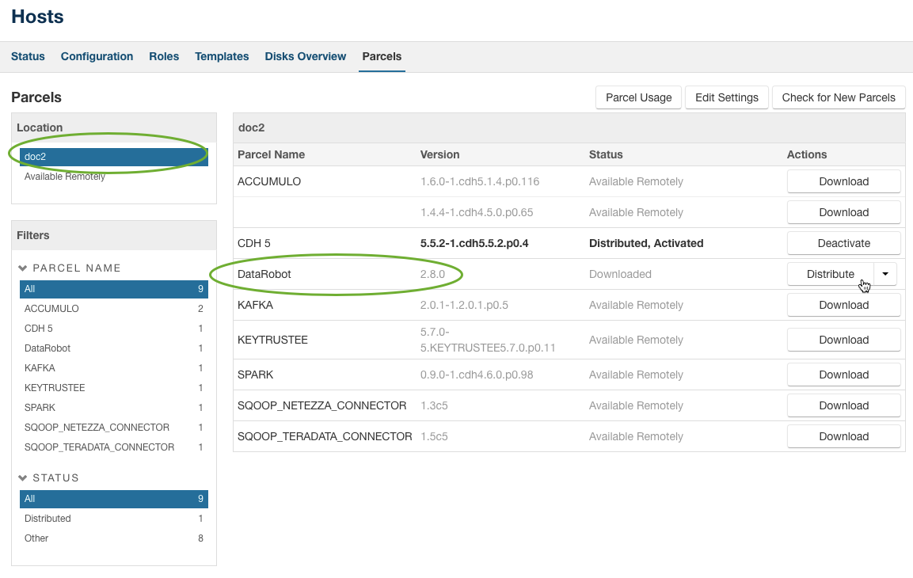
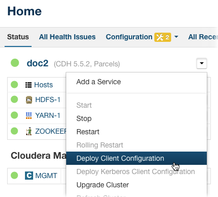
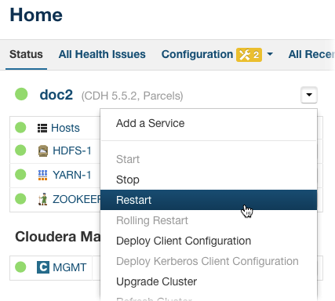
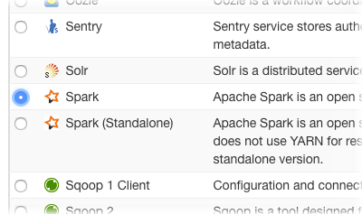
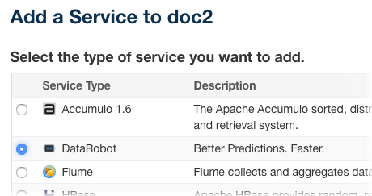
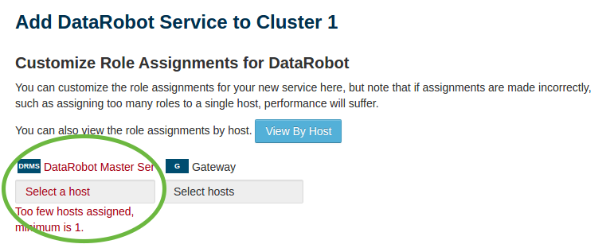
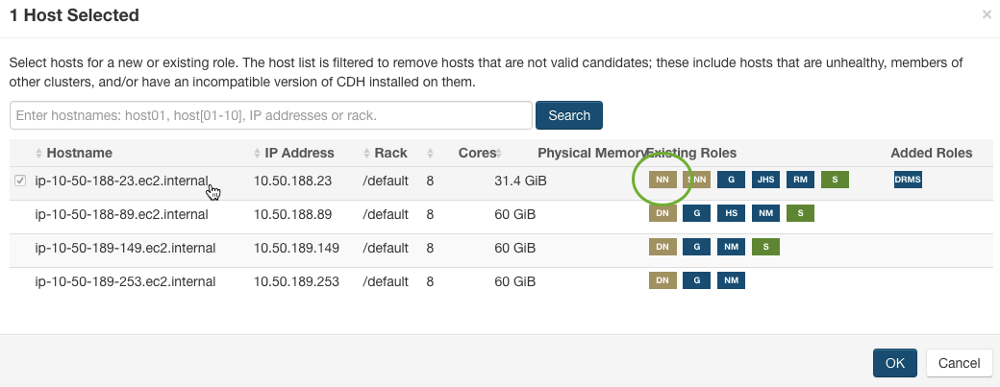
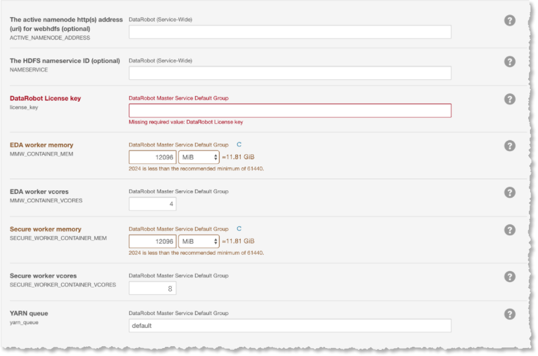
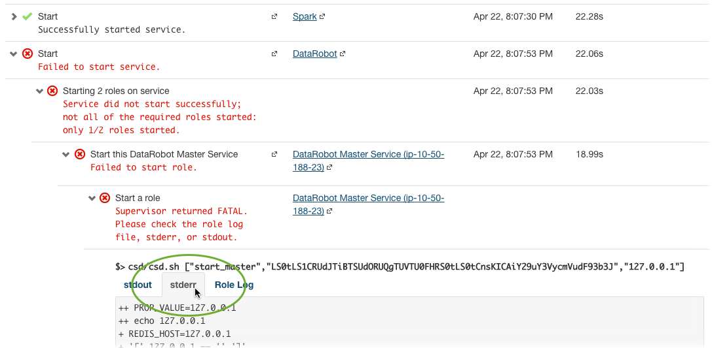

# Cloudera Installation Instructions

Follow the steps in the sections below to install DataRobot on your Cloudera cluster.

## Prepare Cloudera Manager

* Connect to the application server via SSH:

```bash
ssh datarobot@[APPLICATION SERVER IP ADDRESS]
```

* Transfer the installation files from the application server to the Cloudera Manager server:

```bash
scp ~/hadoop/DataRobot-4.1.x*.{jar,parcel,parcel.sha} \
    [CLOUDERA MANAGER SERVER IP ADDRESS]:/tmp
scp ~/hadoop/DataRobot-4.1.x*.{jar,parcel,parcel.sha} \
    [CLOUDERA MANAGER SERVER IP ADDRESS]:/tmp
```

* Connect to the Cloudera Manager Server via SSH:

```bash
ssh [USERNAME]@[CLOUDERA MANAGER IP ADDRESS]
```

* Move the CSD file:

```bash
sudo mv /tmp/DataRobot-4.1.x/*.jar /opt/cloudera/csd/
```

* Change the ownership of the installation files:

```bash
sudo chown cloudera-scm:cloudera-scm \
    /opt/cloudera/csd/DataRobot-4.1.x*.jar
```

* Change the permissions of the installation file:

```bash
sudo chmod 644 /opt/cloudera/csd/DataRobot-3.*.jar
```

* Move the parcel file:

```bash
sudo mv /tmp/DataRobot-4.1.x*.parcel /opt/cloudera/parcel-repo
```

* Move the parcel file's SHA:

```bash
sudo mv /tmp/DataRobot-4.1.x*.parcel.sha /opt/cloudera/parcel-repo
```

**NOTE**: The CDH 5.4.0 and 5.5.0 .sha files have different formats.

The CDH 5.4.0 format is `SHA PARCEL_FILENAME`:

```
# FILE: DataRobot-4.1.x-release-el6.parcel.sha
80e5223337d8978432ccae99ffea55f92e4fb4b9 DataRobot-4.1.x-release-el6.parcel
```

CDH 5.5.0 and later **must only contain the SHA**,
_without the space and filename_, for example:

```
# FILE: DataRobot-4.1.x-release-el6.parcel.sha
80e5223337d8978432ccae99ffea55f92e4fb4b9
```

**NOTE**: This means you must remove the space and filename from the sha, for example:

```bash
cat /tmp/DataRobot-4.1.x-release.el6.parcel | cut -d ' ' -f 1 \
| sudo tee /opt/cloudera/parcel-repo/DataRobot-4.1.x-release.el6.parcel
```

* Change the ownership of the parcel file:

```bash
sudo chown cloudera-scm:cloudera-scm /opt/cloudera/parcel-repo/DataRobot-*
```

* Change permissions on the parcel file:

```bash
sudo chmod 644 /opt/cloudera/parcel-repo/DataRobot-*
```

* Restart the Cloudera Manager Server:

```bash
sudo service cloudera-scm-server restart
```

The restart process may require several minutes to complete.

Even after **Starting cloudera-scm-server** is marked as complete in the terminal,
the Cloudera Manager UI will be unavailable until the restart process is fully
finished.

## Install DataRobot via Cloudera Manager

You should now be able to log in to the Cloudera Manager UI in your web browser.

* Go to the Cloudera Manager UI in your web browser.

The UI is available on port `7180` for HTTP or `7183` for HTTPS.
For example, access a Cloudera Manager with HTTPS enabled at `https://<Cloudera Manager>:7183`.

* Enter your username and password, then click **Login**.


### Update proxyuser settings in core-site.xml

DataRobot requires proxyuser settings in both secure (= Kerberos enabled) and nonsecure clusters.

* Click the name of the **YARN** service on the left side of the screen.

* Click **Configuration** in the menu.

* Type `allowed.system.users` in the search field near the top-left of the screen.

* Click the add (+) button that appears lowest in the list of Allowed System Users and type datarobot in the text field that just appeared:



* Click **Save Changes** just above the **Allowed System Users** section.

* Scroll to the top of the screen and click the **Cloudera Manager** logo in the top-left corner of the page.

* Click on the name of the **HDFS** service in the panel on the left side of the scree

* Click on **Configuration** in the menu.

* Type `Cluster-wide Advanced Configuration Snippet (Safety Valve) for core-site.xml` in the search field near the top-left of the screen.
Paste the following XML into the large text box:

```xml
# CONFIG VALUE: core-site.xml
<property>
  <name>hadoop.proxyuser.datarobot.hosts</name>
  <value>*</value>
</property>
<property>
  <name>hadoop.proxyuser.datarobot.groups</name>
  <value>*</value>
</property>
<property>
 <name>hadoop.proxyuser.datarobot.users</name>
 <value>*</value>
</property>
```

*. (Optional) Add proxyuser properties for YARN. In nonsecure clusters without the Linux Container Executor (LCE) setup, you also need to allow the YARN user to proxy DataRobot.

	```bash
	hadoop.proxyuser.yarn.groups=datarobot
	hadoop.proxyuser.yarn.hosts=*
	```

---
**NOTE**

If nonsecure clusters, by default, the LCE runs all jobs as user "nobody". This user can be changed by setting "yarn.nodemanager.linux-container-executor.nonsecure-mode.local-user" to the desired user. However, it can also be configured to run jobs as the user submitting the job. In that case "yarn.nodemanager.linux-container-executor.nonsecure-mode.limit-users" should be set to false. See [here](https://hadoop.apache.org/docs/r2.7.2/hadoop-yarn/hadoop-yarn-site/NodeManagerCgroups.html) for more detailed information.
DataRobot submits YARN applications from within a YARN container thus either the owner of the process needs to be the service user "datarobot" or the user owning the process needs to be able to proxy "datarobot". If this is not the case, the submitted YARN applications wont be owned by "datarobot".

---

* Click **Save Changes** just above the text box.

* Click the **Cloudera Manager** logo at the top-left corner of the page.

* Click the topmost power button below your cluster's name.

* Click **Restart Stale Services** in the top-right corner of the screen.

* Confirm that *Re-deploy client configuration* is checked.

* Click **Restart Now** at the bottom of the screen.
**WARNING**: This will restart all services on your cluster.

* Once the restart command has completed successfully, click **Finish**.

### Distribute and Activate the DataRobot Parcel

* Click on the Parcels icon ()
in the top toolbar of the website.

* Click on your cluster name on the left hand side in the **Location** section.
Search the list of parcels for the row labeled **DataRobot**:



* If the rightmost side of that row contains a button labeled **Download**,
click it and wait for the action to complete.

* Click the **Distribute** button on the rightmost side of the row for the
DataRobot parcel.

* Click the button again when its label says **Activate**.

* When asked **Are you sure?**, click **OK** and wait for activation to complete.
The Status column for the DataRobot parcel should now read **Distributed, Activated**.

* Scroll to the top of the screen and click the **Cloudera Manager** logo.

* Click the down arrow button to the right of your cluster's name.

* Click **Deploy Client Configuration**:



**NOTE**: Some versions of Cloudera Manager do not have Deploy Client Configuration
in this dropdown menu. If you do not see it, deploy configuration for each service
individually by clicking the blue power icons next to its name and clicking through
the wizard.

* Click **Deploy Client Configuration** in the confirmation window.

* Wait for the client configuration to deploy.

* Once each step has a green checkmark to its left, click **Close**.

* Click the down arrow button to the right of your cluster's name and click **Restart**.



* Click **Restart** in the confirmation window and wait for the command to
finish, then click **Close**.

The DataRobot Parcel is now distributed and activated and all service
configurations are updated.

Next, you will add dependencies for the DataRobot Service.

### Add the Spark Service

The DataRobot service requires that Spark be installed on your cluster.

Follow these instructions to add the Spark service.

* Click the down arrow button to the right of your cluster's name and
select **Add a Service**.

* Click on the radio button to select Spark (do *not* select the standalone
option) and click **Continue**:



* Click **Continue** on the new screen.

* Wait while the system adds the Spark service.

* Click **Continue** when it finishes, then click **Finish** on the Congratulations page.

* Click the down arrow button to the right of your cluster's name and click **Restart** as before.

* Wait for the command to finish and click **Close**.

Spark is now installed on your cluster.

### Add the DataRobot Service

Next, install the DataRobot service on your cluster.

* Click the down arrow button to the right of your cluster's name and select **Add a Service**.

* Click the radio button labeled **DataRobot** and click **Continue**:



* Click **Select a host** under the **DataRobot Master Service** label.

The master service is a process that runs on a Hadoop node and continuously checks if YARN is still running.



* Click the name of the system to host the master service.

This service can go on any node, but we recommend that it go on a **NameNode**
or other administrative node rather than a worker.



* Click **OK**.

* For the **Gateway** service, select _all_ hosts. This is used to
synchronize configuration and must be installed on _all_ hosts.

* For all **DataRobot ETL** services, place one instance of each service on an
available DataNode using the same procedure.

**ETL** services work with Spark to enable large file ingest and processing up to 100GB.

* Click **OK** and **Continue**.

* Click in the **DataRobot License Key** text field and paste in the text from
your DataRobot license key.

* Edit container memory and vcores settings as appropriate for your cluster.

We recommend at least 60GB of RAM for `MMW` and `SECURE_WORKER` containers
and at least four cores.



* (*HA HDFS clusters only*) Fill in a value for `ACTIVE_NAMENODE_ADDRESS` field.

* (*HA HDFS clusters only*) If multiple nameservices exist specify one in the `NAMESERVICE` variable.

* Click **Continue** and wait while DataRobot is added to the cluster.

* When the process is complete, click **Continue**.

* Click **Finish** on the congratulations page.

* Click the down arrow button to the right of your cluster's name and
select **Deploy Client Configuration**.


* Click **Deploy Client Configuration** in the confirmation window.

* Wait for the client configuration to deploy.

* When each step has a green checkmark to its left, click **Close**.

* Click the down arrow button to the right of your cluster's name and select **Restart**.

* Once the restart command has completed successfully, click **Close**.

* If the DataRobot service fails to start, check the `stderr` logs in the
command results. If there was a configuration error, stop and then delete the
DataRobot service and try to add it again.



* Click on the DataRobot service to see a status summary.

* The DataRobot Master Service should be marked in green, indicating "Good Health."

* The Gateway services should be marked in gray, with a health status of
"None." They should be shown for _all nodes_.

* Hosts should display "1 Good Health."

## Synchronize Configuration

Continue by [Synchronizing Configuration](./hadoop-install.md#synchronize-configuration)
