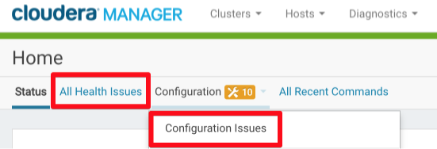
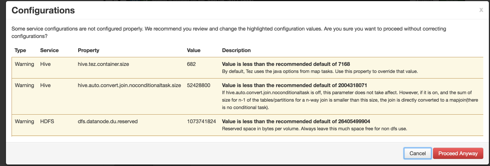
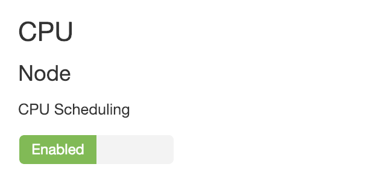

# Pre-Flight Checks

## Pre-Flight Checks CLI Tool
The DataRobot installation media contains a utility for verifying your cluster's configuration.

This will prevent the most common installation issues and is also good for troubleshooting issues with your configuration.

Access it by running:

```bash
./bin/datarobot health cluster-checks
```

Several options can be used to modify behavior for this command; use the `--help` flag to learn about available options.
Individual tests can be disabled with the `-x` flag, for example:

```bash
./bin/datarobot health cluster-checks -x port
```

will disable all port checks.

There are two primary times to run the pre-flight checks tool: before and after dependency installation.
Before dependency install, the tool can be run as shown above, with no flags required.
This will verify connectivity to all hosts specified in the `config.yaml`, and perform a variety of checks to ensure dependency installation goes smoothly, including:

* No port conflicts with defined services and existing applications on the hosts.
* Adequate free space for Docker and the DataRobot application is available.
* Filesystem for `/var/lib/docker` is appropriately configured for the chosen storage driver.

After dependencies have been installed (`./bin/datarobot setup-dependencies`) and the registry is running (`./bin/datarobot run-registry`), the pre-flight checks tool can be executed again.
Additional tests will be executed on the cluster to confirm the correct functioning of the new dependencies.

Run the tool with this command:

```bash
./bin/datarobot health cluster-checks --deps-installed
```

In addition to the checks indicated above, the following will be tested:

* Docker registry is reachable and from all nodes and containers can be run.
* Docker-py was correctly installed and is available to ansible.
* Logging functionality is working properly for DataRobot logs.
* Docker group correctly configured for the datarobot user.
* And more!


## Manual Health Checks

If you cannot use the CLI tool or want more detail, you can perform many of these checks manually.

Perform these steps after performing the [Cluster Preparation](standard-install.md#linux-prep) section of the installation (after `./bin/datarobot setup-dependencies`) and before performing the [Install and Configure the Application](standard-install.md#linux-provision) steps (before `./bin/datarobot install`).

## Docker storage capacity

Verify that Docker has sufficient available storage capacity by checking the output of:

```bash
docker info | grep 'Data Space' 2> /dev/null
```

Ensure that the difference between Data Space Total and Data Space Used is greater than 100 GB.

    Note: Data Space Used and Available may not add up to Total; this is expected in setups using devicemapper storage.

## Can you run Docker containers?

Verify that you can run Docker containers with the following command:

```bash
sudo su - datarobot
cd /opt/datarobot/DataRobot-6.x.x/
docker load -i dockerfiles/datarobot/saved/docker-registry.tar
docker run --rm -it docker.hq.datarobot.com/datarobot/registry
# You should see some logs from the container
# Hit Ctrl-C to cancel
```

## Provisioner connectivity

On the install node, logged in as the DataRobot user, run the following to verify the provisioner will be able to connect to all nodes in the cluster:

```bash
sudo su - datarobot
cd /opt/datarobot/DataRobot-6.x.x/
./bin/inventory --list
./bin/ansible -i ./bin/inventory -m shell -a 'uptime' all
```

## Docker access across all nodes

This end-to-end test will verify that the provisioner can run, connect to nodes via SSH, and interact with the Docker daemon on all application servers:

```bash
sudo su - datarobot
cd /opt/datarobot/DataRobot-6.x.x/
./bin/ansible -i ./bin/inventory -m docker -a "image=foo name=bar state=absent" all
```

## Logging

To verify that logging has been set up properly, run the following commands to generate test messages on your servers.
These commands can be run on any server for which you want to verify your logging setup.
Each command should generate a message in a file on the host’s configured logs directory (eg. `/opt/datarobot/logs/nginx.log`) and in the same file on the central rsyslog server (if applicable):

```bash
logger -i -p daemon.info DRJSON Test Logging Message
logger -i -p daemon.info DSSJSON Test Logging Message
logger -i -p daemon.info DRMJSON Test Logging Message
logger -i -p daemon.info NGINXJSONLOGS Test Logging Message
logger -i -p daemon.info DRAUDIT-gon0DRO4Pb Test Logging Message
ls -l /opt/datarobot/logs
```

**NOTE**: DataRobot does not automatically set up permissions for your RSYSLOG logging system, so the log files may be owned by root and they may not be world-readable.
Log file permissions can be modified in the RSYSLOG configuration files of each host.
If desired, put the `$FileOwner`, `$FileGroup`, and/or `$FileCreateMode` directives at  the top of your DataRobot RSYSLOG configuration file.

```
# FILE SNIPPET: /etc/rsyslog.d/53-logging.conf
$FileOwner datarobot
$FileGroup datarobot
$FileCreateMode 0600
...
```

To apply changes to log file permissions, remove the existing log files and restart the RSYSLOG daemon, or use chmod and chown as appropriate.

Note also that the file creation directives will affect RSYSLOG behavior in all files in /etc/rsyslog.d/ alphabetically higher than the DataRobot configuration.
If such files exist, review their contents and consider adding additional directives to reset permissions.

## Logrotate

Verify that logrotate is properly configured by forcing a rotation of the log files you just created:

```bash
$ ls /opt/datarobot/logs
all.log    datarobot.log         hadoop-master.log
audit.log  datasets-service.log  nginx.log
$ sudo logrotate -f /etc/logrotate.d/datarobot
$ ls /opt/datarobot/logs
all.log         datarobot.log              hadoop-master.log
all.log.1.gz    datarobot.log.1.gz         hadoop-master.log.1.gz
audit.log       datasets-service.log       nginx.log
audit.log.1.gz  datasets-service.log.1.gz  nginx.log.1.gz
...
$ sudo logrotate -f /etc/logrotate.d/rsyslog  # or equivalent file
$ ls /var/log
syslog          daemon.log              messages
syslog.1.gz     daemon.log.1.gz         messages.1.gz
...
```

**NOTE**: DataRobot logs are written to the `daemon` syslog facility. Review your system’s RSYSLOG configuration (`/etc/rsyslog.conf` and `/etc/rsyslog.conf.d/`) to see if these messages will end up in any other log file, such as `/var/log/daemon.log` or `/var/log/messages`, and adjust your RSYSLOG and logrotate configuration to handle these messages.

Example:

```
# FILE: /etc/logrotate.d/system
/var/log/daemon.log
/var/log/messages
/var/log/syslog
{
    su root root
    daily
    rotate 30
    delaycompress
    compress
    missingok
    notifempty
    postrotate
        pkill --ns $$ rsyslog -HUP
    endscript
}
```

# Hadoop Pre-Flight Checks {#hadoop-checks}

Use these checks before installation to ensure that your Hadoop environment is ready to install and run DataRobot.


## Service health and configuration

Check for health and configuration issues reported by Hadoop Manager.

**CDH**:



**HDP**:
Note: this screen will appear when restarting services on the cluster if there are issues with configuration.


## Test YARN Container Submission

Ensure the datarobot user can submit yarn applications with the required container size.
Modify the `container_memory`, `num_containers` and `container_vcores` parameters to match your expected container size.

**CDH**:

```bash
yarn jar \
    /opt/cloudera/parcels/CDH/lib/hadoop-yarn/hadoop-yarn-applications-distributedshell.jar \
    -shell_command "hdfs dfs -ls /tmp" \
    -debug -appname "DataRobot pre-flight check" \
    -num_containers 3 -container_memory 60000 -container_vcores 8 \
    -jar /opt/cloudera/parcels/CDH/lib/hadoop-yarn/hadoop-yarn-applications-distributedshell.jar
```

**HDP**:

```bash
yarn jar \
    /usr/hdp/current/hadoop-yarn-client/hadoop-yarn-applications-distributedshell.jar \
    -shell_command "hdfs dfs -ls /tmp" \
    -debug -appname "DataRobot pre-flight check" \
    -num_containers 3 -container_memory 60000 -container_vcores 8 \
    -jar /usr/hdp/current/hadoop-yarn-client/hadoop-yarn-applications-distributedshell.jar
```

At the end you should see a message like `17/10/16 14:38:22 INFO distributedshell.Client: Application completed successfully`.
To check the logs from this job, find the applicationId in the job output, eg. `Submitted application application_1508158073679_0004` and run `yarn logs -applicationId application_1508158073679_0004 | less`.
You should see the content of the `/tmp` directory in `HDFS` in the container stdout logs:

```
LogType:stdout
Log Upload Time:Mon Oct 16 14:38:22 +0000 2017
LogLength:537
Log Contents:
Found 3 items
drwx--x--x   - hbase     supergroup          0 2017-10-16 11:41 /tmp/hbase-staging
drwx-wx-wx   - hive      supergroup          0 2017-10-16 11:43 /tmp/hive
drwxrwxrwt   - mapred    hadoop              0 2017-10-16 11:42 /tmp/logs
```

## Check Impersonation

In environments with user impersonation (LDAP, SAML), ensure the `datarobot` user can successfully impersonate Unix users:

```bash
WEBHDFS_HOST=webhdfs.internal.com
WEBHDFS_PORT=50070
PATH=/tmp/
USER=someusername
curl -i --negotiate -u : "http://${WEBHDFS_HOST}:${WEBHDFS_PORT}/webhdfs/v1/${PATH}?doas=${USER}&op=LISTSTATUS"
```

The HTTP status code should be 200 and the request should return a json object with a list of files:

```bash
HTTP/1.1 200 OK
Cache-Control: no-cache
Expires: Tue, 17 Oct 2017 11:05:27 GMT
Date: Tue, 17 Oct 2017 11:05:27 GMT
Pragma: no-cache
Expires: Tue, 17 Oct 2017 11:05:27 GMT
Date: Tue, 17 Oct 2017 11:05:27 GMT
Pragma: no-cache
Content-Type: application/json
X-FRAME-OPTIONS: SAMEORIGIN
WWW-Authenticate: Negotiate YGYG
Set-Cookie: hadoop.auth="u=USER&p=USER/HOST@REALM&t=kerberos&e=1508274327891&s=PJecazm2pr1wMVKdRfcbTzyI7Gk="; Path=/; HttpOnly
Transfer-Encoding: chunked

{"FileStatuses":{"FileStatus":[
{"accessTime":0,"blockSize":0,"childrenNum":0,"fileId":16403,"group":"supergroup","length":0,"modificationTime":1508238307613,"owner":"hdfs","pathSuffix":".cloudera_health_monitoring_canary_files","permission":"777","replication":0,"storagePolicy":0,"type":"DIRECTORY"},
```

## Check Spark Health

Make sure Spark is installed and functioning:

**CDH**:

```bash
spark-submit --master yarn \
    --num-executors 3 --executor-memory 20g --executor-cores 4 \
    --proxy-user PROXY_USER \
    --class org.apache.spark.examples.SparkPi \
    /opt/cloudera/parcels/CDH/lib/spark/lib/spark-examples.jar 10000
```

**HDP**:

```bash
spark-submit --master yarn \
    --num-executors 3 --executor-memory 20g --executor-cores 4 \
    --proxy-user PROXY_USER \
    --class org.apache.spark.examples.SparkPi \
    /usr/hdp/current/spark-client/lib/spark-examples-1.6.2.2.5.3.0-37-hadoop2.7.3.2.5.3.0-37.jar 10000
```

When the job finishes you should see the result `Pi is roughly 3.1416745671416746`.
If the installed version of Spark is below 2.0, you will need to create the home directory on HDFS for `PROXY_USER`.
For Spark versions above 2.0, add the parameter `--conf "spark.yarn.stagingDir=<STAGING_DIR_ON_HDFS>"` to your command.


## Check YARN Scheduler Configuration

DataRobot relies on YARN CPU scheduling by default but for some YARN configurations CPU scheduling is not possible, in particular for `CapacityScheduler` with `DefaultResourseCalculator` (by default **HDP** has CPU scheduling disabled and **CDH** has CPU scheduling enabled).

There are 3 ways to fix this issue:

1) If possible enable [DominantResourceCalculator](https://hadoop.apache.org/docs/r2.7.4/hadoop-yarn/hadoop-yarn-site/CapacityScheduler.html#Other_Properties)
   for [CapacityScheduler](https://hadoop.apache.org/docs/r2.7.4/hadoop-yarn/hadoop-yarn-site/CapacityScheduler.html) or switch to [FairScheduler](https://hadoop.apache.org/docs/r2.7.4/hadoop-yarn/hadoop-yarn-site/FairScheduler.html).
2) Set `YARN_CPU_SCHEDULING` to false in the Cloudera Manager or Ambari configuration page for DataRobot.
3) Set number of vcores for each type of container to 1 in configuration.

This problem would manifest in the UI with some jobs waiting indefinitely for workers. Containers with one vcore would work (such as some ingest jobs or availability monitor pings), while modeling jobs and other tasks might wait forever.

Additionally, you would find the following logs in the DataRobot Application Master logs:

```
18/03/05 09:15:02,341  WARN [ForkJoinPool-1-worker-93] (YarnDispatcher.scala:178)
- Allocated container does not have matching request.
details={"containerNodeAdress":"ip-10-50-178-21.ec2.internal:8042",
"containerVCores":"4","containerMemory":"30208",
"containerId":"container_e01_1520184952473_0001_01_021975",
"requests":"ArrayBuffer()"}
```
By itself this log message may appear on a system under load due to [YARN-1902](https://issues.apache.org/jira/browse/YARN-1902) and is not considered problematic.

### Note about Ambari 2.7 (HDP3)

Configuring this parameter for YARN in Ambari is simple: just go to the YARN
configuration page and set the following parameter to _Enabled_:



In Ambari versions starting from 2.7, this parameter is also set in the
Capacity Scheduler advanced configuration.

To verify that this parameter is set correctly, search YARN configuration 
for the `yarn.scheduler.capacity.resource-calculator` parameter and ensure it's 
set to `org.apache.hadoop.yarn.util.resource.DominantResourceCalculator` or unset completely.
Otherwise this parameter will overwrite the value set in the UI toggle.
