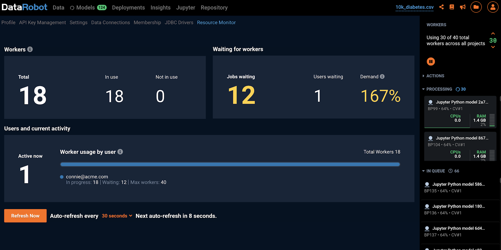

# Overview

DataRobot supports dynamic scale-out and scale-in of worker nodes in AWS. This feature requires an image of a fully provisioned and configured DataRobot worker node, an autoscaling group, and a DataRobot custom metric to be published to the cloud's monitoring service.

## 1. Create a cluster

Below is a listing of suggested node types to build out the DataRobot Auto Scaling cluster. At least 1 Modeling node and at least 1 Modeling Only Node are required.

| Node Type | Required | Count | Cores (vCPUs)  |  RAM (GB) | HD Space (GB) |
|----------------|:---------------------:|:----------------:|:-------------------:|:------------------------:|-------|
| Application+Data Node  | Yes  | 1  | 8 | 64 | 2000 |
| Modeling Node  | Yes  | 1  | 8 | 64 | 100 |
| Modeling Only Node  | Yes  | 1  | 8 | 64 | 100 |
| Dedicated Prediction Engine  | Optional  | 1 | 4 | 32 | 100 |
| Model Management  | Optional  | 1  | 4 | 16 | 1000 |
| Total  |   | 5  | 32 | 240 | 3300 |

Under normal circumstances, you will want to have at least 1 Modeling node running to allow for a single user to use the system whenever they wish. Any other user on this system will be using an auto-scaled worker, which could increase the time it takes to run the jobs by up to 5 minutes.

## 2. Create the IAM role

This will be used to grant access to the web server/provisioner node so that it can publish metrics to CloudWatch.
1. Go to https://console.aws.amazon.com/iam/home#policies
2. Click Create Policy.
3. Click the Select button next to option to Create Your Own Policy.
4. Enter a Policy Name. Under the Policy Document, enter the following:

```json
{
  "Version": "2012-10-17",
  "Statement":[{
    "Sid": "Stmt1470275757100",
    "Effect": "Allow",
    "Action": [
      "autoscaling:*",
      "cloudwatch:PutMetricData",
      "cloudwatch:GetMetricData",
      "cloudwatch:DescribeAlarmsForMetric",
      "cloudwatch:ListDashboards",
      "cloudwatch:GetMetricStatistics",
      "cloudwatch:GetMetricWidgetImage",
      "cloudwatch:ListMetrics"
    ],
    "Resource": "*"
  },
  {
    "Sid": "Stmt1470275757200",
    "Effect": "Allow",
    "Action": "cloudwatch:*",
    "Resource": [
      "arn:aws:cloudwatch::*:dashboard/*",
      "arn:aws:cloudwatch:*:*:alarm:*"
    ]
  }]
}
```
5. Click on **Validate Policy** to make sure it’s a valid policy. The policy will get formatted and a message will appear at the top stating **This policy is valid**.
6. Click on Create Policy. Please note you must have permission to create IAM Policies.
7. Once your policy is created, go to https://console.aws.amazon.com/iam/home#roles.
8. Click Create New Role.
9. Enter a Role Name and then click Next Step in the bottom right.
10. Click the Select button next to Amazon EC2.
11. Find the policy you just created in the list of policies, select it, and click Next Step in the bottom right.
12. Click on Create Role in the bottom right. You must have permission to create IAM roles.
13. Remember the name of the IAM role you’ve created as it will need to be applied to the web server node.

## 3. Install DataRobot

**Please note: DataRobot recommends using an S3 bucket for data storage vs. using gluster**

Refer to [Linux Installation Guide](../standard-install.md) to provision and deploy DataRobot according to the Multi-Node Architecture recommendations.

**3.1 Configure config.yaml**

Copy example config.yaml to `/opt/datarobot/DataRobot-6.x.x/config.yaml`:

```bash
cp example-configs/multi-node.yaml config.yaml
chmod 0600 config.yaml
```

Edit the config.yaml with the following parameters:

```bash
app_configuration:
  drenv_override:
    # Metrics Publisher required parameters
    METRICS_PUBLISHER_CLOUD_PROVIDER: aws
    # S3 required parameters
    FILE_STORAGE_TYPE: s3
    FILE_STORAGE_PREFIX: <Storage Dir Name>/  ## A directory in the given bucket to store the data files
    S3_BUCKET: <S3 Bucket name>
    S3_CALLING_FORMAT: OrdinaryCallingFormat
    S3_PORT: 443
    S3_HOST: s3.<Region>.amazonaws.com
    S3_REGION: <Region>
    S3_IS_SECURE: true
    MULTI_PART_S3_UPLOAD: false
    S3_SIGNATURE_VERSION: s3v4

servers:
# Application node
- services:
  ...other services...
  - metricspublisher

# Modeling node
- services:
  - execmanagereda
  - resourcemonitor
  - datasetsserviceworker0
  - datasetsservicequickworker0
  - datasetsserviceworker1
  - datasetsservicequickworker1

# Modelling-only node (Used for Autoscaling)
- services:
  - execmanagersw
  - resourcemonitor
```

**3.2 Complete the installation and verify cluster health before proceeding**

```bash
cd /opt/datarobot/DataRobot-6.x.x/
./bin/datarobot validate
./bin/datarobot setup-dependencies
./bin/datarobot run-registry
./bin/datarobot health cluster-checks
./bin/datarobot install
# Make sure the cluster is healthy
./bin/datarobot health smoke-test
```

## 4. Creating an Amazon Machine Image (AMI)

To create an AMI on an existing Modeling Only Node:

1. Go to https://console.aws.amazon.com/ec2/v2/home#Instances.
2. In the AWS EC2 console, find the Modeling Only Node we just created
3. Right-click the row with your worker instance, select **Image > Create Image**


4.  In the resulting window, set an image name and click Create Image.


**Important Note #1: AMIs are associated with the cluster that they were created from.**


**Important Note #2: AMI creation can take up to an hour or more and is based solely on the needs of AWS. Please be patient while the creation process finishes.**

## 5. Creating CloudWatch Alarm

To create alarms that dictate whether to increase or decrease the number of instances in a cluster, use the custom ClusterUtilization metric for secure workers.

**Important note: These are suggested starting points. The actual values used on your cluster
will likely need tuning to meet your specific requirements.**

1. Go to https://console.aws.amazon.com/cloudwatch/.
2. In the sidebar on the left, choose Alarms.
3. Click the Create Alarm button
4. Click the Select Metric button
5. Click “DataRobot/AutoScaling/Testing” namespace.


6. Click the “Metrics with no dimensions” link


7. Click the checkbox next to the ClusterUtilization metric and click Select Metric


8. Scroll down and be sure to select the Greater box, put 2 in the **than…*** field, click Advanced and put 2 in both the boxes as shown.


9. Set the Period (upper right) to 1 minute and click Next. (The Period sets how often a metric is checked by the Alarm.)


10. In the Configure actions window, click the Remove button under Notification and click Next.


11. Set the Name to increase_num_workers and click Next.


**Important Note: “2 out of 2 datapoints” sets the number of datapoints necessary to trigger this alarm. That is, when the Period is 1 minute, then 2 consecutive periods equals 2 minutes of `ClusterUtilization >= 2`. These are recommended values for increasing the number of instances.**

12. Click Create Alarm.

13. Repeat the above steps, changing the following values for decreasing the number of instances:
- Set the name to decrease_num_workers.
- Set the values for Whenever ClusterUtilization
is <= .5 for: 20 out of 20 data points
- Delete the existing notification, under Actions.


**Important Note: We scale down alarm to be more conservative as it’s harder to create instances and easy to tear them down.**

## 6. Creating Launch Configurations

The following provides a step-by-step example of creating both a Launch Configuration and an Auto Scaling Group.


To create an Auto Scaling group you will need a Launch Configuration. If you already have a Launch Configuration, skip to Creating Auto Scaling Groups.

1. Open the Amazon EC2 console at https://console.aws.amazon.com/ec2/.

2. On the right-side of the menu bar at the top of the screen, the current region is displayed (e.g. N. Virginia). Select the appropriate region for your Auto Scaling group.

3. On the navigation pane on the left-side, under Auto Scaling, choose Launch Configurations.

4. Click Create launch configuration.

5. On the Choose AMI page, choose the AMI created earlier.

6. On the Choose Instance Type page, select the r4.2xlarge instance type, then click Next: Configure Details.

7. On the Configure Details page, do the following:
- For Name, type a name for your launch configuration (e.g., my-datarobot-autoscale-configuration).
- DataRobot does not recommend using Spot Instances
- If necessary, add an IAM role that will allow access to your EC2 instances.
- In Advanced Details, select an IP address type. If you want to connect to an instance in a VPC, you must select an option that assigns a public IP address. If you want to connect to your instance but aren't sure whether you have a default VPC, select Assign a public IP address to every instance.

8. Choose Next: Add Storage and configure storage size and volume type.


9. Choose Next: Configure Security Group and select an existing security group.

10. Click Review to review your proposed Launch Configuration.

11. Then click Create launch configuration.

12. On the modal that appears, make sure that Choose an existing key pair is selected in the dropdown menu. In the second dropdown, select a key pair. Mark the checkbox.

13. Click Create launch configuration.

## 7. Creating Auto Scaling Groups

To create an Auto Scaling group using your Launch Configuration:

1. Click the yellow cube icon in the top-left or open the AWS EC2 Console at https://console.aws.amazon.com/ec2/.
2. On the navigation pane (the left sidebar), under Auto Scaling, select Auto Scaling Groups.
3. Choose Create Auto Scaling group.
4. On the Create Auto Scaling Group page, select the Launch Configuration box.
5. Select an existing launch configuration, and then choose Next Step.
6. On the Configure Auto Scaling group details page, do the following:
- For Group name, type a name for your Auto Scaling group.
- For Group size, type the desired capacity (number of instances) for your Auto Scaling group.
- For Network, choose a VPC to use.
- Choose a Subnet. If you’re using the EC2-Classic Network, instead select an Availability Zone.
- Click Next: Configure scaling policies.


7. On the Configure scaling policies page, do the following:
- Select Use scaling policies to adjust the capacity of this group.
- Specify the minimum and maximum size for your Auto Scaling group, using the row that begins with Scale between. For example, if your group is already at its maximum size, you must specify a new maximum in order to scale out.


- Click on Scale the Auto Scaling group using a target tracking scaling policy.
- Then click on Create a simple scaling policy for both the Increase Group Size and Decrease Group Size.
- For Increase Group Size, do the following:
    - Add a Name (e.g. increase_num_workers).
    - Specify your scaling-up policy that you created earlier  under Execute policy when.
    - Specify the action to Add instances supplying the number of instances to increase by.
    - Optionally, specify the amount of time necessary for new instances to warm up (300 seconds is default).


- For Decrease Group Size, do the following:
    - Add a Name (e.g. decrease_num_workers).
    - Specify the decrease_num_workers policy under Execute policy when.
    - Specify the action Remove instances supplying the number of instances to decrease by.
    - Optionally, specify the amount of time necessary before allowing scaling activity (300 seconds is default).


- Click Review.
- On the Review page, when satisfied with the configuration, click Create Auto Scaling group.

8. Use the following steps to verify the scaling policies for your Auto Scaling group.

- The Auto Scaling Group creation status page confirms that your Auto Scaling group was successfully created. Choose View your Auto Scaling groups.


- On the Auto Scaling Groups page, select the Auto Scaling group that you just created.

- On the Activity History tab, the Status column shows whether your Auto Scaling group has successfully launched instances.

- On the Instances tab, the Lifecycle column contains the state of your instances. It takes a short time for an instance to launch. After the instance starts, its lifecycle state changes to InService.
    - The Lifecycle column contains the state of your instances. It takes a short time for an instance to launch. After the instance starts, its lifecycle state changes to InService.
    - The Health Status column shows the result of the EC2 instance health check on your instance.
- On the Scaling Policies tab, you can see the policies that you created for the Auto Scaling group


## 8. Test Autoscaling

1. To test your autoscaling setup, generate load on the cluster by running through autopilot on a cluster.

2. Upload sample dataset to create the first project:
http://s3.amazonaws.com/datarobot_data_science/test_data/10k_diabetes.xlsx
Target: “readmitted”

3. Grant your test account with more workers than you have available and allocate them to the project. Track the metric in the Cloud Portal -> Autoscaling / VMs Scaling Set and see the autoscale group adds more virtual machines.

4. If an instance fails to launch, it will terminate and re-launch a new one.

5. Within minutes of a new virtual machine booting up, you should see the cluster capacity increase in the DataRobot Resource Monitor, and you should see additional workers working on jobs in your project.




6. If needed, click Run on the Cross Validation column of completed models in the Model Leaderboard to generate more load.

7. You may start multiple projects in Autopilot mode and notice the new worker image instances increased in turn increase in the total worker count. When load on worker images are reduced these instances scale down as per the rules applied.

8. Congratulations! You have successfully set up autoscaling in AWS. Be sure to cancel all the jobs in your test queue and ensure the autoscaled instances eventually scale back in.

## 9. Clean Up

At the end of this process, you can safely delete the existing Modeling Only Node as it is no longer needed.

Right click into the running VM and delete the instance.
