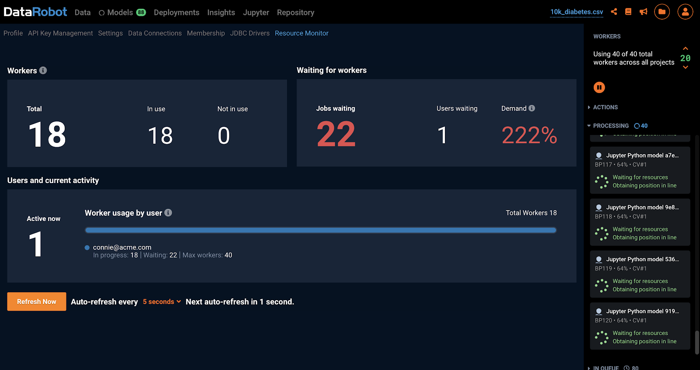

# Overview

DataRobot supports dynamic scale-out and scale-in of worker nodes in Azure. This feature requires an image of a fully provisioned and configured DataRobot worker node, an autoscaling group, and a DataRobot custom metric to be published to the cloud's monitoring service.

Note: Azure Autoscaling is compatable with Azure blob storage, which is higly recommended for objet storage if Azure Autoscaling is required 
## 1. Create a cluster

Below is a listing of suggested node types to build out the DataRobot Auto Scaling cluster. At least 1 Modeling node and at least 1 Modeling Only Node are required.

| Node Type | Required | Count | Cores (vCPUs)  |  RAM (GB) | HD Space (GB) |
|---|---|---|---|---|---|
Application+Data Node  | Yes  | 1  | 8 | 64 | 2000
Modeling Node  | Yes  | 1  | 8 | 64 | 100
Modeling Only Node  | Yes  | 1  | 8 | 64 | 100
Dedicated Prediction Engine  | Optional  | 1 | 4 | 32 | 100
Model Management  | Optional  | 1  | 4 | 16 | 1000
Total  |   | 5  | 32 | 240 | 3300

Under normal circumstances, you will want to have at least 1 Modeling node running to allow for a single user to use the system whenever they wish. Any other user on this system will be using an auto-scaled worker, which could increase the time it takes to run the jobs by up to 5 minutes.

## 2. Create an Application Insights Instrumentation Key

Use the following documentation from Azure to create an Azure Insights Instrumentation Key: https://github.com/microsoft/ApplicationInsights-Home/wiki#getting-an-application-insights-instrumentation-key

1. You may need to query in the top search bar in the marketplace for Application Insights to be applied. From the main Home page, select “Application Insights” and “Add” to deploy a new Application Insight to your Resource Group.


2. Fill out the fields to deploy Application Insights to the Resource Group. Please see below for more info on what Azure Application Insights recommends regarding which subscription to utilize. You can choose according to your own preferences. “Pay-as-you-go” is used in this example.


Once this has successfully deployed, you can find the Instrumentation Key that will be saved under METRICS_PUBLISHER_AZURE_TELEMETRY_CLIENT_TOKEN.


## 3. Install DataRobot

Refer to [Linux Installation Guide](../standard-install.md) to provision and deploy DataRobot according to the Multi-Node Architecture recommendations.

**3.1 Configure config.yaml**

Copy example config.yaml to `/opt/datarobot/DataRobot-7.x.x/config.yaml`:

```bash
cp example-configs/multi-node.yaml config.yaml
chmod 0600 config.yaml
```

Edit the config.yaml with the following parameters:

```bash
app_configuration:
  drenv_override:
    METRICS_PUBLISHER_CLOUD_PROVIDER: azure
    METRICS_PUBLISHER_AZURE_TELEMETRY_CLIENT_TOKEN: telemetry-client-token-retrieved-above
    METRICS_PUBLISHER_AZURE_TELEMETRY_METRIC_NAME: DataRobotQueueLoadAutoscalingMetric
    # Optional
    STATS_PUBLISH_FREQUENCY: 10  # Frequency of metric collection in seconds.
    METRICS_PUBLISHER_AZURE_TELEMETRY_MAX_QUEUE_LENGTH: 10  # Metric aggregation batch size.

servers:
# Application node
- services:
  ...other services...
  - metricspublisher

# Modeling node
- services:
  - execmanagereda
  - datasetsserviceworker0
  - datasetsservicequickworker0
  - datasetsserviceworker1
  - datasetsservicequickworker1

# Modelling-only node (Used for Autoscaling)
- services:
  - execmanagersw
```

**3.2 Complete the installation and verify cluster health before proceeding**

```bash
cd /opt/datarobot/DataRobot-7.x.x/
./bin/datarobot validate
./bin/datarobot setup-dependencies
./bin/datarobot run-registry
./bin/datarobot health cluster-checks
./bin/datarobot install
# Make sure the cluster is healthy
./bin/datarobot health smoke-test
```

**3.3 Verify new DataRobot metric in Azure Portal**

After several minutes, you should see the metric created in the **azure.applicationinsights** namespace of your cluster's scope.


## 4. Capture a Worker Machine Image

https://docs.microsoft.com/en-us/azure/virtual-machines/linux/capture-image

In the Azure Portal, capture a VM image of the modeling-only node. We will take this existing VM and turn it into a reusable custom image that you can use to create new VM instances.

This is the node that has the following services configured

```
-execmanagersw
```

1.  Deprovision the VM

Deprovisioning and marking the VM as generalized will make source VM unusable, and it cannot be restarted.

- SSH to the modeling-only node from the app node.
```bash
ssh <modeling-only-node-IP>
```
- Deprovision the VM.
```bash
sudo waagent -deprovision+user -force
```
- Close the SSH session
```bash
exit
```

2. Install and Configure Azure CLI

- Follow instruction in https://docs.microsoft.com/en-us/cli/azure/install-azure-cli to install and configure azure cli on your machine

3. Deallocate and mark the VM as generalized

- To create an image, the VM needs to be deallocated.
```bash
az vm deallocate --resource-group myResourceGroup --name myVM
```
- Set the state of the VM as generalized so the Azure platform knows the VM has been generalized. You can only create an image from a generalized VM.
```bash
az vm generalize --resource-group myResourceGroup --name myVM
```
- Create the image
```bash
az image create --resource-group myResourceGroup --name myImage --source myVM
```
- Sample output
```json
[
  {
    "hyperVgeneration": "V1",
	"id": "/subscriptions/<subsciption_id>/resourceGroups/<myResourceGroup>/providers/Microsoft.Compute/images/drworkernode_image",
	"location": "eastus",
	"name": "drworkernode_image",
	"provisioningState": "Succeeded",
    "resourceGroup": "<myResourceGroup>",
    "sourceVirtualMachine": {
  	"id": "/subscriptions/<subsciption_id>/resourceGroups/<myResourceGroup>/providers/Microsoft.Compute/virtualMachines/ModelingNode4-11784",
      "resourceGroup": "<myResourceGroup>"
	},
    "storageProfile": {
      "dataDisks": [
    	{
          "blobUri": null,
          "caching": "None",
          "diskSizeGb": 128,
      	"lun": 0,
          "managedDisk": {
        	"id": "/subscriptions/<subsciption_id>/resourceGroups/<myResourceGroup>/providers/Microsoft.Compute/disks/ModelingNode4-11784_disk2_e5298dc0b8fb4399b245572f98063b60",
            "resourceGroup": "<myResourceGroup>"
      	},
          "snapshot": null,
   	   "storageAccountType": "Standard_LRS"
    	}
  	],
  	"osDisk": {
        "blobUri": null,
        "caching": "ReadWrite",
        "diskSizeGb": 128,
        "managedDisk": {
      	"id": "/subscriptions/<subsciption_id>/resourceGroups/<myResourceGroup>/providers/Microsoft.Compute/disks/ModelingNode4-11784_OsDisk_1_13e2cef47375475d83135ef82e9a6d8b",
          "resourceGroup": "<myResourceGroup>"
    	},
        "osState": "Generalized",
	    "osType": "Linux",
        "snapshot": null,
        "storageAccountType": "Standard_LRS"
  	},
      "zoneResilient": null
	},
	"tags": {},
	"type": "Microsoft.Compute/images"
  }
]
```

3. Create VMs from the image (Optional)

Since one of the nodes had to be deprovisioned and deallocated, you will be one worker node short. You can run this command to replace it, but not necessarily required since autoscaling will be implemented.  As long as you have at least one available modeling worker, this can be an optional step.
```bash
az vm create --resource-group myResourceGroup --name myVMDeployed --image myImage --admin-username datarobot --ssh-key-value <id_rsa.pub>
```

- Sample output
```json

{
  "fqdns": "",
  "id": "/subscriptions/<subscription_id>/resourceGroups/<myResourceGroup>/providers/Microsoft.Compute/virtualMachines/drworkernode1",
  "location": "eastus",
  "macAddress": "<macAddress>",
  "powerState": "VM running",
  "privateIpAddress": "<privateIpAddress>",
  "publicIpAddress": "<publicIpAddress>",
  "resourceGroup": "<myResourceGroup>",
  "zones": ""
}
```

4. Image Management (Optional)

- List all images by name in a table format
```bash
az image list --resource-group myResourceGroup
```
- Sample output
```json
[
  {
    "hyperVgeneration": "V1",
	"id": "/subscriptions/<subsciption_id>/resourceGroups/<myResourceGroup>/providers/Microsoft.Compute/images/drworkernode_image",
	"location": "eastus",
	"name": "drworkernode_image",
	"provisioningState": "Succeeded",
    "resourceGroup": "<myResourceGroup>",
    "sourceVirtualMachine": {
  	"id": "/subscriptions/<subsciption_id>/resourceGroups/DRR<myResourceGroup>/providers/Microsoft.Compute/virtualMachines/ModelingNode4-11784",
      "resourceGroup": "<myResourceGroup>"
	},
    "storageProfile": {
      "dataDisks": [
    	{
          "blobUri": null,
          "caching": "None",
          "diskSizeGb": 128,
      	"lun": 0,
          "managedDisk": {
        	"id": "/subscriptions/<subsciption_id>/resourceGroups/<myResourceGroup>/providers/Microsoft.Compute/disks/ModelingNode4-11784_disk2_e5298dc0b8fb4399b245572f98063b60",
            "resourceGroup": "<myResourceGroup>"
      	},
          "snapshot": null,
   	   "storageAccountType": "Standard_LRS"
    	}
  	],
  	"osDisk": {
        "blobUri": null,
        "caching": "ReadWrite",
        "diskSizeGb": 128,
        "managedDisk": {
      	"id": "/subscriptions/<subsciption_id>/resourceGroups/<myResourceGroup>/providers/Microsoft.Compute/disks/ModelingNode4-11784_OsDisk_1_13e2cef47375475d83135ef82e9a6d8b",
          "resourceGroup": "<myResourceGroup>"
    	},
        "osState": "Generalized",
	    "osType": "Linux",
        "snapshot": null,
        "storageAccountType": "Standard_LRS"
  	},
      "zoneResilient": null
	},
	"tags": {},
	"type": "Microsoft.Compute/images"
  }
]
```

## 5. Create a Virtual Machine Scale Set
Create a Virtual Machine Scale Set of your modeling-only node.
https://docs.microsoft.com/en-us/azure/virtual-machine-scale-sets/quick-create-portal

1. Create a virtual machine scale set


2. After selecting "Add”, go to “Browse all public and private images” to find our custom baked modeling only node image.


3. Continue filling out the rest of the fields in the Virtual Machine Scale Set after selecting the VM image. For the purpose of this example, the instance size is set to **Standard_DS1_v2**. Please see the previous suggested sizing **Standard_E8_v3**.

4. Click Review and Create.

## 6. Configure Autoscaling

Use the following guide to configure your virtual machine scale set to dynamically scale according to the queue load metric: https://docs.microsoft.com/en-us/azure/azure-monitor/platform/autoscale-custom-metric

A simple default configuration would be able to scale the cluster up if the queue load metric is above XXX for two minutes and scale down if the queue load metric is below XXX for five minutes. It is recommended to never scale below 1 instance.

1. Search for Virtual Machine Scale Set in the Resource Group. Go to “Scaling”. This is where you can configure “Custom Autoscale” utilizing our new custom metric. You can set the instance limit so that when scaling horizontally you do not exceed any billing budgets. In this example, we will set the max to 5 instances.


2. You will need to add 2 rules; one for scaling in and another for scaling out. Be sure to re-select all the custom options for each Scale rule. After selecting “Other resource” for your Metric source, you should be able to select “Application Insights” for Resource Type and your resource group. Your custom metric “azure.applicationinsights” will show in the namespace here too.


3. Click “Save” the new changes made to create custom autoscale rules.


## 7. Test Autoscaling

1. To test your autoscaling setup, generate load on the cluster by running through autopilot on a cluster.

2. Upload sample dataset to create the first project:
http://s3.amazonaws.com/datarobot_data_science/test_data/10k_diabetes.xlsx
Target: “readmitted”

3. Grant your test account with more workers than you have available and allocate them to the project. Track the metric in the Azure Portal -> Autoscaling / VMs Scaling Set and see the autoscale group adds more virtual machines.

4. If an instance fails to launch, it will terminate and re-launch a new one.

5. Within minutes of a new virtual machine booting up, you should see the cluster capacity increase in the DataRobot Resource Monitor, and you should see additional workers working on jobs in your project.




6. If needed, click Run on the Cross Validation column of completed models in the Model Leaderboard to generate more load.

7. You may start multiple projects in Autopilot mode and notice the new worker image instances increased in turn increase in the total worker count. When load on worker images are reduced these instances scale down as per the rules applied.

8. Congratulations! You have successfully set up autoscaling in Azure. Be sure to cancel all the jobs in your test queue and ensure the autoscaled instances eventually scale back in.

## 8. Clean Up

At the end of this process, you can safely delete the existing Modeling Only Node as it is no longer needed.

Right click into the running VM and delete the instance.
