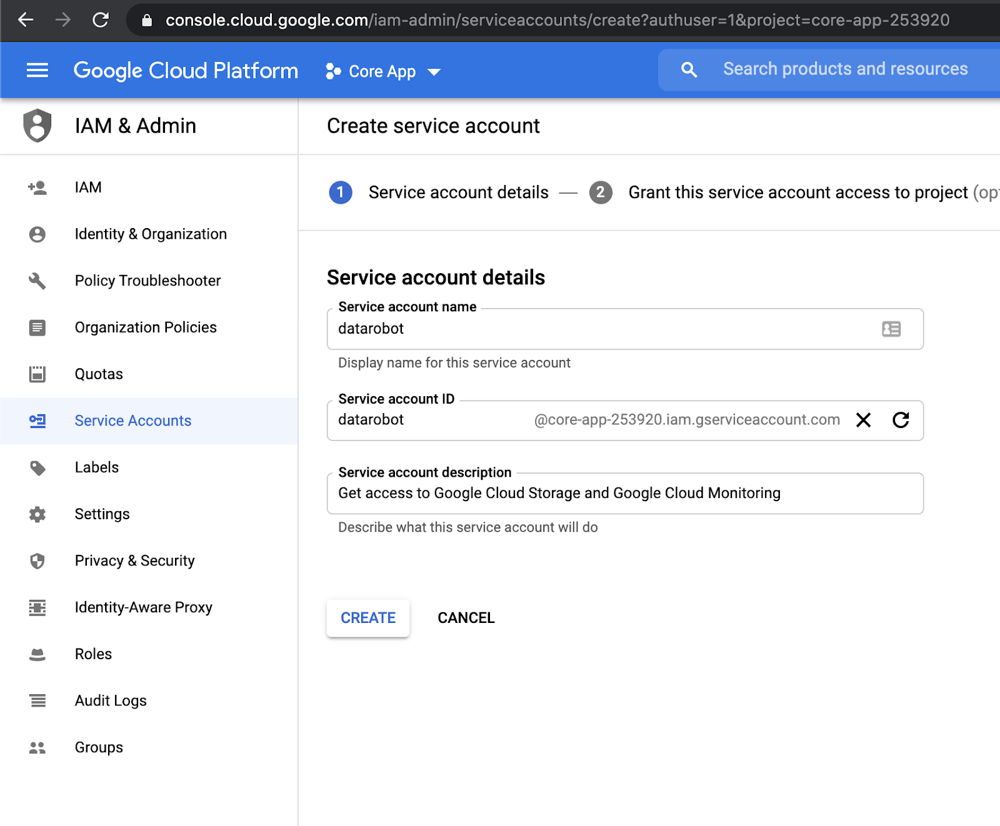
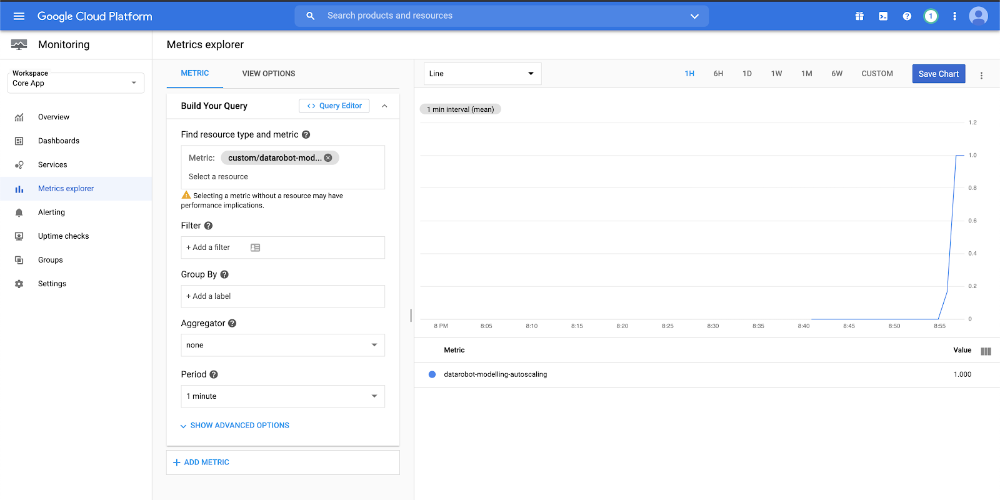
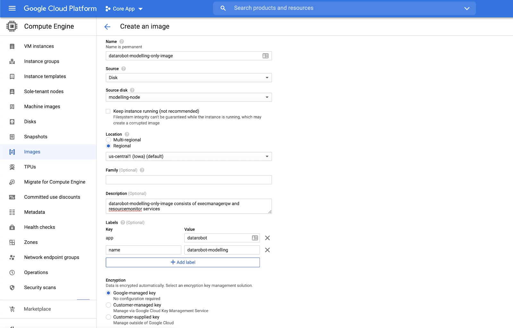
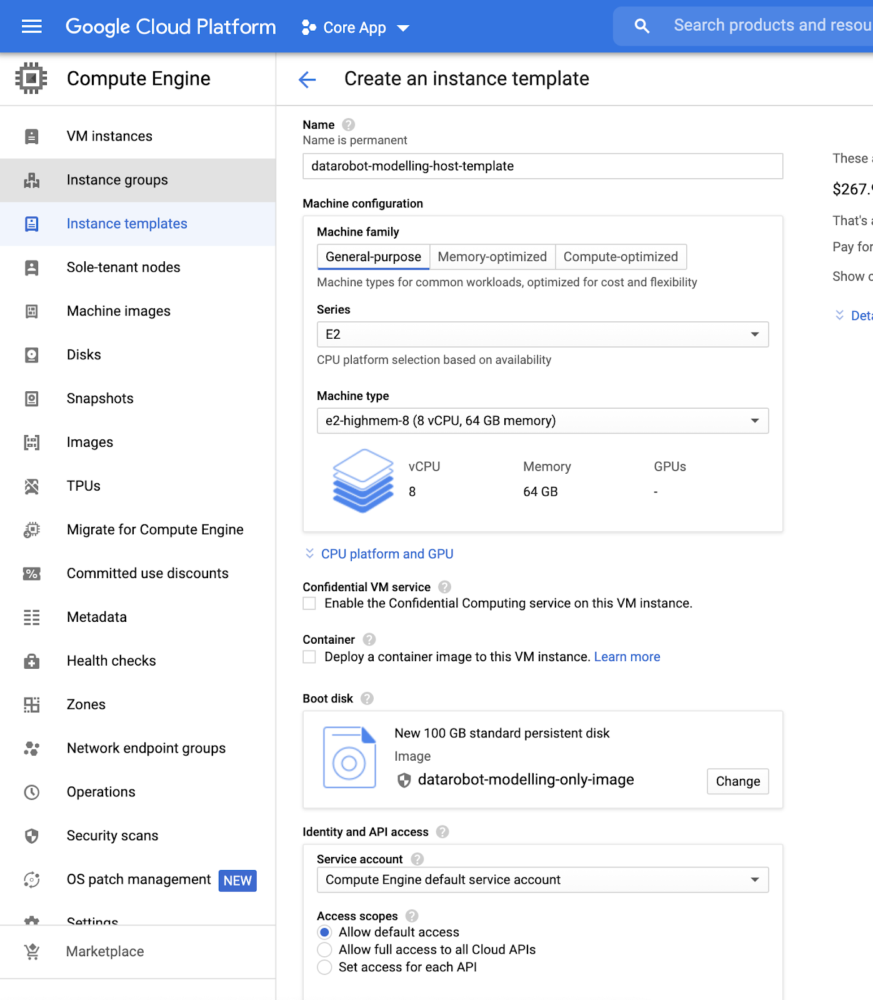
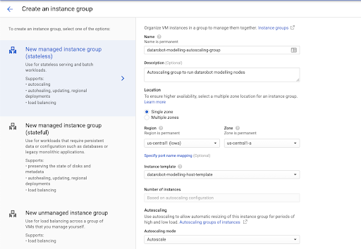
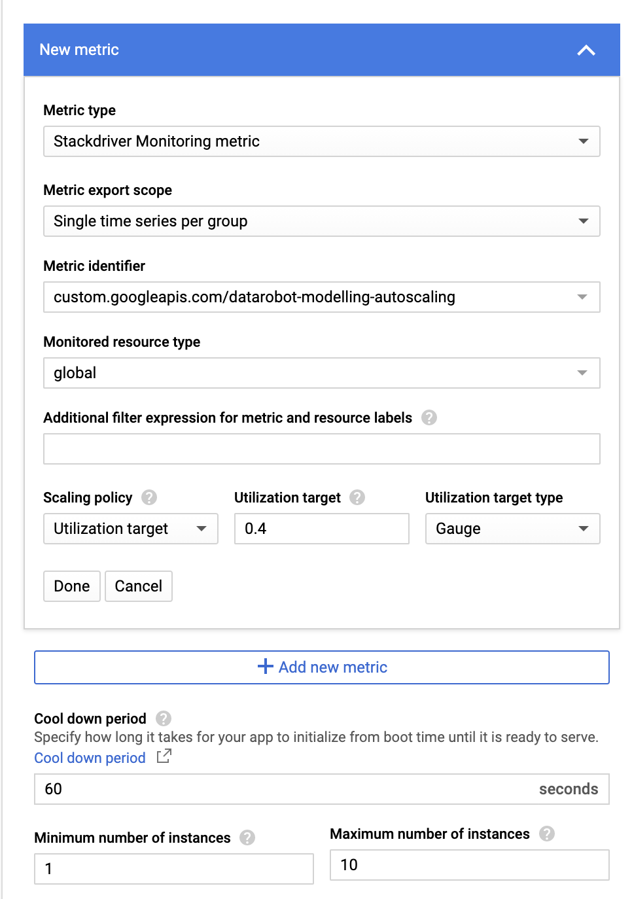
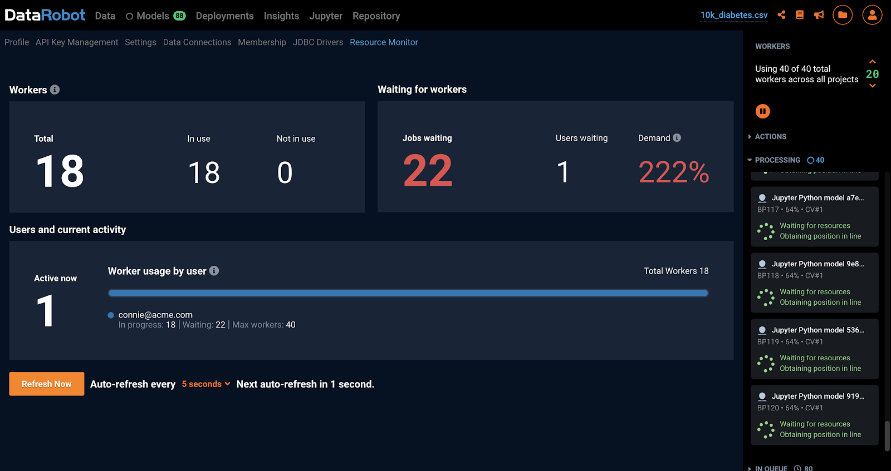
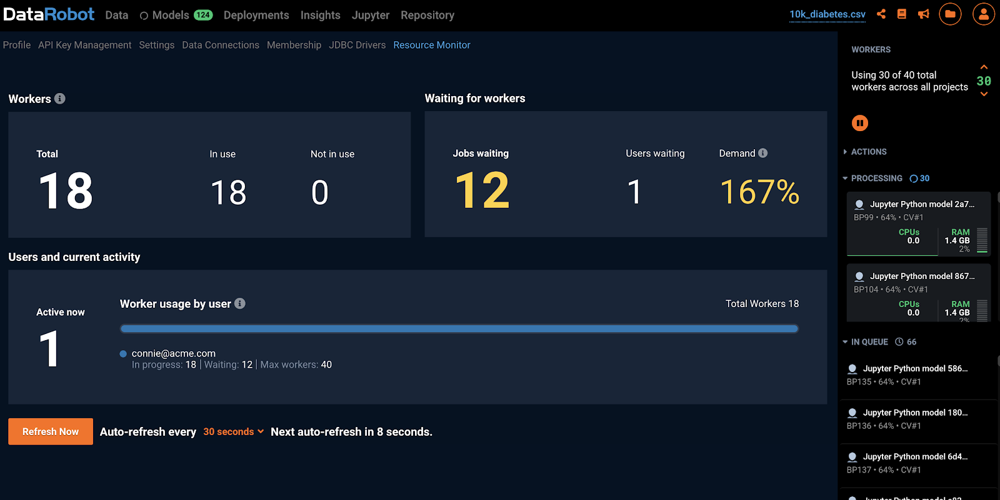

# Overview

DataRobot supports dynamic scale-out and scale-in of worker nodes in Google Cloud. This feature requires an image of a fully provisioned and configured DataRobot worker node, an autoscaling group, and a DataRobot custom metric to be published to the cloud's monitoring service.

## 1. Create a cluster

Below is a listing of suggested node types to build out the DataRobot Auto Scaling cluster. At least 1 Modeling node and at least 1 Modeling Only Node are required.

| Node Type | Required | Count | Cores (vCPUs)  |  RAM (GB) | HD Space (GB) |
|----------------|:---------------------:|:----------------:|:-------------------:|:------------------------:|-------|
| Application+Data Node  | Yes  | 1  | 8 | 64 | 2000 |
| Modeling Node  | Yes  | 1  | 8 | 64 | 100 |
| Modeling Only Node  | Yes  | 1  | 8 | 64 | 100 |
| Dedicated Prediction Engine  | Optional  | 1 | 4 | 32 | 100 |
| Model Management  | Optional  | 1  | 4 | 16 | 1000 |
| Total  |   | 5  | 32 | 240 | 3300 |

Under normal circumstances, you will want to have at least 1 Modeling node running to allow for a single user to use the system whenever they wish. Any other user on this system will be using an auto-scaled worker, which could increase the time it takes to run the jobs by up to 5 minutes.

## 2. Configure Google Cloud Service Account

- In the Google Cloud Portal -> IAM -> Service Accounts, create a new service account for DataRobot. Grant Monitoring Admin and Storage Admin for the new Service Account.

- Attach the service account to the machines running DataRobot (Application Default Credentials - adc mode) or download the google credential json file, copy to application host and set the file path in config.yaml later (Path/Content mode).



## 3. Install DataRobot

Refer to [Linux Installation Guide](../standard-install.md) to provision and deploy DataRobot according to the Multi-Node Architecture recommendations.

**3.1 Configure config.yaml**

Copy example config.yaml to `/opt/datarobot/DataRobot-7.x.x/config.yaml`:

```bash
cp example-configs/multi-node.yaml config.yaml
chmod 0600 config.yaml
```

Next, follow the instruction to edit `config.yaml` for providing Google Cloud credential via ADC or path mode.

**3.1.1 Configure the application running in GCE using ADC**

Google can provide ["Application Default Credentials (ADC)"](https://cloud.google.com/docs/authentication/production)
to software running on a GCE instance.
The GCE instance must be [configured with a default service account](https://cloud.google.com/compute/docs/access/create-enable-service-accounts-for-instances)
in order for this to work.
This method is the most convenient and secure because google will manage all credentials outside the
instance, so plain-text credentials will not be stored.

Example `config.yaml` snippet:

```bash
os_configuration:
  google_cloud:
    use_google_cloud_application: true
    google_credential_source: adc

app_configuration:
  drenv_override:
    # Metrics Publisher required parameters
    METRICS_PUBLISHER_CLOUD_PROVIDER: gcp
    ADMIN_API_TOKEN: admin-token-retrieved-above
    GOOGLE_CLOUD_PROJECT_ID: your-project-id
    STATS_METRICS_NAMESPACE: datarobot-modelling-autoscaling
    # Google Cloud Storage parameters (Only required if Google Cloud Storage enabled)
    FILE_STORAGE_PREFIX: data/
    FILE_STORAGE_TYPE: google
    GOOGLE_STORAGE_BUCKET: your-google-storage-bucket
    ENABLE_GS_INGESTION: True

servers:
# Application node
- services:
  ...other services...
  - metricspublisher

# Modeling node
- services:
  - execmanagereda
  - resourcemonitor
  - datasetsserviceworker0
  - datasetsservicequickworker0
  - datasetsserviceworker1
  - datasetsservicequickworker1

# Modelling-only node (Used for Autoscaling)
- services:
  - execmanagersw
  - resourcemonitor
```

**3.1.2 Configure the application running in GCE using manually distributed credentials**

The keyfile must be manually copied to the provisioner node, and this path must be supplied in the configuration.

Example `config.yaml` snippet:

```bash
os_configuration:
  google_cloud:
    use_google_cloud_application: true
    google_credential_source: path
    google_credential_keyfile_path: /opt/datarobot/etc/credentials/<keyfile.json>

app_configuration:
  drenv_override:
    # Metrics Publisher required parameters
    METRICS_PUBLISHER_CLOUD_PROVIDER: gcp
    ADMIN_API_TOKEN: admin-token-retrieved-above
    GOOGLE_CLOUD_PROJECT_ID: your-project-id
    STATS_METRICS_NAMESPACE: datarobot-modelling-autoscaling
    # Google Cloud Storage parameters (Only required if Google Cloud Storage enabled)
    FILE_STORAGE_PREFIX: data/
    FILE_STORAGE_TYPE: google
    GOOGLE_STORAGE_BUCKET: your-google-storage-bucket
    ENABLE_GS_INGESTION: True

servers:
# Application node
- services:
  ...other services...
  - metricspublisher

# Modeling node
- services:
  - execmanagereda
  - resourcemonitor
  - datasetsserviceworker0
  - datasetsservicequickworker0
  - datasetsserviceworker1
  - datasetsservicequickworker1

# Modelling-only node (Used for Autoscaling)
- services:
  - execmanagersw
  - resourcemonitor
```

**3.2 Complete the installation and verify cluster health before proceeding**

```bash
cd /opt/datarobot/DataRobot-7.x.x/
./bin/datarobot validate
./bin/datarobot setup-dependencies
./bin/datarobot run-registry
./bin/datarobot health cluster-checks
./bin/datarobot install
# Make sure the cluster is healthy
./bin/datarobot health smoke-test
```

**3.3 Verify new DataRobot metric in Google Cloud Portal**

After several minutes, you should see the metric created in the Google Cloud Portal -> Monitoring -> Metrics Explorer under custom.googleapis.com/datarobot-modelling-autoscaling namespace.



## 4. Capture a Worker Image

- In the Google Cloud Portal -> Compute Engine -> Images, capture a VM image of the modeling-only node. We will take this existing VM and turn it into a reusable custom image that you can use to create new VM instances.

- Configure Source disk to take disk snapshot from Modelling Only node. This is the node that has the following services configured:
```
-execmanagersw
-resourcemonitor
```



## 5. Create Instance Template

- In the Google Cloud Portal -> Compute Engine -> Instance Templates, create an instance template from the VM snapshot image generated in the previous step
- Configure Machine Family to e2-highmem-8 (8 CPUs + 64GB memory)
- Configure Boot Disk to load from VM snapshot image



## 6. Create Instance Group

In the Google Cloud Portal -> Compute Engine -> Instance Group -> New Managed Instance Group (stateless), create an instance group (autoscaling group) from the instance template generated in the previous step



Configure Autoscaling in the instance group to use DataRobot custom metric as the screenshot below.

Use Scaling Policy = Utilization Target, Utilization Target = 0.4, Utilization Target Type = Gauge

Configure Min and Max number of instances in the Autoscaling Group as your need. In this example, we set the range is from 1-10 instances.



## 7. Test Autoscaling

1. To test your autoscaling setup, generate load on the cluster by running through autopilot on a cluster.

2. Upload sample dataset to create the first project:
http://s3.amazonaws.com/datarobot_data_science/test_data/10k_diabetes.xlsx
Target: “readmitted”

3. Grant your test account with more workers than you have available and allocate them to the project. Track the metric in the Cloud Portal -> Autoscaling / VMs Scaling Set and see the autoscale group adds more virtual machines.

4. If an instance fails to launch, it will terminate and re-launch a new one.

5. Within minutes of a new virtual machine booting up, you should see the cluster capacity increase in the DataRobot Resource Monitor, and you should see additional workers working on jobs in your project.





6. If needed, click Run on the Cross Validation column of completed models in the Model Leaderboard to generate more load.

7. You may start multiple projects in Autopilot mode and notice the new worker image instances increased in turn increase in the total worker count. When load on worker images are reduced these instances scale down as per the rules applied.

8. Congratulations! You have successfully set up autoscaling in Google Cloud Platform. Be sure to cancel all the jobs in your test queue and ensure the autoscaled instances eventually scale back in.

## 8. Clean Up

At the end of this process, you can safely delete the existing Modeling Only Node as it is no longer needed.

Right click into the running VM and delete the instance.
