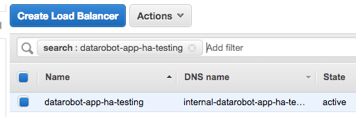
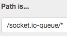

# HA Web Services for DataRobot

## Overview

This document details how to enable High Availability (HA) Web Services for DataRobot.
High availability in this context means running multiple copies of specific DataRobot services which are involved in handling HTTP requests, both directly from clients (UI + API) as well as from other parts of DataRobot (e.g. the `internalapi`).

The HA Web Services feature adds redundancy and additional capacity to almost all web-tier and middleware components of DataRobot.
Paired with HA databases, this feature allows DataRobot to scale to large workloads with high fault tolerance.

### Architecture

The conceptual architecture for HA DataRobot services is as follows:

<kbd></kbd>

In this framework users access the application through an application load balancer.
Requests are balanced among several instances of each service in the cluster.
When a service instance or node stops responding to its service health check, it is removed from the load balancer.

This architecture supports the use of several load balancers.
The primary use case for this is to separate user-facing traffic from internal application traffic while maintaining high availability.

### Overview of Example Setup on AWS Platform

The architecture maps readily onto AWS Application Load Balancer component.
A detailed description of it can be found [here](https://docs.aws.amazon.com/elasticloadbalancing/latest/application/introduction.html), but the following is a schematic respresentation of it:

<kbd></kbd>

Users create Target groups - this represents a set of EC2 instances grouped by some feature, in our case - a type of services deployed on them, declared to be listening on a particular HTTP/S port.
In other words target groups represent a pool of targets for the load balancer to route to.
Target groups must have a configured health check to ensure the backend service instances are healthy and able to perform work.
The health check can contact the service at a given path directly, or use a different port from the load-balanced traffic.

Target groups are used as backends for Load Balancer forwarding rules, which allow traffic to be routed according to which port it was sent to, what address it's coming from, and the URL path used.
DataRobot only uses the path component of a request in its forwarding rules.

In the example setup documented here, one ALB is used to route requests both from internal and external sources.

SSL is terminated at the load balancer, meaning that all listeners are secured, accepting only HTTPS connections.
SSL inside the DataRobot cluster is disabled, but a separate SSL certificate can be used for traffic from the load balancer to the application as well.
This directly influences configuration parameters for the ALB infrastructure as can be seen later in this document.

On the Application Load Balancer, we add 3 listeners:
- Port 443 (default, secured): Used for communication with clients of the DataRobot application and by some internal services.
- Port 8100 (secured): Used by internal services to access the *datasetsserviceapi* service.
- Pot 9494 (secured): Used by internal services to access the *pngexport* service.

### AWS Infrastructure Requirements

The following infrastructure will be required or set up during the installation process:
* 2+ EC2 instances for web services
* Amazon ALB
* Amazon target groups
* Amazon Route53 record pointing to the load balancer
* SSL certificate stored in AWS Certificate Manager

## AWS Application Load Balancer Setup

### Create Target Groups

<kbd></kbd>

A new target group must be created for each service and [added](#listeners_associations) to a load balancer listener's routing rules.
To each target group, add only the instances that are expected to run that service, as defined by your _config.yaml_ in the [DataRobot Application Configuration](#datarobot_configuration) section.

#### Table: Target Groups

The following tables summarize all of the target groups that must be created:

Name | Protocol | Traffic Port | Health Check Path | Health Check Port | Stickiness
---- | -------- | ------------ | ----------------- | ----------------- | ----------
app | HTTP | 80 | /ping | traffic port | Disabled
publicapi | HTTP | 80 | /api/v2/ping | traffic port | Disabled
appupload | HTTP | 80 | /upload/ping | traffic port | Disabled
mmqueue | HTTP | 80 | /ping | 8011 | 1 day
internalapi | HTTP | 80 | /api/v0/ping | traffic port | Disabled
dss-api | HTTP | 8100 | /status | traffic port | Disabled
pngexport | HTTP | 9494 | /ping | traffic port | Disabled

**NOTE:**
* SSL also can be terminated on the cluster nodes (depending on the deployment scheme) in which case `nginx` instances on those nodes will be listening on **`443`** traffic port by default and communicating by **`HTTPS`** protocol.
* `dss-api` and `pngexport` services will always listen on **`8100`** and **`9494`** in any SSL configuration.
* Health check parameters for `mmqueue` service do not change whether SSL termination is enabled on the nodes or not: it will always have **`HTTP:8011`** scheme.

Aside from the documented Health Check settings unique to each service, use the following settings for all Health Checks:

Protocol | Healthy Threshold | Unhealthy Threshold | Timeout | Interval | Success Codes
-------- | ----------------- | ------------------- | ------- | -------- | -------------
HTTP | 2 | 2 | 3 | 5 | 200

**NOTE:** again, health check endpoints protocol will change to **`HTTPS`** when SSL termination is enabled on the cluster _nodes_.

#### Walkthrough: Target Group Creation

For illustration purposes, a detailed walkthrough of creating the _mmqueue_ Target Group follows:

* First, create the _mmqueue_ target group with the given settings:

<kbd></kbd>

* Configure the health check to use port 8011:

<kbd></kbd>

* Add instances that will run the _mmqueue_ service to the target group as show in the example:

<kbd></kbd>

<kbd></kbd>

* Now, enable stickiness on this target group. Stickiness is only required for the _mmqueue_ target group.

<kbd></kbd>

<kbd></kbd>

* The targets should become healthy once the [DataRobot Application Configuration](#datarobot_configuration) section has successfully completed:

<kbd></kbd>

### Create ALB

* In the EC2 panel for Amazon services go to the "Load Balancers" menu and select "Create Load Balancer".

<kbd></kbd>

* Choose "Application Load Balancer".

<kbd></kbd>

* Configure the load balancer with your choice of Name and Scheme.

    * Use the ipv4 IP address type.

    <kbd></kbd>

    * Add a secure listener on port 443

    <kbd></kbd>

* Choose the VPC and availability zones inside the VPC where the targets for routing reside.

* Select the subnets containing your EC2 instances.

* For maximum resiliency, ensure your web servers will be hosted in at least three separate availability zones.

* On the Configure Security Settings page, choose your SSL certificate to encrypt traffic between your clients and the ALB.

<kbd></kbd>

* Add the ALB into one or more security groups.

    * The ALB must be in a security group that allows incoming traffic port 443 from your clients, and on all other listener ports from your EC2 instances.

    * The ALB must be able to send outgoing traffic to the security groups occupied by your HA Web Services on all of the configured target group and health check ports (see below).

* Set up default target group routing

    * Choose existing target group which routes traffic to the app service

    <kbd></kbd>

    * This will be the default routing for the ALB if the traffic does not match any other routing rules.

* Check that load balancer was created

<kbd></kbd>

### Create Additional Listeners

Now you can create the remaining Listeners on your Application Load Balancer:

* Add a new secure listener for the _pngexport_ service target group:

<kbd></kbd>

* Use HTTPS for traffic port 9494, and route it to your _pngexport_ target group. Use the same SSL certificate as before:

<kbd></kbd>

* Add another secure (HTTPS) listener for traffic port 8100, and route it to your _dss-api_ target group:

<kbd></kbd>

### <a name="listeners_associations"></a>Target Group Listener Associations

Now we can associate the remaining Target Groups with listener Forwarding Rules.

#### Table: Target Group Listener Association

The following table summarizes all Target Group Listener Associations to create, including the default ones we have already created.

Name | Listener | Forwarding Rule
---- | -------- | ---------------
app | HTTPS:443 | default
publicapi | HTTPS:443 | /api/v2/\*
appupluad | HTTPS:443 | /upload/\*
mmqueue | HTTPS:443 | /socket.io-queue/\*
internalapi | HTTPS:443 | /api/v0/\*
dss-api | HTTPS:8100 | default
pngexport | HTTPS:9494 | default

#### Walkthrough: Target Group Listener Association

For illustration purposes, a detailed walkthrough of adding the mmqueue Target Group to the Load Balancer listener follows:

* Navigate to your Application Load Balancer and open the Listeners tab:

<kbd></kbd>

* Edit the rules for the HTTPS:443 listener:

<kbd></kbd>

* Click on the `+` symbol to add a new rule, and choose Insert Rule.
  Order of rules does not matter for any DataRobot ALB Listener Rules, so long as the app target group is the default for its listener.

<kbd></kbd>

* Use a `Path is…` condition type for all rules:

<kbd></kbd>

* For mmqueue, use the following path to forward traffic to the _mmqueue_ Target Group:

<kbd></kbd>

<kbd></kbd>

* **NOTE:** You must **ALWAYS include the leading `/` and trailing `/*`** on _all_ Path conditions or traffic will not be correctly forwarded.

### Create A Route53 Record

Now the ALB must be associated with a hostname that matches the SSL certificate used for its listeners.

* Obtain the DNS name of your ALB from its Description page:

<kbd></kbd>

* Navigate to the Hosted Zones of the Route 53 page in the AWS Console and select **Hosted zones**:

<kbd></kbd>

<kbd></kbd>

* Select **Create record set**:
    * Choose **A - IPv4 address**  as type for the record set
    * Choose **Alias**
    * Select DNS name of you ALB from **Alias Target** dropdown:

<kbd></kbd>

## <a name="datarobot_configuration"></a>DataRobot Application Configuration

The following is a _config.yaml_ example for a cluster that can be used in this example.
It has three _webserver_ nodes, a node for non-HA services, workers, and HA databases.
This example is for illustrative purposes only.
Reach out to your DataRobot Support contact to adapt it to your environment.

Install your cluster with this configuration, or use `./bin/datarobot install` if you are modifying an existing installation.

### <a name="config_example"></a>Example of _config.yaml_
```yaml
---
# This dictionary associates different ALB URL's with load-balanced services.
ha_services_endpoints:
  https://datarobot-ha-testing.ent.datarobot.com:
  - app
  - appupload
  - publicapi
  - internalapi
  - mmqueue
  - pngexport
  - datasetsserviceapi

# Insert your cluster's global configuration here:
app_configuration:
  drenv_override:
    SECURE_WORKER_FIT_WORKERS: 4

os_configuration:
  user: datarobot
  group: datarobot
  private_ssh_key_path: /home/datarobot/.ssh/id_rsa
  admin_user: dradmin
  admin_private_ssh_key_path: /home/dradmin/.ssh/id_rsa
  datarobot_home_dir: /opt/datarobot
  prediction_ssl:
    enabled: false
  ssl:
    enabled: false
  webserver_hostname: https://datarobot-ha-testing.ent.datarobot.com

  # set this flag if ideworker is deployed for the cluster
  enable_ip_forwarding: true

servers:
# Non-HA services
- hosts:
  - 192.168.0.0
  services:
  - provisioner

  # Cluster monitoring and infrastructure
  - availabilitymonitor
  - rsyslog
  - jobretryservice
  - logstash
  - haproxy

  # Brokers and Proxies
  - edabroker
  - securebroker
  - idebroker
  - queueproxy
  - resourceproxy
  - taskmanager

  # Additional optional services
  - idebroker
  - ideworker
  - diagnostics
  - tableauextension

# HA Web services
- hosts:
  - 192.168.0.4
  - 192.168.0.5
  - 192.168.0.6
  services:
  - nginx
  - app
  - appupload
  - publicapi
  - internalapi
  - mmqueue
  - datasetsserviceapi
  - pngexport

# HA Databases
- hosts:
  - 192.168.0.1
  - 192.168.0.2
  - 192.168.0.3
  services:
  - minio
  - mongo
  - redis
  - rabbit
  - sentinel

# Workers
- hosts:
  - 192.168.0.7
  - 192.168.0.8
  - 192.168.0.9
  services:
  - execmanager
  - resourcemonitor
  - datasetsservicequickworker0
  - datasetsservicequickworker1
  - datasetsserviceworker0
  - datasetsserviceworker1

# Predictions
- hosts:
  - 192.168.0.10
  services:
  - dedicatedpredictionnginx
  - dedicatedpredictionapi
```

### Further notes on _config.yaml_

As you may have noticed this config differs from regular one, let’s break down the HA related additions.

```yaml
ha_services_endpoints:
  https://datarobot-ha-testing.ent.datarobot.com:
  - app
  - appupload
  - publicapi
  - internalapi
  - mmqueue
  - pngexport
  - datasetsserviceapi
```

This section maps between ALB endpoints (actually _route53_ record names) and services which are accessible through that load balancer.
In this setup we configured only one load balancer.
In the event there is more than one ALB, simply map each URL to its proxied services, for example:

```yaml
ha_services_endpoints:
  # This endpoint is accessible to DataRobot clients
  https://datarobot-public.company.org:
  - app
  - appupload
  - publicapi
  - mmqueue

  # This endpoint can only be accessed by DataRobot services
  https://datarobot-internal.int.company.org:
  - internalapi
  - pngexport
  - datasetsserviceapi

os_configuration:
 ...
  # This value must match the endpoint hosting public services
  webserver_hostname: https://datarobot-public.company.org
```


_**Important note:**_ the endpoint for an ALB must always be a full URL, with proper protocol prefix (HTTPS if secure listeners are used and HTTP otherwise).

Now for the `servers/hosts` section: for the regular multinode deployment config it must contain the list of cluster nodes with services deployed on them, this is also true for HA deployment - if you want to have a scalable service replica on a node - put its name into the list of services for that node, simple as that.
 The only requirement is that the `nginx` service must be _**always**_ installed with scaled services.


If you would like to add in clusterd RabbitMQ nodes you'll need to add two addtional services to your config.yaml, these sections have been added to the sample config above

```yaml
servers:
# Non-HA services
- hosts:
  - 192.168.0.0
  services:
  - provisioner

  # Cluster monitoring and infrastructure
  - availabilitymonitor
  - rsyslog
  - jobretryservice
  - logstash
  - haproxy # added to support clusterd RabbitMQ and MinIO nodes, multple proxies will be supported in a later release
...
# HA Databases
- hosts:
  - 192.168.0.1
  - 192.168.0.2
  - 192.168.0.3
  services:
  - minio
  - mongo
  - redis
  - rabbit  # added here to cluster RabbitMQ nodes
  - sentinel
```


## Verifying the Setup

After installing DataRobot with the given _config.yaml_ and creating the infrastructure, all of your Target Groups should show _`healthy`_ for each instance.

### Basic Health Tests

Ensure that all services work as expected:
* Create a new project
* Run autopilot and let some models build
* Submit a model via the Jupyter Notebook interface
* Export PNGs of diagrams for successful model runs

### Simulating a Failed Instance

Find the EC2 instances in your DataRobot cluster and Stop an instance.
Verify that the instance shows unhealthy in its Target Groups, and check that everything above still completes successfully:

<kbd></kbd>

Now Start the instance, wait for it to return to the Running state, wait for it to appear _`healthy`_ in the target group health checks, and run through the test steps one more time.

### Troubleshooting

#### The UI doesn't show updates while files upload or models build

You may have not enabled stickiness on the _**mmqueue**_ target group

#### Overall the application does not seem to be working

Always make sure you put full URL path with proper protocol prefix for ALB endpoints into `ha_services_endpoints` mapping and `os_configuration.webserver_hostname` key, as in the [config example](#config_example) above:

```yaml
ha_services_endpoints:
  https://datarobot-public.company.org:
    ...

  https://datarobot-internal.int.company.org:
    ...
```

#### Jupyter is waiting for the server set up

One of the reasons for that to be happening for HA Web Services clusters is that `ideworker` service is not installed on the same node with any replica of `internalapi` and IP forwarding is disabled for that node.

To check if IP forwarding is enabled:

* SSH to the node with `ideworker` service.
* Run `cat /proc/sys/net/ipv4/ip_forward`. The output should be `1`.

To quickly enable IP forwarding for the cluster nodes add `enable_ip_forwarding: true` to `os_configuration` section of the _config.yaml_:

```yaml
os_configuration:
 ...
 enable_ip_forwarding: true
```
Run `./bin/datarobot setup-dependencies`

#### Large file uploads are failing (`ClientDisconnected: 400 Bad Request``)

One of the reasons that large file uploads can fail is that the ALB `idle_timeout` is shorter than the time that it takes to upload the file; by default a new ALB `idle_timeout` is set to 60 seconds.

If large file uploads are failing, and you're seeing `ClientDisconnected: 400 Bad Request` errors in the logs, you an try increasing the `idle_timeout` setting on the ALBs.

To update `idle_timeout` using the AWS console:

* Open the Amazon EC2 console at https://console.aws.amazon.com/ec2/
* On the navigation pane, under *LOAD BALANCING*, choose *Load Balancers*
* Select the load balancer you want to modify
* On the *Description* tab, choose *Edit attributes*
* On the *Edit load balancer attributes* page, modify the value for *Idle timeout* to reflect the number of seconds you want the connection to wait for an upload to complete.  The valid range is 1-4000 seconds, the default is 60 seconds.
* Choose *Save*

To update `idle_timeout` using the AWS CLI:

* Use the _modify-load-balancer-attributes_ command with the `idle_timeout.timeout_seconds` attribute

To configure `idle_timeout` using Terraform:

The Terraform `aws_lb` resource accepts an `idle_timeout` argument

## Disaster Recovery

In the event an HA Web Server EC2 instance (_not_ the HA Web Services replicas on that instance) goes unhealthy, you must manually recover the instance.

Create a new EC2 instance, prepare it per the instructions in the Installation Guide, and then install services on it using the DataRobot installer CLI.
You should use the `--limit-hosts` flag to the `./bin/datarobot {setup-dependencies,install,reconfigure}` commands.
This allows you to avoid interference with other services and downtime of the whole application.
