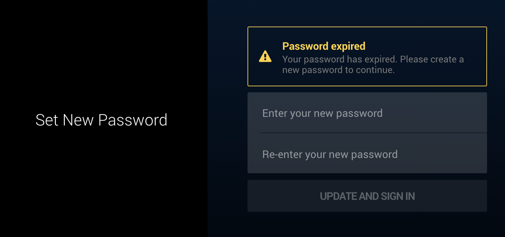
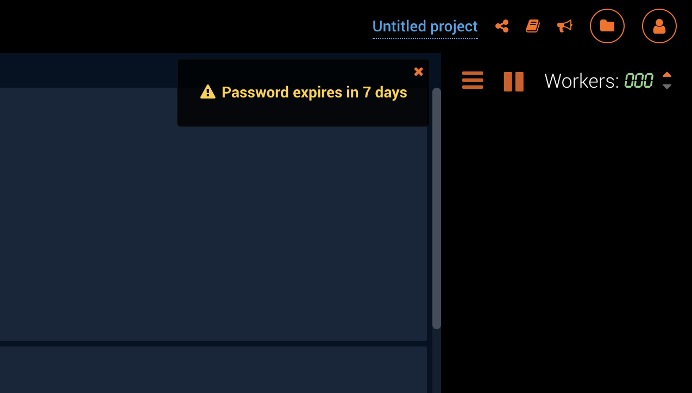
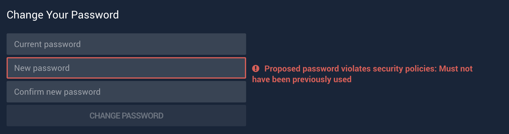

# Password Policies

DataRobot can be configured to enforce restrictions on users' passwords.

## Default Password Policies

By default, DataRobot is configured so that all users' passwords must meet the following requirements:
* Contains only printable ASCII characters
* Must be between 8 and 512 characters in length
* Must contain at least one capital letter
* Must contain at least one number
* Cannot be the same as the user's username

## Password Expiration

Passwords can be configured to expire a certain number of days after they are set. If a user attempts
to login to DataRobot using an expired password, they will be prompted to change their password before
they can access the application.



To enable password expiration, set the `PASSWORD_EXPIRATION_TIME` setting in `config.yaml` to a non-zero
number. This value is the number of days after which a password will expire.

```yaml
# config.yaml snippet
---
app_configuration:
  drenv_override:
    PASSWORD_EXPIRATION_TIME: 180
```

When a user's password is about to expire, they will be warned when they login and every time they
load DataRobot in a new browser tab.



How much notice users are given before their password expires can be configured using
`PASSWORD_EXPIRATION_WARNING_TIME` setting in `config.yaml`. This value controls the number of days
before a user's password expires that DataRobot will begin warning them. For example, to show warnings
to a user up to two weeks before their password expires:

```yaml
# config.yaml snippet
---
app_configuration:
  drenv_override:
    PASSWORD_EXPIRATION_WARNING_TIME: 14
```

## Password Reuse

If password expiration is enabled, DataRobot will block users from reusing passwords. How many
recently used passwords are blocked is controlled by the `PASSWORD_HISTORY_LENGTH`
setting in `config.yaml`. This number does not include the user's current password. For example,
to prevent users from reusing their 3 most recent passwords:

```yaml
# config.yaml snippet
---
app_configuration:
  drenv_override:
    PASSWORD_HISTORY_LENGTH: 3
```

When a user attempts to change their password to a previously used password, they will see:


