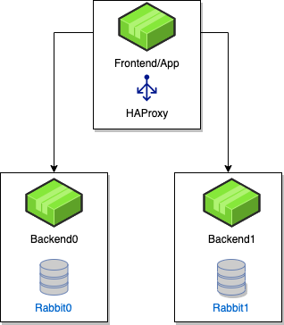

# High Availability RabbitMQ

## Overview

Starting in DataRobot 5.3 we've introduced a method by which it's possible to cluster RabbitMQ. Clustered RabbitMQ provides extra durability of queues in the event of a failure.

### Architecture

The conceptual architecture for HA RabbitMQ services is as follows:

<kbd></kbd>

In this configuration, we have one "frontend" server which hosts the application server and multiple backends hosting storage services.
You can find sample configuration(s) both before and after HA Rabbit at the end of this document.

#### Upgrade/Adding RabbitMQ HA

Clustering of RabbitMQ is dependent on a shared secret, which is written out to the RabbitMQ host machine during standard installs at `/opt/datarobot/data/rabbit/data/.erlang.cookie`. The contents of this file must be the same on all hosts running RabbitMQ for clustering to succeed. In 5.3 we have a default cookie value and secrets enforced can be used to generate and set the same random cookie value on all nodes automatically. Delete the old cookie before proceeding with upgrades or installs (if you are adding RabbitMQ HA).

As with any upgrade process at DataRobot, you should prepare for the upgrade by following the upgrade guide located here [Upgrades](../upgrades.md).
Ensure that you have good backups before any upgrade procedure. Once you have  solid  backups, you can modify the config.yaml to contain an additional
Rabbit node and a  HAproxy node. Please note that if you have the Patroni service running, you do not need to add an additional HAproxy service to your config.yaml.
You can find sample config.yaml's before and after here:

#### Sample config.yaml (before RabbitHA enabled)
```
app_configuration:
  ENABLE_HADOOP_DEPLOYMENT: false
    SECURE_WORKER_FIT_WORKERS: 2
os_configuration:
  admin_private_ssh_key_path: /home/centos/.ssh/id_rsa
  admin_user: centos
  code_signing:
    enabled: false
  datarobot_home_dir: /opt/datarobot
  group: datarobot
  logs:
    enabled: true
    filebeat: true
    server: test-logstash.ent.datarobot.com
  prediction_ssl:
    enabled: false
  private_ssh_key_path: /home/datarobot/.ssh/id_rsa
  ssl:
    enabled: false
  user: datarobot
servers:
- app_configuration:
  hosts:
  - 192.168.1.1
  services:
  - analyticsbrokeringest
  - analyticsbrokerpublisher
  - app
  - appupload
  - availabilitymonitor
  - datasetsserviceapi
  - internalapi
  - jobretryservice
  - logtailer
  - mmqueue
  - mongo
  - nginx
  - pngexport
  - predictionapi
  - provisioner
  - publicapi
  - rsyslog
  - sentinel
  - minio
  - idebroker
  - ideworker
  - logstash
- app_configuration:
  hosts:
  - 192.168.1.2
  services:
  - edabroker
  - mongo
  - queueproxy
  - redis
  - resourcemonitor
  - resourceproxy
  - securebroker
  - sentinel
  - taskmanager
  - minio
- app_configuration:
  hosts:
  - 192.168.1.3
  services:
  - datasetsservicequickworker0
  - datasetsserviceworker0
  - edaworker
  - execmanager
  - mongo
  - rabbit
  - redis
  - resourcemonitor
  - secureworker
  - sentinel
  - datasetsservicequickworker1
  - datasetsserviceworker1
  - minio
```
#### Sample config.yaml (after RabbitHA enabled)
```
app_configuration:
  ENABLE_HADOOP_DEPLOYMENT: false
    SECURE_WORKER_FIT_WORKERS: 2
os_configuration:
  admin_private_ssh_key_path: /home/centos/.ssh/id_rsa
  admin_user: centos
  code_signing:
    enabled: false
  datarobot_home_dir: /opt/datarobot
  group: datarobot
  logs:
    enabled: true
    filebeat: true
    server: test-logstash.ent.datarobot.com
  prediction_ssl:
    enabled: false
  private_ssh_key_path: /home/datarobot/.ssh/id_rsa
  ssl:
    enabled: false
  user: datarobot
servers:
- app_configuration:
  hosts:
  - 192.168.1.1
  services:
  - analyticsbrokeringest
  - analyticsbrokerpublisher
  - app
  - haproxy
  - appupload
  - availabilitymonitor
  - datasetsserviceapi
  - internalapi
  - jobretryservice
  - logtailer
  - mmqueue
  - mongo
  - nginx
  - pngexport
  - predictionapi
  - provisioner
  - publicapi
  - rsyslog
  - sentinel
  - minio
  - idebroker
  - ideworker
  - logstash
- app_configuration:
  hosts:
  - 192.168.1.2
  services:
  - edabroker
  - mongo
  - rabbit
  - queueproxy
  - redis
  - resourcemonitor
  - resourceproxy
  - securebroker
  - sentinel
  - taskmanager
  - minio
- app_configuration:
  hosts:
  - 192.168.1.3
  services:
  - datasetsservicequickworker0
  - datasetsserviceworker0
  - edaworker
  - execmanager
  - mongo
  - rabbit
  - redis
  - resourcemonitor
  - secureworker
  - sentinel
  - datasetsservicequickworker1
  - datasetsserviceworker1
  - minio
```

#### Advanced verification of RabbitMQ HA

Once you have edited your config.yaml and followed the normal upgrade procedure, you can verify RabbitMQ HA is working with the following steps:

1. Open your config.yaml
2. locate a host running RabbitMQ
3. Login to that host via ssh
4. Execute the following:
   * `docker exec rabbit /entrypoint rabbitmqctl cluster_status`
5. you should receive output similar to
```
   Cluster status of node rabbit@192.168.1.3
[{nodes,[{disc,['rabbit@192.168.1.2','rabbit@192.168.1.3']}]},
 {running_nodes,['rabbit@192.168.1.3','rabbit@192.168.1.2']},
 {cluster_name,<<"rabbit@drrabbit">>},
 {partitions,[]},
 {alarms,[{'rabbit@192.168.1.3',[]},{'rabbit@192.168.1.2',[]}]}]
 ```
Alternatively, the cluster status will be displayed in the RabbitMQ Management web ui under the Overview tab. This can be reached through `http://<haproxy-host-ip>:15672` or `https://<haproxy-host-ip>:15671`.
